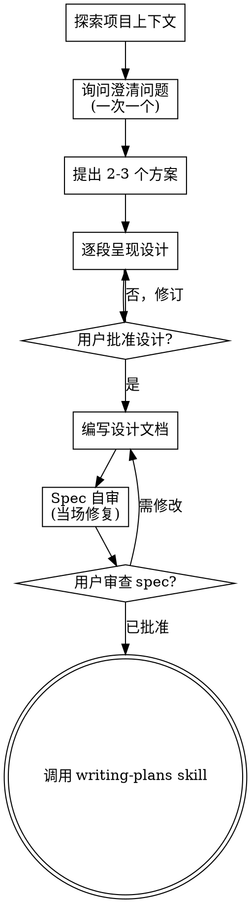

# Brainstorming — 从想法到设计文档

## Overview

将模糊的想法转化为完整的设计文档和 spec，通过自然协作对话推进。

**核心原则：** 在用户批准设计之前，不允许写任何实现代码。

**违反字面规则即违反精神规则。**

## 硬性门禁

```
<HARD-GATE>
在展示设计并获得用户批准之前，不得调用任何实现 skill、编写任何代码、
搭建任何项目、或采取任何实现动作。此规则适用于每个项目，无论看似多么简单。
</HARD-GATE>
```

## 反模式："这太简单了不需要设计"

每个项目都要走这个流程。Todo list、单函数工具、配置变更——全部都要。"简单"的项目恰恰是未经验证的假设造成最多浪费的地方。设计可以很短（真正简单的项目只需几句话），但**必须展示并获得批准**。

## 清单

使用 TaskCreate 为每个清单项创建任务，按顺序完成：

1. **探索项目上下文** — 检查文件、文档、最近提交
2. **询问澄清问题** — 一次一个，理解目的/约束/成功标准
3. **提出 2-3 个方案** — 附权衡分析和你的推荐
4. **逐段呈现设计** — 每段按复杂度缩放，逐段获得批准
5. **编写设计文档** — 保存到 `docs/specs/YYYY-MM-DD-<topic>-design.md` 并提交
6. **Spec 自审** — 检查占位符、矛盾、歧义、范围
7. **用户审查写好的 spec** — 请用户审查 spec 文件后再继续
8. **过渡到实现** — 调用 writing-plans skill 创建实施计划

## 流程图



**终点状态是调用 writing-plans。** 不要调用其他实现 skill。brainstorming 之后的唯一 skill 是 writing-plans。

## 流程详解

### 理解想法

- 先查看当前项目状态（文件、文档、最近提交）
- 在问细节问题之前，先评估范围：如果请求描述的是多个独立子系统（如"构建一个带聊天、文件存储、计费和分析的平台"），立即标记出来。不要在需要分解的项目上浪费时间问细节。
- 如果项目对一个 spec 来说太大，帮助用户分解为子项目：什么是独立的部分？它们如何关联？应该按什么顺序构建？然后对第一个子项目执行标准设计流程。每个子项目获得自己的 spec → plan → implementation 循环。
- 对范围合适的项目，一次问一个问题来完善想法
- 尽可能使用选择题，但开放式问题也可以
- **每次只问一个问题** — 如果一个主题需要更多探索，拆成多个问题
- 聚焦于理解：目的、约束、成功标准

### 探索方案

- 提出 2-3 种不同的方案，附权衡分析
- 以对话方式呈现选项，附上你的推荐和理由
- 先给出推荐的方案并解释为什么

### 呈现设计

- 一旦你认为理解了要构建什么，呈现设计
- 每段按复杂度缩放：简单的一两句话，复杂的 200-300 字
- 每段后询问"这部分看起来对吗？"
- 覆盖：架构、组件、数据流、错误处理、测试
- 准备好如果在某些方面不清楚就回去澄清

### 设计原则：隔离与清晰

- 将系统拆分为更小的单元，每个单元有一个清晰的职责、通过明确定义的接口通信、可以独立理解和测试
- 对每个单元，应该能回答：它做什么？如何使用？它依赖什么？
- 不阅读内部实现就能理解一个单元做什么吗？可以在不破坏调用者的情况下更改内部实现吗？如果不能，边界需要重新设计
- 更小、边界更清晰的单元也让你更容易工作——你能更好地推理可以一次性放入上下文的代码

### 在现有代码库中工作

- 在提出变更之前探索现有结构。遵循现有模式。
- 如果现有代码存在影响工作的问题（如文件变得太大、边界不清、职责纠缠），将针对性的改进作为设计的一部分——就像好的开发者在他们工作的代码中做的那样。
- 不要提出无关的重构。聚焦于服务当前目标的内容。

## 设计完成之后

### 编写文档

- 将验证过的设计（spec）保存到 `docs/specs/YYYY-MM-DD-<topic>-design.md`
- 用户偏好的 spec 位置覆盖此默认值
- 提交设计文档到 git

### Spec 自审

写完 spec 文档后，用新的眼光审视：

1. **占位符扫描**：有任何 "TBD"、"TODO"、不完整部分或模糊需求吗？修复它们。
2. **内部一致性**：各部分之间有矛盾吗？架构是否匹配功能描述？
3. **范围检查**：这个 spec 是否足够聚焦于一个实施计划？还是需要进一步分解？
4. **歧义检查**：任何需求可以有两种不同的解释吗？如果有，选择一种并明确说明。

当场修复所有问题。不需要重新审查——修复后继续。

### 用户审查门禁

自审通过后，请用户审查写好的 spec：

> Spec 已编写并提交到 `<path>`。请审查并告知是否需要修改，然后再开始编写实施计划。

等待用户响应。如果他们要求修改，进行修改并重新运行 spec 自审。只有用户批准后才能继续。

### 实现

- 调用 `writing-plans` skill 来创建详细的实施计划
- **不要调用任何其他 skill。** writing-plans 是下一步。

## 关键原则

- **一次一个问题** — 不要用多个问题淹没用户
- **优先选择题** — 比开放式更容易回答
- **YAGNI 无情** — 从所有设计中移除不必要的功能
- **探索替代方案** — 在确定方案前总是提出 2-3 种方法
- **增量验证** — 展示设计，获得批准后再继续
- **保持灵活** — 当某个部分不合理时回去澄清
- **不写代码** — 在用户批准设计之前，一行代码都不写

## 使用视觉辅助

在构思过程中，可以使用 `show_widget` 工具创建内联图表、流程图或交互式原型来帮助沟通设计思路。

**何时使用视觉辅助：**
- 架构关系用图表说明比文字更清晰
- 提议多套布局方案时，可绘制简图对比
- 数据流或状态机用流程图表达更直观

**何时不需要：**
- 纯概念性问题（"这个上下文中的个性是什么意思？"）
- 简单的文本选项对比
- 范围决策

使用原则：**用户通过看到它比读到它能理解得更好吗？** 如果是，就用视觉辅助。

## 反理性化

| 借口 | 现实 |
|------|------|
| "这只是个简单问题" | 简单问题也有隐藏假设。展示设计。 |
| "用户已经说清楚了" | 说清楚什么 ≠ 说清楚怎么构建。展示设计。 |
| "我先写一点代码看看" | "看看" = 已经开始实现。违反了硬性门禁。 |
| "这太简单了不需要设计" | 简单项目正是隐藏假设造成最多浪费的地方。 |
| "用户会告诉我如果错了" | 等用户纠正比先展示设计批准更慢。 |
| "时间紧迫" | 出错了重做更耗时。15分钟的设计可以省下几小时。 |

## Red Flags — STOP

这些想法意味着你在合理化的借口。STOP 并回到流程：

- "只是一个快速修复"
- "这太简单了"
- "我先写一点代码"
- "用户说清楚了，不需要设计"
- "我知道他们要什么"
- "设计是浪费时间的"
- 想着任何实现细节（代码、架构、文件结构）而设计还没批准

**所有这些意味着：回到 brainstorming 流程。不展示设计就不写代码。**

## 快速参考

| 阶段 | 关键活动 | 完成标准 |
|------|---------|---------|
| 1. 探索 | 查看项目状态 | 了解上下文 |
| 2. 澄清 | 一次一个问题 | 理解目的和约束 |
| 3. 方案 | 提出 2-3 个选项 | 选择方案 |
| 4. 设计 | 逐段呈现 | 用户批准 |
| 5. 文档 | 编写 spec 并提交 | spec 文件 |
| 6. 自审 | 检查占位符/矛盾/歧义 | 无问题 |
| 7. 用户审查 | 用户审查 spec | 用户批准 |
| 8. 交接 | 调用 writing-plans | 开始实施 |

## 集成

**调用方：**
- 用户在开始新功能/修改时的自然入口
- `project-workflow` 流程 A 的入口

**交接给：**
- **writing-plans** — 设计批准后创建实施计划

**配合：**
- **project-workflow** — 在流程 A 中作为起始步骤
