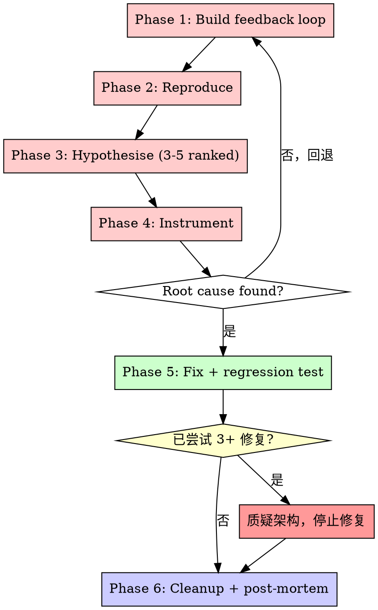

# Diagnose — 纪律性调试循环

## Overview

随机修复浪费时间和制造新 bug。快速补丁掩盖根本问题。

**核心原则：** 在找到根因之前不得尝试修复。症状修复就是失败。

**违反字面规则即违反精神规则。**

## 铁律

```
没有根因调查之前，不得尝试修复。
```

如果还没完成根因调查阶段，不能提出修复方案。

## 流程图



## 何时使用

用于任何技术问题：
- 测试失败
- 生产环境 bug
- 意外行为
- 性能问题
- 构建失败
- 集成问题

**尤其在以下情况使用：**
- 时间紧迫（紧急情况让人想猜）
- "就快速修一下"似乎很明显
- 已经尝试了多次修复
- 之前的修复没奏效
- 不完全理解问题

**不要跳过的情况：**
- 问题看似简单（简单 bug 也有根因）
- 赶时间（匆忙保证返工）
- 用户 wants it fixed NOW（系统化比乱碰快）

## 六个阶段

当探索代码库时，使用项目的领域词汇表来了解相关模块，并检查涉及区域的 ADRs。

### Phase 1 — 构建反馈循环

**这是核心技能。** 其他都是机械操作。如果有一个快速、确定性、可自动化运行的 pass/fail 信号来识别 bug，根因就能找到——二分法、假设检验和仪器化都只是消耗这个信号。如果没有信号，即使代码看再多也没用。

在此投入不成比例的努力。**要激进。要有创意。拒绝放弃。**

#### 构建反馈循环的方法——按此顺序尝试

1. **Failing test** — 在能触及 bug 的接缝处编写——单元、集成、端到端
2. **Curl / HTTP script** — 针对运行中的开发服务器
3. **CLI invocation** — 用 fixture input，将 stdout 与已知正确的快照做 diff
4. **Headless browser script** (Playwright / Puppeteer) — 驱动 UI，在 DOM/console/network 上断言
5. **Replay a captured trace** — 将真实的网络请求/负载/事件日志保存到磁盘；隔离地在代码路径中回放
6. **Throwaway harness** — 启动系统的一个最小子集（一个服务 + mock 依赖），用单个函数调用练习 bug 代码路径
7. **Property / fuzz loop** — 如果 bug 是"有时输出错误"，运行 1000 个随机输入观察失败模式
8. **Bisection harness** — 如果 bug 出现在两个已知状态之间（commit、数据集、版本），自动化"在状态 X 启动 → 检查 → 重复"以便使用 `git bisect run`
9. **Differential loop** — 对同一个输入运行旧版本 vs 新版本（或两种配置）并 diff 输出

构建了正确的反馈循环，bug 就 90% 修好了。

#### 迭代优化循环

把循环当产品对待。一旦有了循环就问：

- 可以更快吗？（缓存设置、跳过无关初始化、缩小测试范围）
- 信号能更清晰吗？（针对特定症状断言，而不是"没崩溃"）
- 能更确定性吗？（固定时间、种子 RNG、隔离文件系统、冻结网络）

一个 30 秒的 flaky 循环不比没有循环好多少。一个 2 秒的确定性循环是调试超能力。

#### 非确定性 bug

目标不是干净的回放，而是**更高的复现率**。循环触发 100x、并行化、增加压力、缩小时间窗口、注入 sleep。50% 复现率的 bug 是可调试的；1% 则不是——不断提高复现率直到可调试。

#### 当真的无法构建反馈循环

停下来明确说明。列出已尝试的方法。向用户请求：(a) 访问能复现的环境、(b) 捕获的产物（HAR 文件、日志转储、核心转储、带有时间戳的录屏）、或 (c) 添加临时生产仪器化的权限。在没有反馈循环的情况下，**不要**进入假设阶段。

在 Phase 1 完成之前不要进入 Phase 2。

### Phase 2 — 复现

运行循环。观察 bug 出现。

确认：

- [ ] 循环产生的失败模式与**用户**描述的一致——不是附近碰巧发生的不同失败
- [ ] 失败在多次运行中可复现（或对于非确定性 bug，以足够高的频率可复现以便调试）
- [ ] 确切的症状已被捕获（错误消息、错误输出、慢速），以便后续阶段验证修复是否真正解决了问题

在 bug 被复现之前不要继续。

### Phase 3 — 提出假设

在测试任何假设之前生成 **3-5 个排好序的假设**。单个假设会锚定在第一个看起来合理的想法上。

每个假设必须是**可证伪的**：陈述它做出的预测。

> 格式："如果 <X> 是原因，那么 <修改 Y> 会使 bug 消失 / <修改 Z> 会使它更糟。"

如果无法陈述预测，这个假设只是一种感觉——丢弃或打磨它。

**在测试之前向用户展示排好序的列表。** 用户通常有领域知识可以立即重新排序，或者知道已经排除了哪些假设。如果用户不在，按你的排序继续。

#### 多组件系统的根因追踪

当系统有多个组件时（CI → build → signing、API → service → database）：

**在提出修复之前，添加诊断仪器化：**

```
对每个组件边界：
  - 记录什么数据进入组件
  - 记录什么数据离开组件
  - 验证环境/配置传播
  - 检查每层的状态

运行一次收集显示在哪里出错的证据
然后分析证据识别故障组件
然后调查那个特定组件
```

**示例（多层系统）：**
```bash
# Layer 1: Workflow
echo "=== Secrets available in workflow: ==="
echo "IDENTITY: ${IDENTITY:+SET}${IDENTITY:-UNSET}"

# Layer 2: Build script
echo "=== Env vars in build script: ==="
env | grep IDENTITY || echo "IDENTITY not in environment"

# Layer 3: Signing script
echo "=== Keychain state: ==="
security list-keychains
security find-identity -v
```

这揭示：哪层失败了（secrets → workflow ✓, workflow → build ✗）

### Phase 4 — 仪器化

每个探针必须映射到 Phase 3 的特定预测。**一次只改变一个变量。**

工具偏好：

1. **Debugger / REPL inspection** — 如果环境支持，一个断点胜过十条日志
2. **Targeted logs** — 在能区分假设的边界处
3. 永远不要"记录所有内容然后 grep"

**为每个调试日志加上唯一前缀标签**，例如 `[DEBUG-a4f2]`。最后清理变成一个 grep。未标记的日志存活；带标记的日志消失。

**性能分支。** 对于性能回归，日志通常是错的。改为：建立基线测量（定时 harness、`performance.now()`、分析器、查询计划），然后二分。先测量，后修复。

### Phase 5 — 修复 + 回归测试

在修复之前编写回归测试——但仅当存在**正确的接缝**时。

正确的接缝是指测试在调用点处练习**真实的 bug 模式**。如果唯一可用的接缝太浅（当 bug 需要多个调用者时的单调用者测试、无法复现触发 bug 的链路的单元测试），那里的回归测试会给出虚假的信心。

**如果没有正确的接缝存在，那本身就是发现。** 记录下来。代码库架构阻止了 bug 被锁定。将此标记为下一阶段。

如果存在正确的接缝：

1. 将最小化复现转换为该接缝处的失败测试
2. 观察它失败
3. 应用修复
4. 观察它通过
5. 对原始（未最小化的）场景重新运行 Phase 1 反馈循环

### Phase 6 — 清理 + 事后分析

在声明完成之前必须完成：

- [ ] 原始复现不再复现（重新运行 Phase 1 循环）
- [ ] 回归测试通过（或不存​​在接缝的情况已记录）
- [ ] 所有 `[DEBUG-...]` 仪器化已移除（`grep` 前缀）
- [ ] 一次性原型已删除（或移到明确标记的调试位置）
- [ ] 正确的假设在 commit/PR 消息中说明——以便下次调试的人学习

**然后问：什么本可以阻止这个 bug？** 如果答案涉及架构变更（没有好的测试接缝、调用者纠缠不清、隐藏耦合），将具体细节移交给 `improve-architecture` skill。在修复完成**之后**提出建议——现在比诊断开始时拥有更多信息。

## 3+ 次修复失败的规则

如果已经尝试了 3 次修复，**STOP 并质疑架构。**

指示存在架构问题的模式：
- 每次修复暴露出不同地方的新共享状态/耦合/问题
- 修复需要"大规模重构"才能实现
- 每次修复在其他地方产生新症状

**STOP 并质疑基础：**
- 这个模式从根本上是合理的吗？
- 我们是否因为"惯性"而坚持使用它？
- 应该重构架构 vs 继续修复症状？

**在尝试更多修复之前与用户讨论。**

**这不是假设失败——这是错误的架构。**

## 反理性化

| 借口 | 现实 |
|------|------|
| "快速修一下，以后再调查" | "以后"永远不会来。现在做根因调查。 |
| "先试试改 X 看行不行" | 猜测不是方法。先调查。 |
| "一次改多个，节省时间" | 无法隔离哪个有效。制造新 bug。 |
| "跳过测试，我手动验证" | 手动测试是临时的。没有记录，不能重新运行。 |
| "问题简单，不需要流程" | 简单问题也有根因。流程对简单 bug 很快。 |
| "紧急情况，没时间走流程" | 系统化调试比猜-试-猜更快。 |
| "情况我认为是 X，先修复" | 看到症状 ≠ 理解根因。 |
| "再试一次"（已尝试 2+ 次） | 3+ 次失败 = 架构问题。质疑模式，不要继续修。 |
| "每种修复暴露新问题" | 清晰信号：架构有问题而不是假设失败。 |

## Red Flags — STOP 并遵循流程

如果你发现自己在想：
- "快速修一下，以后再调查"
- "先试试改 X 看行不行"
- "加多个更改，一起测试"
- "跳过测试，我手动验证"
- "可能是 X，让我修一下"
- "不完全理解但可能行"
- "模式说 X 但我改一下适应"
- "这些是主要问题：[列修复方案而不做调查]"
- 在追踪数据流之前就提出解决方案
- **"再试一次修复"（已尝试 2+ 次）**
- **每次修复在不同地方暴露出新问题**

**所有这些意味着：STOP。回到 Phase 1。**

**如果已尝试 3+ 修复：** 质疑架构（见 3+ 修复规则）。

## 快速参考

| Phase | 关键活动 | 成功标准 |
|-------|---------|---------|
| **1. 反馈循环** | 构建快速、确定性的 pass/fail 信号 | 可自动化运行的循环 |
| **2. 复现** | 运行循环，确认用户描述的 bug | bug 稳定复现 |
| **3. 假设** | 生成 3-5 个可证伪假设，排序 | 明确的预测列表 |
| **4. 仪器化** | 每个探针映射到预测，一次改一个变量 | 定位根因 |
| **5. 修复** | 先写回归测试，再修复，再验证 | bug 消失，测试通过 |
| **6. 清理** | 移除仪器化，记录发现，提出架构建议 | 项目清洁 |

## 集成

**调用方：**
- `project-workflow` 流程 B（Bug 修复）
- 用户说 "diagnose this" / "debug this" / "修复 bug"

**配合：**
- **tdd** — 回归测试应遵循 TDD 循环（先写失败测试）
- **improve-architecture** — 如果事后分析发现架构问题，移交处理
