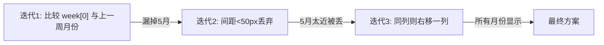
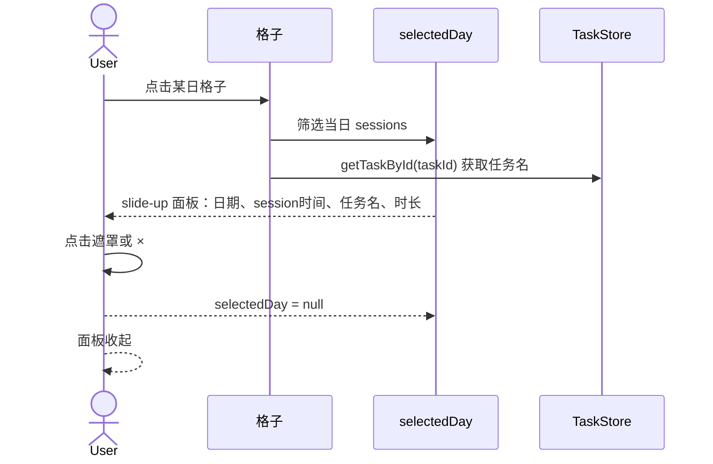

# TaskCalendar 功能迭代笔记

> **日期**: 2026-05-04 ~ 2026-05-05  
> **组件**: `src/components/TaskCalendarPanel.vue`  
> **目标**: GitHub Contributions 风格热力图

---

## 1. 新增功能

| 功能 | 说明 |
|------|------|
| **53 周全年视野** | 时间跨度从 12 周扩展到 53 周 |
| **横向滚动容器** | 热力图区域支持鼠标/触控板横向滑动浏览全年 |
| **5 级颜色梯度** | 0 / 1-2 / 3-5 / 6-8 / 9+ 番茄钟密度等级 |
| **月份标签精确对齐** | 月份标签落在该月首列；碰撞时右移一列避免重叠 |
| **点击看当日详情** | 点击格子底部滑出面板，展示该日所有番茄钟记录 |
| **关联任务追溯** | 详情面板展示每个 session 对应任务标题 |

---

## 2. 月份标签算法演进



**最终算法**（遍历每月首日，碰撞偏移）：

```typescript
const COL_WIDTH = CELL_SIZE + CELL_GAP // 14px

heatmapData.value.forEach((day, dayIndex) => {
  const d = new Date(day.date + 'T00:00:00')
  const monthKey = d.getFullYear() * 12 + d.getMonth()

  if (!seen.has(monthKey)) {
    seen.add(monthKey)
    const weekIndex = Math.floor(dayIndex / 7)
    let x = weekIndex * COL_WIDTH

    // 若与前一个标签同列，则右移一列避免重叠
    const prev = labels[labels.length - 1]
    if (prev && Math.abs(x - prev.x) < COL_WIDTH) {
      x += COL_WIDTH
    }

    labels.push({
      label: d.toLocaleDateString('zh-CN', { month: 'short' }),
      x,
    })
  }
})
```

---

## 3. 颜色梯度

| 数量 | 颜色 | 透明度 |
|------|------|--------|
| 0 | `#58A6FF`（var(--border)）| — |
| 1-2 | `#58A6FF` | 0.35 |
| 3-5 | `#58A6FF` | 0.55 |
| 6-8 | `#58A6FF` | 0.75 |
| 9+ | `#58A6FF` | 0.95 |

---

## 4. 尺寸体系

| 元素 | 值 |
|------|-----|
| Cell 尺寸 | 11 × 11 px |
| Cell 间距 | 3 px |
| 周列间距 | 3 px |
| 星期标签宽度 | 32 px |
| 月份标签行高 | 20 px |
| 月份标签左偏移 | 36 px |

---

## 5. 交互时序



---

## 6. Commit 记录

| Commit | 说明 |
|--------|------|
| `66a4cea` | feat: github-style heatmap with 53-week scroll, precise month labels, click-to-view daily sessions |
| `cfd97e1` | fix: accurate month labels using first-day-of-month detection with collision avoidance |
| `51b841e` | fix: remove greedy collision filter on month labels to prevent missing months |
| `487cbd7` | fix: shift month label right by one column when colliding with previous month label |
| `8761750` | chore: trigger redeploy |
