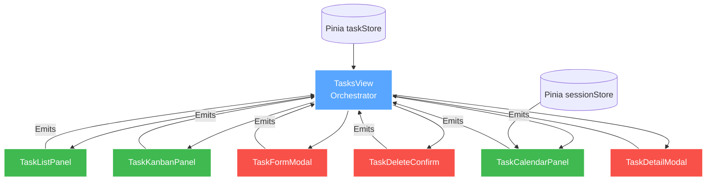
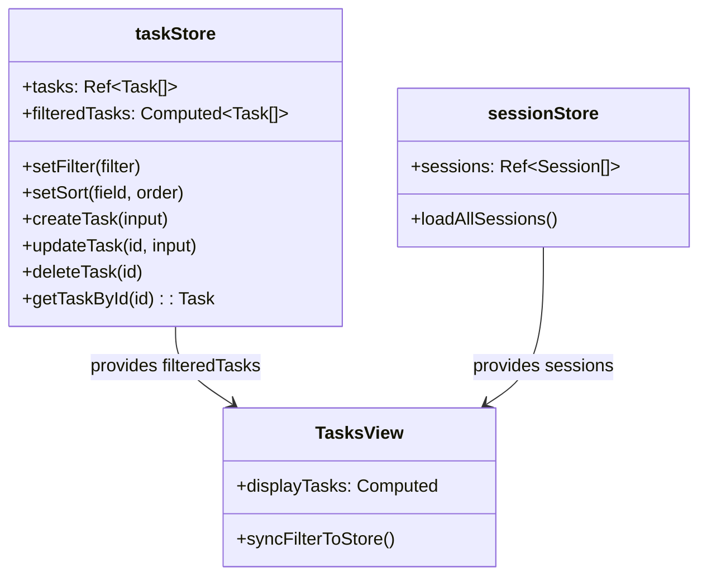
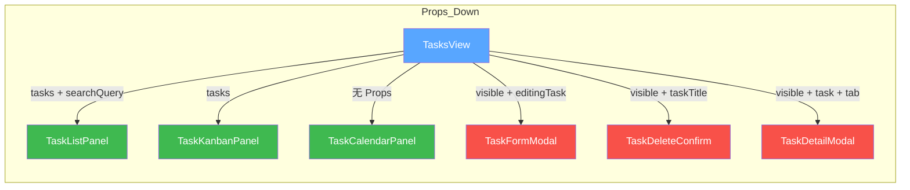
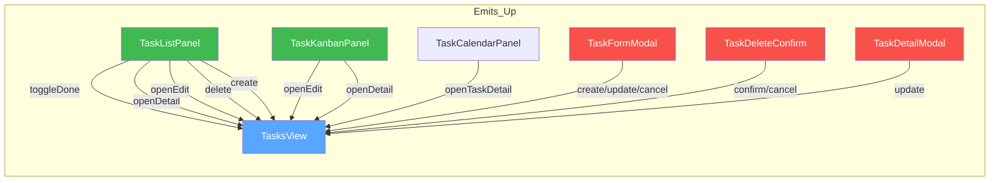
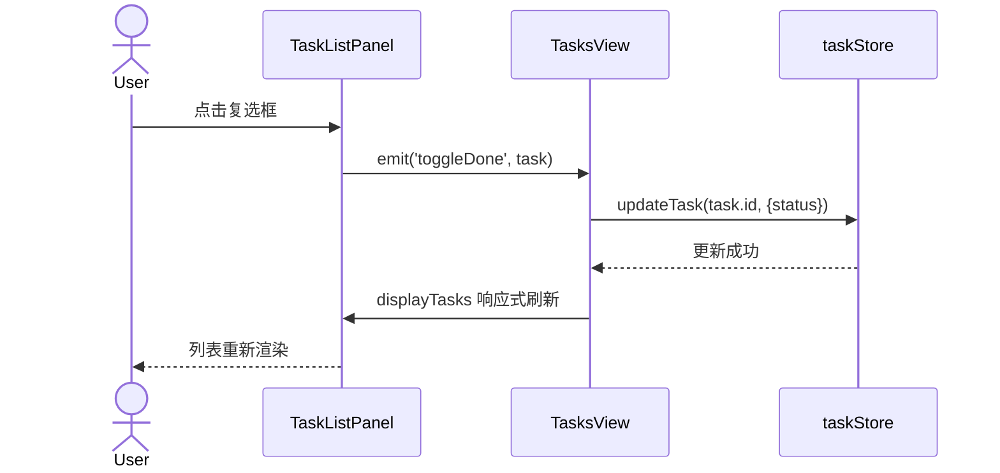
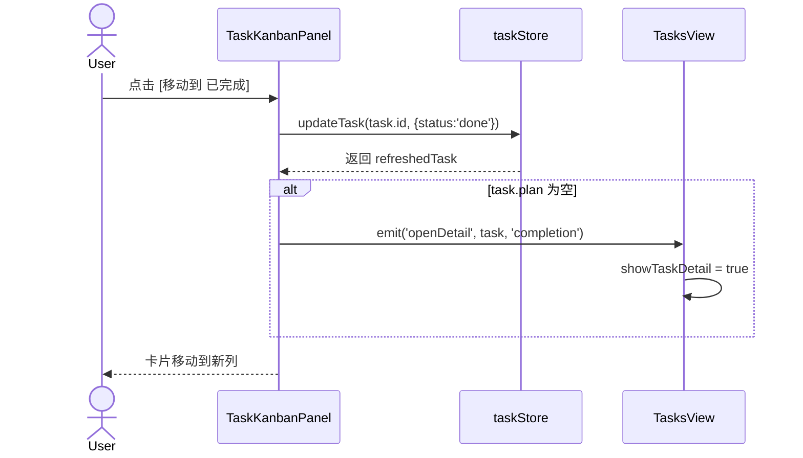
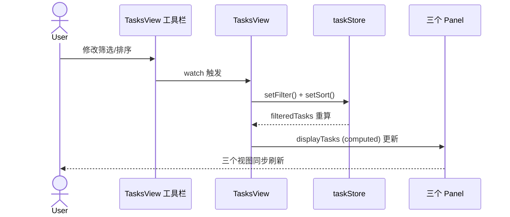
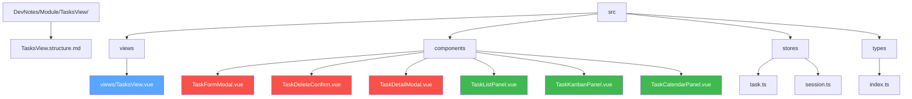

# TasksView 模块架构文档

> **版本**: v1.0  
> **日期**: 2026-05-04  
> **模块路径**: `src/views/TasksView.vue`  
> **关联组件**: `TaskFormModal`, `TaskDeleteConfirm`, `TaskListPanel`, `TaskKanbanPanel`, `TaskCalendarPanel`, `TaskDetailModal`

---

## 1. 架构概览

`TasksView` 采用 **Orchestrator（编排器）模式**，将原本近 3000 行的单体组件拆分为 **6 个独立子模块**。主视图仅保留跨视图状态与事件路由，各子模块通过 `Props / Emits` 进行松耦合通信。



---

## 2. 组件层级与职责矩阵

| 组件 | 文件路径 | 核心职责 | 代码行数（约） |
|------|---------|---------|--------------|
| **TasksView** | `src/views/TasksView.vue` | 视图模式切换、筛选/排序状态、模态框调度、快捷键 | 1083 |
| **TaskListPanel** | `src/components/TaskListPanel.vue` | 列表渲染、行内编辑、展开详情、状态徽章 | 508 |
| **TaskKanbanPanel** | `src/components/TaskKanbanPanel.vue` | 四列看板、状态流转按钮、优先级圆点 | ~450 |
| **TaskCalendarPanel** | `src/components/TaskCalendarPanel.vue` | 热力图生成、周/月聚合、Tooltip、统计摘要、**每日任务汇总 Modal**、emit `openTaskDetail` | ~350 |
| **TaskFormModal** | `src/components/TaskFormModal.vue` | 新建/编辑表单、校验、标签管理 | ~400 |
| **TaskDeleteConfirm** | `src/components/TaskDeleteConfirm.vue` | 删除二次确认、动画反馈 | ~200 |
| **TaskDetailModal** | `src/components/TaskDetailModal.vue` | 任务详情、Plan/Completion/**Session 日期分组折叠编辑** 三栏 | ~200 |

---

## 3. 状态分层

### 3.1 全局状态（Pinia Stores）



### 3.2 局部状态（TasksView Orchestrator）

| 状态变量 | 类型 | 说明 |
|---------|------|------|
| `viewMode` | `'list' \| 'kanban' \| 'calendar'` | 当前视图模式 |
| `statusFilter` | `TaskStatus \| 'all'` | 状态筛选 |
| `priorityFilter` | `Priority \| ''` | 优先级筛选 |
| `tagFilter` | `string` | 标签筛选 |
| `searchQuery` | `string` | 搜索关键词 |
| `sortField` | `SortField` | 排序字段 |
| `sortOrder` | `SortOrder` | 排序方向 |
| `showForm` | `boolean` | 表单弹窗显隐 |
| `editingTask` | `Task \| null` | 当前编辑的任务 |
| `showDeleteConfirm` | `boolean` | 删除确认弹窗 |
| `deletingTaskId` | `string \| null` | 待删除任务 ID |
| `showTaskDetail` | `boolean` | 详情弹窗显隐 |
| `selectedTaskForDetail` | `Task \| null` | 当前查看详情的任务 |
| `detailInitialTab` | `'plan' \| 'completion' \| 'sessions'` | 详情弹窗默认 Tab |

### 3.3 子模块内部状态

各 Panel 组件自持 **视图级局部状态**，不与 Orchestrator 共享：

- **TaskListPanel**: `expandedTaskId`, `inlineEditingId`, `inlineEditTitle`
- **TaskKanbanPanel**: `kanbanColumns`（常量列定义）
- **TaskCalendarPanel**: `heatmapTooltip`（鼠标悬浮提示坐标）、`selectedDay`（当日详情 Modal 状态）、`dayTaskSummaries`（按任务汇总的计算属性）

---

## 4. 事件流与接口契约

### 4.1 Props 传递拓扑



### 4.2 Emits 上报拓扑



### 4.3 类型契约

```typescript
// TaskListPanel Props
interface ListPanelProps {
  tasks: Task[]
  searchQuery?: string
}

// TaskListPanel Emits
toggleDone(task: Task)
openDetail(task: Task)
openEdit(task: Task)
delete(taskId: string)
create()

// TaskKanbanPanel Props
interface KanbanPanelProps {
  tasks: Task[]
}

// TaskKanbanPanel Emits
openEdit(task: Task)
openDetail(task: Task, tab: 'plan' | 'completion' | 'sessions')

// TaskCalendarPanel
// 零 Props —— 内部直接读取 sessionStore
// Emits
openTaskDetail(task: Task) // 点击日汇总中的任务条目，打开任务详情
```

---

## 5. 核心交互时序

### 5.1 列表视图 —— 完成勾选



### 5.2 看板视图 —— 状态流转



### 5.3 筛选同步链路



---

## 6. 目录结构



---

## 7. 技术约束与规范

| 项目 | 规范 |
|------|------|
| **API 风格** | Vue 3 `<script setup>` + Composition API |
| **状态管理** | Pinia（全局）+ `ref/computed`（局部） |
| **组件通信** | Props Down / Events Up，Panel 组件内部可直接调用 Store |
| **样式方案** | `<style scoped>` + CSS Variables（玻璃拟态主题） |
| **动画** | `<Transition>` / `<TransitionGroup>`，命名规范：`task-item-*`, `kanban-card-*`, `view-fade-*` |
| **类型安全** | TypeScript 严格模式，所有 Props / Emits 显式声明类型 |

---

## 8. 扩展预留

| 扩展点 | 建议实现位置 | 预估影响面 |
|--------|-------------|-----------|
| 拖拽排序（Kanban） | `TaskKanbanPanel` 内部引入 `vuedraggable` | 仅该组件 |
| 批量操作（List） | `TaskListPanel` 新增多选状态，新增 `emit('batchDelete')` | List + Orchestrator |
| 日历视图月/周切换 | `TaskCalendarPanel` 新增 `viewGranularity` prop | 仅该组件 |
| 任务导入/导出 | `TasksView` 新增工具栏按钮，调用 `taskStore` API | 仅 Orchestrator |
| 实时协作同步 | `taskStore` 层接入 WebSocket，视图层无感知 | Store 层 |

---

## 9. 变更日志

| 版本 | 日期 | 变更内容 | 影响面 |
|------|------|---------|--------|
| v1.0 | 2026-05-04 | 完成 TaskListPanel / TaskKanbanPanel / TaskCalendarPanel 提取 | TasksView 2827 → 1083 行 |
| v1.1 | 2026-05-05 | TaskCalendarPanel 交互升级（居中 modal、任务日汇总、自动滚动）+ TaskDetailModal sessions Tab 日期分组折叠与编辑 | 详见 [specs](../../specs/2026-05-05-session-list-grouping-design.md) |
