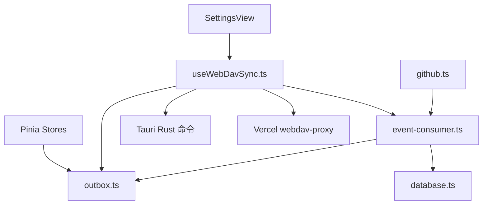
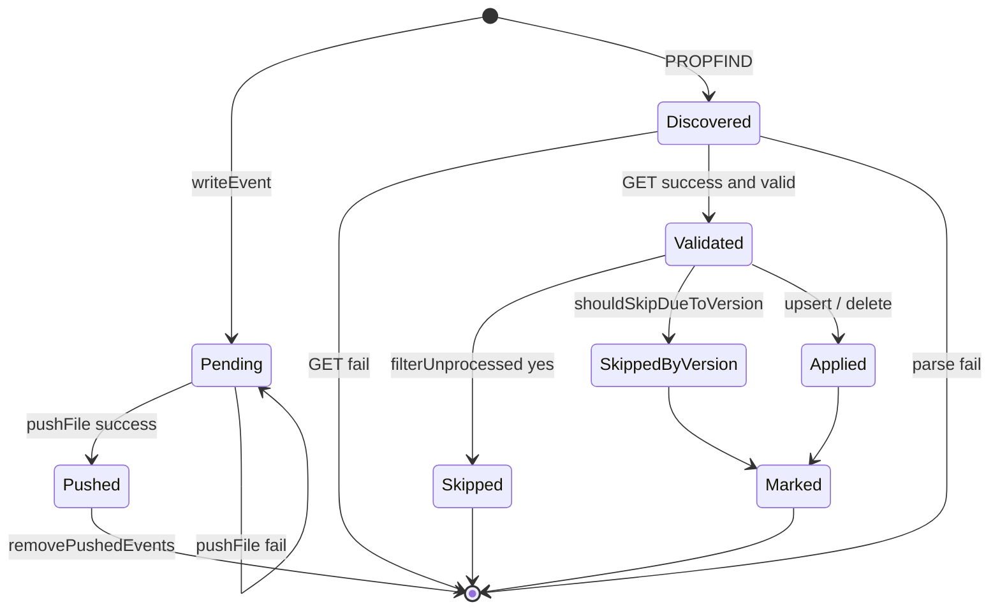
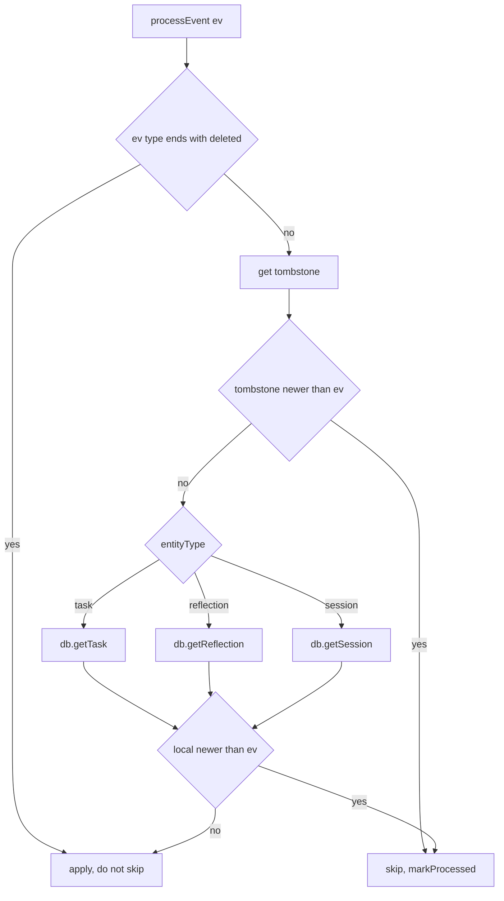

# WebDAV 同步模块 · 工程实现完整参考

> **版本**：v2.0（Phase 2 · Append-only 事件流）
> **更新日期**：2026-05-05
> **基线 commit**：`f0bb4bd`（138/138 测试通过）
> **关联文档**：[`WebDavSync.structure.md`](WebDavSync.structure.md)

本文档面向**实现者与维护者**，提供：

- 模块的完整 API 参考
- 关键算法的伪码与实际代码
- 历史踩坑的根因分析（含 commit 引用）
- 故障诊断与调试 runbook
- 性能基准与监控建议

阅读建议：先读架构文档建立 mental model，再读本文档查阅实现细节。

---

## 1. 项目结构与模块边界

### 1.1 完整目录树

```
src/
├── composables/
│   ├── useWebDavSync.ts              # 1106 行，核心传输 + 调度 + 校验
│   └── useWebDavSync.test.ts         # 33 个用例
├── services/
│   ├── outbox.ts                     #  282 行，事件队列 + 墓碑
│   ├── outbox.test.ts                #   6 个用例
│   ├── event-consumer.ts             #  252 行，消费 + 版本保护
│   ├── event-consumer.test.ts        #  22 个用例
│   ├── database.ts                   # MemoryStore / Tauri SQLite
│   └── github.ts                     # GitHub Issue 同步路径（共享 consumer）
├── stores/
│   ├── task.ts                       # writeEvent('task.*')
│   ├── reflection.ts                 # writeEvent('reflection.*')
│   ├── session.ts                    # writeEvent('session.created/updated/deleted')
│   ├── session.test.ts               #   7 个用例（deleteSession 联动 task）
│   └── sync.ts                       # 总线，暴露 recordEvent
└── views/
    └── SettingsView.vue              # 配置面板 UI

src-tauri/
├── src/lib.rs                        # webdav_* Rust 命令（ureq v3）
└── Cargo.toml                        # ureq = "3", base64 = "0.22"

api/
└── webdav-proxy.js                   # Vercel Node.js Function

vercel.json                           # /api/* 路由
```

### 1.2 模块依赖图



依赖方向**单向向下**，无环依赖。

---

## 2. Outbox 事件队列（services/outbox.ts）

### 2.1 模块概述

Outbox 是本系统的**单一真相源**，三个独立功能：

1. **未推送事件队列**（`outbox-event-*`）：本地新生成、待推送的事件
2. **已处理事件索引**（`outbox-processed-*`）：消费端去重表
3. **墓碑表**（`tombstone-*-*`）：删除事件的最终态记录

三者都用 [idb-keyval](https://github.com/jakearchibald/idb-keyval) 存储到浏览器 IndexedDB。

### 2.2 数据结构

```ts
export type OutboxEventType =
  | "task.created"
  | "task.updated"
  | "task.deleted"
  | "reflection.created"
  | "reflection.updated"
  | "reflection.deleted"
  | "session.created"
  | "session.updated"
  | "session.deleted";

export interface OutboxEvent {
  eventId: string; // UUID v4
  type: OutboxEventType;
  entityType: string; // 'task' | 'reflection' | 'session'
  entityId: string;
  payload: unknown; // 实体快照 / { id }
  timestamp: string; // ISO 8601
}

interface ProcessedEvent {
  eventId: string;
  processedAt: string;
}

interface TombstoneRecord {
  entityId: string;
  entityType: string;
  deletedAt: string;
}
export type Tombstone = TombstoneRecord;
```

### 2.3 键空间布局

```
IndexedDB（idb-keyval 默认 store）
├── outbox-event-<uuid>            ← OutboxEvent
├── outbox-processed-<uuid>        ← ProcessedEvent
└── tombstone-<entityType>-<id>    ← TombstoneRecord
```

### 2.4 核心 API 完整参考

#### `writeEvent(type, entityId, payload)`

写入新事件，返回创建的事件对象。

```ts
export async function writeEvent(
  type: OutboxEventType,
  entityId: string,
  payload: unknown
): Promise<OutboxEvent> {
  const entityType = type.split(".")[0]; // 'task.created' → 'task'

  const event: OutboxEvent = {
    eventId: generateId(), // crypto.randomUUID
    type,
    entityType,
    entityId,
    payload,
    timestamp: new Date().toISOString(),
  };

  await set(`outbox-event-${event.eventId}`, sanitize(event));
  return event;
}
```

**实现要点**：

- `entityType` 由 `type` 派生，保证不变量 I-3。
- `sanitize` = `JSON.parse(JSON.stringify(value))`：剥离 Vue Proxy，防止 IndexedDB 抛 `DataCloneError`。
- 时间戳用 `toISOString()`，UTC，毫秒精度。

#### `getUnpushedEvents()`

返回所有未推送事件，按 timestamp 升序。

```ts
export async function getUnpushedEvents(): Promise<OutboxEvent[]> {
  const allKeys = await keys();
  const eventKeys = allKeys.filter((k) =>
    String(k).startsWith("outbox-event-")
  );

  const events: OutboxEvent[] = [];
  for (const key of eventKeys) {
    const event = await get<OutboxEvent>(key);
    if (event) events.push(event);
  }

  events.sort((a, b) => a.timestamp.localeCompare(b.timestamp));
  return events;
}
```

> **为什么 localeCompare 而非 parseTime？** 这里只处理本地写入（始终是 ISO），字符串字典序与数值序一致。`parseTime` 是为了对付混合格式，本地写入无该问题。

#### `removePushedEvents(ids[])`

push 成功后清理本地对应事件。

```ts
export async function removePushedEvents(eventIds: string[]): Promise<void> {
  for (const id of eventIds) {
    await del(`outbox-event-${id}`);
  }
}
```

#### `markProcessed` / `isProcessed` / `filterUnprocessed`

消费端的幂等去重三件套。

```ts
export async function markProcessed(eventId: string): Promise<void> {
  const record: ProcessedEvent = {
    eventId,
    processedAt: new Date().toISOString(),
  };
  await set(`outbox-processed-${eventId}`, sanitize(record));
}

export async function isProcessed(eventId: string): Promise<boolean> {
  const record = await get<ProcessedEvent>(`outbox-processed-${eventId}`);
  return !!record;
}

export async function filterUnprocessed(
  events: OutboxEvent[]
): Promise<OutboxEvent[]> {
  const result: OutboxEvent[] = [];
  for (const e of events) {
    if (!(await isProcessed(e.eventId))) result.push(e);
  }
  return result;
}
```

#### 墓碑 API

```ts
markTombstone(entityType, entityId, timestamp?)
getTombstone(entityType, entityId): Tombstone | null
removeTombstone(entityType, entityId)
upsertTombstones(records[])
getAllTombstones(): Tombstone[]
```

**关键设计**：消费端 `markTombstone` **必须**传 `event.timestamp`，不能用本地 `Date.now()`。否则两端的同一删除事件会得到不同墓碑时间，破坏不变量 I-6。

#### `clearAll()`（仅测试用）

```ts
export async function clearAll(): Promise<void> {
  const allKeys = await keys();
  for (const key of allKeys) {
    const s = String(key);
    if (
      s.startsWith("outbox-event-") ||
      s.startsWith("outbox-processed-") ||
      s.startsWith("tombstone-")
    ) {
      await del(key);
    }
  }
}
```

只清同步层数据，不动用户业务表。

### 2.5 状态机



### 2.6 IndexedDB 容量与 GC

- `outbox-event-*`：在线时基本一推完就删，量小。
- `outbox-processed-*`：**只增不减**，30 天活跃用户约几百到几千项。
- `tombstone-*-*`：实体重新创建时清。

**当前未实现 GC**。极端长期用户可考虑 30 天后清理 processed（事件早已不在远端，安全可清）。

---

## 3. 事件消费器（services/event-consumer.ts）

### 3.1 模块概述

事件消费器是**与传输无关**的纯逻辑层，可被任何同步通道调用：

```ts
consumeEvents()              // GitHub Issue 路径
consumeEventsFrom(events[])  // WebDAV 路径，也是通用入口
```

### 3.2 时间戳工具

```ts
export function parseTime(ts: string): number {
  const normalized = ts.replace(" ", "T"); // iOS Safari 兼容
  const ms = new Date(normalized).getTime();
  return Number.isNaN(ms) ? 0 : ms; // 解析失败保守放行
}

export function isNewerThan(localTs: string, eventTs: string): boolean {
  return parseTime(localTs) > parseTime(eventTs);
}
```

设计动机：

- 数据库历史遗留 `'YYYY-MM-DD HH:mm:ss'`，新数据是 ISO 8601；不归一化会出现字符串比较 bug。
- iOS Safari 对 `new Date("2026-05-04 12:00:00")` 返回 `Invalid Date`；必须先把空格替换为 'T'。
- 解析失败返回 0：让事件**通过**版本保护检查（保守策略）。
- **严格大于**：等于时不跳过（避免同时间戳事件误丢）。

### 3.3 版本保护决策树



实现：

```ts
async function shouldSkipDueToVersion(event: OutboxEvent): Promise<boolean> {
  if (event.type.endsWith(".deleted")) return false; // 不变量 I-8

  // 1. 墓碑保护
  const ts = await getTombstone(event.entityType, event.entityId);
  if (ts && isNewerThan(ts.deletedAt, event.timestamp)) {
    console.log(
      `[EventConsumer] 跳过 ${event.type} ${event.entityId}: ` +
        `墓碑 ${ts.deletedAt} > ${event.timestamp}`
    );
    return true;
  }

  // 2. 本地版本保护
  try {
    switch (event.entityType) {
      case "task": {
        const t = await db.getTask(event.entityId);
        if (t && isNewerThan(t.updatedAt, event.timestamp)) return true;
        break;
      }
      case "reflection": {
        /* 同构 */ break;
      }
      case "session": {
        const s = await db.getSession(event.entityId);
        if (s?.updatedAt && isNewerThan(s.updatedAt, event.timestamp))
          return true;
        break;
      }
    }
  } catch {
    return false; // DB 查询失败保守放行
  }

  return false;
}
```

### 3.4 处理分支

```ts
async function processEvent(event: OutboxEvent): Promise<void> {
  if (await shouldSkipDueToVersion(event)) return;

  switch (event.type) {
    case "task.created":
    case "task.updated": {
      await db.upsertTask(event.payload as Task);
      await removeTombstone("task", event.entityId);
      break;
    }
    case "task.deleted": {
      const { id } = event.payload as { id: string };
      await db.deleteTask(id);
      await markTombstone("task", id, event.timestamp); // 不变量 I-6
      break;
    }

    case "reflection.created":
    case "reflection.updated": {
      /* 同构 */ break;
    }
    case "reflection.deleted": {
      /* 同构 */ break;
    }

    case "session.created":
    case "session.updated": {
      await db.upsertSession(event.payload as Session);
      await removeTombstone("session", event.entityId);
      break;
    }
    case "session.deleted": {
      const { id } = event.payload as { id: string };
      await db.deleteSession(id);
      await markTombstone("session", id, event.timestamp);
      break;
    }

    default:
      console.warn("[EventConsumer] 未知事件类型:", event.type);
  }
}
```

### 3.5 主入口 `consumeEventsFrom`

```ts
export async function consumeEventsFrom(remote: OutboxEvent[]): Promise<{
  pulled: number;
  processed: number;
  errors: number;
}> {
  if (!remote?.length) return { pulled: 0, processed: 0, errors: 0 };

  // 1. 按 timestamp 升序排序
  const sorted = [...remote].sort(
    (a, b) => parseTime(a.timestamp) - parseTime(b.timestamp)
  );

  // 2. 按 eventId 去重
  const unprocessed = await filterUnprocessed(sorted);

  let processed = 0,
    errors = 0;
  for (const event of unprocessed) {
    try {
      await processEvent(event);
      await markProcessed(event.eventId); // 跳过的事件也 mark
      processed++;
    } catch (err) {
      console.error(`[EventConsumer] 处理事件失败 ${event.eventId}:`, err);
      errors++;
      // 不 markProcessed → 下次重试
    }
  }

  return { pulled: remote.length, processed, errors };
}
```

**关键不变性**：

- `pulled = remote.length`（输入大小）
- `processed` 包含被跳过的（它们也成功 markProcessed）
- `errors` 仅指 throw 异常

---

## 4. WebDAV 传输层（composables/useWebDavSync.ts）

### 4.1 模块结构

```
useWebDavSync.ts (1106 行)
├── 类型与全局状态        config / lastSync / isSyncing / serialized
├── 纯函数（导出供测试）
│   ├── mergeWithTombstones      Phase 1 兼容
│   ├── mergeTombstones
│   ├── parsePropfindHrefs
│   ├── extractFileNamesFromHrefs
│   └── isValidOutboxEvent       Phase 2 校验器
├── 持久化辅助            loadConfig / saveConfig / loadLastSync / saveLastSync
├── HTTP 工具
│   ├── joinUrl
│   └── webProxyRequest          Web 端 fetch 封装
└── useWebDavSync()              返回 reactive API
    ├── isAvailable / isConfigured / isSyncing / lastSyncAt
    ├── setConfig / clearConfig / testConnection
    ├── pushFile / pullFile / pullJsonArray
    ├── ensureRemoteDir
    ├── listEvents / pushLocalEvents / pullRemoteEvents
    └── syncEvents               主入口
```

### 4.2 串行锁

```ts
let _syncLock: Promise<unknown> = Promise.resolve();

function serialized<T>(fn: () => Promise<T>): Promise<T> {
  const run = _syncLock.then(() => fn());
  _syncLock = run.catch(() => undefined); // 失败也不打断后续
  return run;
}

export const __webdavSerialized = serialized; // 测试导出
```

**为什么模块级 Promise 链？**

- 同一进程内只有一个 `_syncLock`，所有实例共享。
- `.then` 自动排队：`fn1` 完成后才跑 `fn2`。
- `.catch` 把 reject 转成 undefined：失败的 `fn1` 不会让 `fn2` 一起 reject。

### 4.3 字段校验器 `isValidOutboxEvent`

```ts
export function isValidOutboxEvent(raw: unknown): raw is OutboxEvent {
  if (!raw || typeof raw !== "object") return false;
  const e = raw as Record<string, unknown>;

  if (typeof e.eventId !== "string" || e.eventId.length === 0) return false;
  if (typeof e.type !== "string" || e.type.length === 0) return false;
  if (typeof e.entityType !== "string" || e.entityType.length === 0)
    return false;
  if (typeof e.entityId !== "string" || e.entityId.length === 0) return false;
  if (typeof e.timestamp !== "string" || e.timestamp.length === 0) return false;

  // typeof [] === "object"，必须显式排除数组
  if (
    e.payload === null ||
    typeof e.payload !== "object" ||
    Array.isArray(e.payload)
  ) {
    return false;
  }

  // 类型白名单
  const allowed = new Set<string>([
    "task.created",
    "task.updated",
    "task.deleted",
    "reflection.created",
    "reflection.updated",
    "reflection.deleted",
    "session.created",
    "session.updated",
    "session.deleted",
  ]);
  if (!allowed.has(e.type as string)) return false;

  // type 前缀必须 ⇔ entityType
  const prefix = (e.type as string).split(".")[0];
  if (prefix !== e.entityType) return false;

  return true;
}
```

**校验维度**：

|   # | 检查                       | 防御场景                                 |
| --: | -------------------------- | ---------------------------------------- |
|   1 | 非 null 对象               | `JSON.parse('null')` 等怪情况            |
| 2-6 | 5 字符串字段非空           | 任何字段缺失                             |
|   7 | payload 非 null 非数组对象 | `typeof [] === 'object'` 边界            |
|   8 | type 在白名单              | 任意 type 命中 default                   |
|   9 | type 前缀 ⇔ entityType     | `task.updated` 伪装 session 绕过版本保护 |

### 4.4 PROPFIND XML 解析

```ts
export function parsePropfindHrefs(xml: string): string[] {
  if (!xml || !xml.trim()) return [];

  // 优先 DOMParser
  try {
    const doc = new DOMParser().parseFromString(xml, "application/xml");
    const hrefs = Array.from(doc.getElementsByTagName("*"))
      .filter((el) => el.localName === "href" || el.nodeName.endsWith(":href"))
      .map((el) => el.textContent?.trim() ?? "")
      .filter((s) => s.length > 0)
      .map((s) => {
        try {
          return decodeURIComponent(s);
        } catch {
          return s;
        }
      });
    if (hrefs.length > 0) return hrefs;
  } catch {
    /* 降级到正则 */
  }

  // 正则降级
  const regex = /<[^>:]*:?href[^>]*>([^<]+)<\/[^>:]*:?href>/gi;
  const result: string[] = [];
  let m: RegExpExecArray | null;
  while ((m = regex.exec(xml)) !== null) {
    const raw = m[1].trim();
    if (raw) {
      try {
        result.push(decodeURIComponent(raw));
      } catch {
        result.push(raw);
      }
    }
  }
  return result;
}
```

```ts
export function extractFileNamesFromHrefs(
  hrefs: string[],
  dirPath: string,
  suffix?: string
): string[] {
  const dir = dirPath.endsWith("/") ? dirPath : dirPath + "/";
  const names: string[] = [];
  for (const href of hrefs) {
    const idx = href.indexOf(dir);
    if (idx === -1) continue;
    const tail = href.slice(idx + dir.length);
    if (!tail || tail.endsWith("/") || tail.includes("/")) continue;
    if (suffix && !tail.endsWith(suffix)) continue;
    names.push(tail);
  }
  return names;
}
```

### 4.5 双端 HTTP 抽象

#### Tauri 端

```ts
await invoke("webdav_put", { url, username, password, path, content });
await invoke("webdav_get", { url, username, password, path });
await invoke("webdav_test", { url, username, password });
await invoke("webdav_mkcol", { url, username, password, path });
await invoke("webdav_list", { url, username, password, path });
await invoke("webdav_delete", { url, username, password, path });
```

#### Web 端

```ts
async function webProxyRequest(
  cfg: WebDavConfig,
  method: string,
  path: string,
  body?: string,
  opts?: { depth?: string }
): Promise<Response> {
  const targetUrl = joinUrl(cfg.url, path);
  const proxy = cfg.proxyUrl?.replace(/\/$/, "") || "/api/webdav-proxy";
  const reqUrl = `${proxy}?url=${encodeURIComponent(targetUrl)}`;
  const auth = btoa(`${cfg.username}:${cfg.password}`);
  const headers: Record<string, string> = {
    Authorization: `Basic ${auth}`,
  };

  let finalBody = body;
  if (method === "PROPFIND") {
    headers["Depth"] = opts?.depth ?? "0";
    headers["Content-Type"] = "application/xml; charset=utf-8";
    finalBody =
      body ??
      '<?xml version="1.0" encoding="utf-8"?>' +
        '<D:propfind xmlns:D="DAV:"><D:allprop/></D:propfind>';
  } else if (method === "PUT" || body !== undefined) {
    headers["Content-Type"] = "application/json";
  }

  return fetch(reqUrl, { method, headers, body: finalBody });
}
```

### 4.6 三态 pull 结果

```ts
type PullResult =
  | { kind: "ok"; content: string }
  | { kind: "missing" } // 404 / 409
  | { kind: "fatal"; error: string }; // 401 / 5xx / 网络

async function pullFile(path: string): Promise<PullResult> {
  if (!config.value) return { kind: "fatal", error: "WebDAV 未配置" };

  if (isTauri()) {
    try {
      const content = await invoke<string>("webdav_get", {
        /* ... */
      });
      return { kind: "ok", content };
    } catch (err) {
      const msg = err instanceof Error ? err.message : String(err);
      if (msg.includes("404") || msg.includes("Not Found")) {
        return { kind: "missing" };
      }
      return { kind: "fatal", error: msg };
    }
  }

  try {
    const res = await webProxyRequest(config.value, "GET", path);
    if (res.status === 404 || res.status === 409) return { kind: "missing" };
    if (!res.ok) {
      const body = await res.text().catch(() => "");
      return { kind: "fatal", error: `HTTP ${res.status} ${body}`.trim() };
    }
    return { kind: "ok", content: await res.text() };
  } catch (err) {
    return {
      kind: "fatal",
      error: err instanceof Error ? err.message : String(err),
    };
  }
}
```

**为什么三态？**

- `missing` 是**正常情况**（首次同步、已被 GC）。
- `fatal` 是**异常情况**（账号错、服务挂）。
- 调用方反应不同：missing → 跳过；fatal → 计错或终止。

### 4.7 主入口 `syncEvents`

```ts
async function syncEvents(): Promise<SyncEventsResult> {
  if (!config.value) return { pushed: 0, pulled: 0, processed: 0, errors: 0,
                              error: "WebDAV 未配置" };
  if (!isAvailable.value) return { /* ... */, error: "..." };

  isSyncing.value = true;
  syncError.value = null;

  try {
    // 阶段 A · Push
    const { pushed, failed } = await pushLocalEvents();

    // 阶段 B · Pull
    const pullRes = await pullRemoteEvents();
    if (pullRes.kind === "fatal") {
      return { pushed, pulled: 0, processed: 0, errors: failed,
               error: `拉取远端事件失败：${pullRes.error}` };
    }

    // 阶段 C · Consume
    const consumed = await consumeEventsFrom(pullRes.events);

    saveLastSync(new Date().toISOString());
    return {
      pushed,
      pulled: consumed.pulled,
      processed: consumed.processed,
      errors: failed + consumed.errors + pullRes.fetchErrors + pullRes.parseErrors,
    };
  } catch (err) {
    const msg = err instanceof Error ? err.message : "事件同步失败";
    syncError.value = msg;
    return { pushed: 0, pulled: 0, processed: 0, errors: 0, error: msg };
  } finally {
    isSyncing.value = false;
  }
}
```

**结果字段语义**：

| 字段        | 含义                                                                   |
| ----------- | ---------------------------------------------------------------------- |
| `pushed`    | 成功推送到远端的事件数                                                 |
| `pulled`    | 从远端拉到的事件数（含已处理）                                         |
| `processed` | 实际应用到本地的事件数（含跳过）                                       |
| `errors`    | 各类错误总和（pushFailed + fetchErrors + parseErrors + consumeErrors） |
| `error`     | fatal 错误消息（UI 红色提示）                                          |

---

## 5. Tauri Rust 后端（src-tauri/src/lib.rs）

### 5.1 依赖

```toml
[dependencies]
tauri = { version = "2", features = [] }
tauri-plugin-sql = { version = "2", features = ["sqlite"] }
serde = { version = "1", features = ["derive"] }
serde_json = "1"
chrono = { version = "0.4", features = ["serde"] }
dirs = "6"
ureq = "3"           # ⚠️ v3 与 v2 API 完全不同
base64 = "0.22"
```

### 5.2 ureq v2 → v3 关键差异

ureq v3 是大版本破坏性升级：

| API              | ureq 2.x                         | ureq 3.x                             |
| ---------------- | -------------------------------- | ------------------------------------ |
| 创建 Agent       | `Agent::new()`                   | `Agent::new_with_defaults()`         |
| 设置 header      | `.set("X", "v")`                 | `.header("X", "v")`                  |
| 发送字符串体     | `.send_string("body")`           | `.send("body")`                      |
| 自定义 HTTP 方法 | `agent.request("PROPFIND", url)` | `agent.run(http::Request)`           |
| 错误模式         | `Error::Status(code, _)`         | `Error::StatusCode(code)`            |
| 状态码类型       | `u16`                            | `http::StatusCode`（用 `.as_u16()`） |
| 响应体读取       | `resp.into_string()`             | `resp.body_mut().read_to_string()`   |
| Body 类型        | `ureq::Response`                 | `http::Response<ureq::Body>`         |

### 5.3 自定义方法封装 `dav_run`

```rust
fn dav_run(
    method: &str,
    full_url: &str,
    auth: &str,
    extra_headers: &[(&str, &str)],
    body: &str,
) -> Result<ureq::http::Response<ureq::Body>, ureq::Error> {
    let agent = ureq::Agent::new_with_defaults();
    let mut builder = ureq::http::Request::builder()
        .method(method)
        .uri(full_url)
        .header("Authorization", auth);
    for (k, v) in extra_headers {
        builder = builder.header(*k, *v);
    }
    let req = builder.body(body.to_string()).map_err(|e| {
        ureq::Error::Other(format!("build request failed: {}", e).into())
    })?;
    agent.run(req)
}
```

`Agent::run(http::Request)` 接受任何 `http::Method`，覆盖 PROPFIND / MKCOL / 等所有 WebDAV 扩展方法。

### 5.4 命令实现

#### `webdav_put`

```rust
#[tauri::command]
fn webdav_put(url: &str, username: &str, password: &str,
              path: &str, content: &str) -> Result<String, String> {
    let full_url = format!("{}/{}",
        url.trim_end_matches('/'),
        path.trim_start_matches('/'));
    let agent = ureq::Agent::new_with_defaults();
    let resp = agent.put(&full_url)
        .header("Authorization", &basic_auth(username, password))
        .send(content)
        .map_err(|e| format!("PUT failed: {}", e))?;

    let status = resp.status().as_u16();
    if (200..300).contains(&status) {
        Ok(format!("Upload successful: {}", status))
    } else {
        Err(format!("Upload failed with status: {}", status))
    }
}
```

#### `webdav_get`

```rust
#[tauri::command]
fn webdav_get(url: &str, username: &str, password: &str, path: &str)
    -> Result<String, String>
{
    let full_url = format!("{}/{}", /* ... */);
    let agent = ureq::Agent::new_with_defaults();
    let resp = agent.get(&full_url)
        .header("Authorization", &basic_auth(username, password))
        .call()
        .map_err(|e| format!("GET failed: {}", e))?;

    let status = resp.status().as_u16();
    if (200..300).contains(&status) {
        let mut resp = resp;
        resp.body_mut().read_to_string()
            .map_err(|e| format!("Read body failed: {}", e))
    } else {
        Err(format!("GET failed with status: {}", status))
    }
}
```

#### `webdav_mkcol` —— 容忍已存在

```rust
#[tauri::command]
fn webdav_mkcol(url: &str, username: &str, password: &str, path: &str)
    -> Result<String, String>
{
    let full_url = format!("{}/{}", /* ... */);
    let auth = basic_auth(username, password);
    match dav_run("MKCOL", &full_url, &auth, &[], "") {
        Ok(resp) => Ok(format!("MKCOL {}", resp.status().as_u16())),
        Err(ureq::Error::StatusCode(c)) if c == 405 || c == 409 || c == 301 => {
            // 不同 WebDAV 服务器对"已存在"返回不一
            Ok(format!("MKCOL already exists ({})", c))
        }
        Err(e) => Err(format!("MKCOL failed: {}", e)),
    }
}
```

#### `webdav_list`

```rust
#[tauri::command]
fn webdav_list(url: &str, username: &str, password: &str, path: &str)
    -> Result<String, String>
{
    let full_url = format!("{}/{}", /* ... */);
    let auth = basic_auth(username, password);
    let result = dav_run("PROPFIND", &full_url, &auth,
        &[("Depth", "1"), ("Content-Type", "application/xml")], "");

    match result {
        Ok(mut resp) => resp.body_mut().read_to_string()
            .map_err(|e| format!("Read PROPFIND body failed: {}", e)),
        Err(ureq::Error::StatusCode(404)) => Ok(String::new()),
        Err(e) => Err(format!("PROPFIND failed: {}", e)),
    }
}
```

#### `webdav_delete`

```rust
#[tauri::command]
fn webdav_delete(url: &str, username: &str, password: &str, path: &str)
    -> Result<String, String>
{
    let full_url = format!("{}/{}", /* ... */);
    let agent = ureq::Agent::new_with_defaults();
    let result = agent.delete(&full_url)
        .header("Authorization", &basic_auth(username, password))
        .call();
    match result {
        Ok(resp) => Ok(format!("DELETE {}", resp.status().as_u16())),
        Err(ureq::Error::StatusCode(404)) => Ok(String::from("DELETE 404 (already gone)")),
        Err(e) => Err(format!("DELETE failed: {}", e)),
    }
}
```

### 5.5 Basic Auth 工具

```rust
fn basic_auth(username: &str, password: &str) -> String {
    format!("Basic {}", base64_encode(&format!("{}:{}", username, password)))
}

fn base64_encode(input: &str) -> String {
    use base64::{Engine as _, engine::general_purpose};
    general_purpose::STANDARD.encode(input)
}
```

### 5.6 命令注册

```rust
pub fn run() {
    tauri::Builder::default()
        .plugin(tauri_plugin_sql::Builder::default().build())
        .invoke_handler(tauri::generate_handler![
            greet,
            webdav_put, webdav_get, webdav_test,
            webdav_mkcol, webdav_list, webdav_delete,
        ])
        .setup(|app| { /* tray */ Ok(()) })
        .run(tauri::generate_context!())
        .expect("error while running tauri application");
}
```

---

## 6. Vercel Node.js 代理（api/webdav-proxy.js）

### 6.1 部署架构

```
浏览器
  ↓ fetch /api/webdav-proxy?url=...
Vercel Edge Region
  ↓
Node.js 18+ Function（冷启动 ~100ms，热 ~5ms）
  ↓ fetch(target)
WebDAV 服务器
```

### 6.2 ESM 配置

根 `package.json` 含 `"type": "module"`，代理必须 ESM：

```js
// ✅ 正确
export default async function handler(request, response) {
  /* ... */
}

// ❌ 错误：ReferenceError: module is not defined
// module.exports = async function handler(...) { }
```

### 6.3 安全白名单

```js
const ALLOWED_HOSTS = [
  "dav.jianguoyun.com",
  "webdav.yandex.com",
  "dav.box.com",
];
const ALLOWED_METHODS = [
  "GET",
  "PUT",
  "PROPFIND",
  "MKCOL",
  "DELETE",
  "OPTIONS",
  "HEAD",
];
```

校验：

```js
const targetUrl = new URL(targetUrlRaw);
if (targetUrl.protocol !== "https:") {
  return response.status(400).json({ error: "Only HTTPS allowed" });
}
if (!ALLOWED_HOSTS.includes(targetUrl.hostname)) {
  return response.status(403).json({ error: "Host not allowed" });
}
if (!ALLOWED_METHODS.includes(request.method)) {
  return response.status(405).json({ error: "Method not allowed" });
}
```

### 6.4 流式 body 转发

Node `IncomingMessage` 是 stream，不能直接给 fetch：

```js
let bodyText;
if (!["GET", "HEAD", "OPTIONS"].includes(request.method)) {
  const chunks = [];
  for await (const chunk of request) chunks.push(chunk);
  if (chunks.length > 0) bodyText = Buffer.concat(chunks).toString("utf-8");
}

const proxyResponse = await fetch(targetUrl, {
  method: request.method,
  headers: forwardHeaders,
  body: bodyText,
});
```

### 6.5 头部白名单与 UA 伪装

```js
const FORWARD_HEADERS = [
  "authorization",
  "content-type",
  "depth",
  "destination",
  "overwrite",
  "if-match",
  "if-none-match",
];

const forwardHeaders = {};
for (const h of FORWARD_HEADERS) {
  if (request.headers[h]) forwardHeaders[h] = request.headers[h];
}

// 坚果云会拒绝非浏览器 UA
forwardHeaders["User-Agent"] =
  "Mozilla/5.0 (Windows NT 10.0; Win64; x64) AppleWebKit/537.36 " +
  "(KHTML, like Gecko) Chrome/124.0.0.0 Safari/537.36";
```

### 6.6 CORS 头透传

```js
const CORS_HEADERS = {
  "Access-Control-Allow-Origin": "*",
  "Access-Control-Allow-Methods": ALLOWED_METHODS.join(", "),
  "Access-Control-Allow-Headers":
    "Authorization, Content-Type, Depth, Destination, Overwrite, If-Match, If-None-Match",
  "Access-Control-Expose-Headers":
    "ETag, Last-Modified, Content-Length, X-Upstream-Status",
  "Access-Control-Max-Age": "86400",
};

// OPTIONS 预检
if (request.method === "OPTIONS") {
  Object.entries(CORS_HEADERS).forEach(([k, v]) => response.setHeader(k, v));
  return response.status(204).end();
}
```

### 6.7 健康检查与文档端点

```js
if (url.searchParams.get("health") === "1") {
  return response.status(200).json({
    status: "ok",
    service: "pomodorox-webdav-proxy",
  });
}

if (!url.searchParams.has("url")) {
  return response
    .status(200)
    .send(
      "PomodoroX WebDAV Proxy (Vercel)\n\n" +
        "Usage: <method> /api/webdav-proxy?url=<webdav-target-url>\n" +
        "Allowed hosts: " +
        ALLOWED_HOSTS.join(", ") +
        "\n"
    );
}
```

### 6.8 vercel.json 路由

```json
{
  "rewrites": [
    { "source": "/api/:path*", "destination": "/api/:path*" },
    { "source": "/(.*)", "destination": "/index.html" }
  ]
}
```

第一条优先级**关键**——否则 SPA fallback 会把 `/api/webdav-proxy` 重写成 `/index.html`。

---

## 7. Store 接线规范

### 7.1 模板（以 session.ts 为例）

```ts
async function recordEvent(
  type: "session.created" | "session.updated" | "session.deleted",
  id: string,
  payload: unknown
) {
  try {
    const syncStore = useSyncStore();
    await syncStore.recordEvent(type, id, payload);
  } catch (err) {
    console.error("[SessionStore] 同步事件写入失败（业务操作已成功）:", err);
  }
}

async function addSession(input: CreateSessionInput): Promise<Session | null> {
  try {
    const session = await db.createSession(input);
    sessions.value.unshift(session);
    await recordEvent("session.created", session.id, session);
    return session;
  } catch (err) {
    console.error("[SessionStore] 创建会话失败:", err);
    return null;
  }
}

async function updateSession(
  id: string,
  input: Partial<Session>
): Promise<Session | null> {
  try {
    const updated = await db.updateSession(id, input);
    if (updated) {
      const i = sessions.value.findIndex((s) => s.id === id);
      if (i !== -1) sessions.value[i] = updated;
      await recordEvent("session.updated", id, updated);
    }
    return updated;
  } catch (err) {
    console.error("[SessionStore] 更新会话失败:", err);
    return null;
  }
}
```

### 7.2 接线规范要点

✅ **必须遵守**

1. **业务先于事件**：`db.upsert` / `db.delete` 必须先 await，再 await `recordEvent`。
2. **事件失败不回滚**：`recordEvent` 用 try/catch 围住，失败仅 `console.error`。
3. **payload 用持久化后的对象**：`db.upsert` 的返回值，含 `updatedAt` 等服务端填的字段。
4. **delete 事件 payload 是 `{ id }`**：consumer 也只用 id。
5. **更新事件即使本地无变化也发**：避免漏同步；版本保护会去重。

❌ **禁止**

- 在事件 catch 里抛错：会把同步层故障传染给业务层。
- 用 `void recordEvent(...)`：丢失 await。
- 跳过 recordEvent：删除不传播。

---

## 8. SettingsView 接线

```ts
const webDav = useWebDavSync();
const webDavUrl = ref("");
const webDavUsername = ref("");
const webDavPassword = ref("");

const canTestWebDav = computed(
  () => !!(webDavUrl.value && webDavUsername.value)
);
const canSyncWebDav = computed(() => canTestWebDav.value);

async function testWebDavConnection() {
  saveWebDavConfig();
  const ok = await webDav.testConnection();
  webDavTestResult.value = ok
    ? { success: true, message: "连接成功！WebDAV 服务可用" }
    : { success: false, message: "连接失败，请检查地址、用户名和密码" };
}

async function syncWebDav() {
  isSyncingWebDav.value = true;
  try {
    const r = await webDav.syncEvents();
    if (r.error) {
      appStore.showToast(r.error, "error");
    } else {
      const summary =
        `推送 ${r.pushed} / 拉取 ${r.pulled} / 处理 ${r.processed}` +
        (r.errors > 0 ? ` / 失败 ${r.errors}` : "");
      appStore.showToast(
        `同步完成：${summary}`,
        r.errors > 0 ? "warning" : "success"
      );
    }
  } finally {
    isSyncingWebDav.value = false;
  }
}
```

UI 元素：服务器地址、用户名、应用密码、测试连接按钮、立即同步按钮、上次同步时间。**已移除**先前的"同步内容（reflections / sessions / tasks）"复选框（事件流模式原子覆盖所有类型）。

---

## 9. 测试设计与边界覆盖

### 9.1 测试矩阵（149 用例）

| 测试文件                 |    用例 | 覆盖维度                                                         |
| ------------------------ | ------: | ---------------------------------------------------------------- |
| `useWebDavSync.test.ts`  |      33 | 所有纯函数 + isValidOutboxEvent 全部分支（含 session.deleted）   |
| `event-consumer.test.ts` |      22 | 处理器 + 版本/墓碑保护 + 排序 + 失败隔离 + session.deleted       |
| `outbox.test.ts`         |       6 | writeEvent / 队列读取 / 墓碑                                     |
| `session.test.ts`        |       7 | sessionStore.deleteSession 联动 task.actualPomodoros 回退 + 边界 |
| `database.test.ts`       |      17 | 业务 CRUD（含 session.updatedAt）                                |
| `export.test.ts`         |      39 | 导出                                                             |
| `github.test.ts`         |       6 | GitHub 路径（共享 consumer）                                     |
| `format.test.ts`         |      15 | 时间格式化                                                       |
| 其他                     |       4 | constants / tauri                                                |
| **合计**                 | **149** |                                                                  |

### 9.2 关键测试用例清单

#### useWebDavSync.test.ts

- mergeWithTombstones：空墓碑 LWW、墓碑覆盖本地/远端、墓碑较旧时放过、混合时间格式
- mergeTombstones：取最新 deletedAt、按 entityType:entityId 去重
- parsePropfindHrefs：DOMParser 优先、正则降级、空 XML、非法 XML 不抛
- extractFileNamesFromHrefs：仅第一层、suffix 过滤、URL 编码
- `__webdavSerialized`：顺序执行、失败不打断
- `isValidOutboxEvent`：完整合法通过、null/字符串/数字拒绝、6 字段缺失逐一拒绝（it.each）、空字符串拒、未知 type 拒、type 与 entityType 不一致拒、payload null/字符串/数字/数组拒

#### event-consumer.test.ts

- consumeEvents：未配置返回 0、拉到全部应用、单事件失败不影响后续
- consumeEventsFrom：不依赖 GitHub、空数组返回 0、按 timestamp 升序处理、已 mark 跳过、墓碑较新跳过、本地较新跳过 updated、delete 总是执行、session.updated 应用 + 版本保护、session.deleted 触发 db.deleteSession + 写墓碑、墓碑保护拒绝迟到的 session.created

#### session.test.ts

- deleteSession：session 不存在返回 false、work+completed+taskId 回退 actualPomodoros、0 不减为负、break 不回退、incomplete 不回退、无 taskId 不回退、taskStore 缺失时回退到 db.getTask

### 9.3 测试基础设施

#### `vi.hoisted` 模式

```ts
const mockDb = vi.hoisted(() => ({
  getTask: vi.fn(),
  upsertTask: vi.fn(),
  deleteTask: vi.fn(),
  getReflection: vi.fn(),
  upsertReflection: vi.fn(),
  deleteReflection: vi.fn(),
  getSession: vi.fn(),
  upsertSession: vi.fn(),
}));
vi.mock("@/services/database", () => ({ db: mockDb }));
```

`vi.hoisted` 让 mock 在 import 之前定义，避免循环依赖。

#### makeEvent helper

```ts
function makeEvent(overrides: Partial<OutboxEvent> = {}): OutboxEvent {
  return {
    eventId: "default-event-id",
    type: "task.updated",
    entityType: "task",
    entityId: "task-1",
    payload: { id: "task-1", title: "...", updatedAt: "..." },
    timestamp: "2026-05-04T10:00:00.000Z",
    ...overrides,
  };
}
```

让用例集中表达"差异"。

### 9.4 跑测试

```powershell
# 单测
corepack pnpm test -- --run

# 类型检查
corepack pnpm run typecheck    # vue-tsc

# 构建
corepack pnpm run build        # Vite SPA
corepack pnpm run build:web    # Vercel build

# Tauri Rust
cd src-tauri; cargo check
cd src-tauri; cargo build --release
```

---

## 10. 历史踩坑详细分析

### 10.1 `payload: []` 通过校验（commit `f0bb4bd`）

**症状**：远端某事件 JSON 是 `{ ..., payload: [] }`，被 isValidOutboxEvent 放过。下游 `db.upsert([])` 在 MemoryStore 写入 `{ id: undefined }` 脏记录；在 SQLite 上抛异常。

**根因**：`typeof [] === "object"` 是 JS 边界。原校验只查 null + object 两条件，没排除数组。

**修法**：加 `Array.isArray(e.payload)` 第三条件。

**测试**：`isValidOutboxEvent({ ...good, payload: [] })` → false。

### 10.2 字段缺失绕过版本/墓碑保护（commit `f5c9140`）

**症状**：构造 `{ eventId, type, timestamp, payload, /* 缺 entityType / entityId */ }` 的事件能进入 consumer。`shouldSkipDueToVersion` 用 `undefined` 查 db 和墓碑，命中 catch 路径放行；processEvent 走 default，**记日志但仍 markProcessed**。看似无害但：

- 该事件永远不会被重试。
- 浪费 IO。

更糟：恶意构造 `{ type: "task.updated", entityType: "session", payload: 任意对象 }`，绕过 session 版本保护，把 session 数据 upsert 到 task 表。

**根因**：1) 校验过松；2) type 与 entityType 不交叉验证。

**修法**：1) 6 个字段全验；2) 加 `type.split('.')[0] === entityType`；3) 加 type 白名单。

### 10.3 ureq v2 → v3 迁移（commit `5bfa48a`）

**症状**：`cargo check` 报错：

```text
error: no method `send_string` on RequestBuilder<WithBody>
error: no method `request` on Agent
error: mismatched types StatusCode vs integer
```

**根因**：Tauri 升级带动 ureq 升级到 v3，API 大改。

**修法**：详见 §5.2 迁移表。

### 10.4 `session.updated` 未上事件流（commit `5bfa48a`）

**症状**：编辑番茄记录的 plan/completion 在另一端不可见。

**根因**：`OutboxEventType` 早期没有 `session.updated`，`useSessionStore.updateSession` 只 `await db.updateSession`，没 `recordEvent`。

**修法**：1) 加 type；2) session store updateSession 加 recordEvent；3) consumer switch 共用 upsertSession 分支；4) shouldSkipDueToVersion 加 session 分支；5) 添加测试。

### 10.5 `pullRemoteEvents` 单文件失败被吞（commit `5bfa48a`）

**症状**：`syncEvents` 返回 `errors: 0`，但实际有事件因 GET 失败被静默丢弃。

**根因**：原代码在 GET 失败时 `console.warn` 后 continue，没计数。

**修法**：返回值加 `fetchErrors` / `parseErrors`，syncEvents 累加到 `result.errors`。

### 10.6 字符串字典序时间比较错（commit `b6b4e06`）

**症状**：合并时新本地数据被旧远端覆盖。

**根因**：`localTs > eventTs` 字符串比较。空格 0x20 < 'T' 0x54，字典序错把含空格的"较新"时间判为"较旧"。

**反例**：

- local = `"2026-05-04 15:00:00"`（实际较新）
- event = `"2026-05-04T10:00:00.000Z"`（实际较旧）
- 字符串比较：local < event → 错误结论：远端覆盖本地

**修法**：抽 `parseTime` 工具，所有比较走 `parseTime(a) > parseTime(b)`。

### 10.7 IndexedDB DataCloneError（commit `a979e57`）

**症状**：刷新后反思列表丢部分字段。

**根因**：Vue Proxy / Pinia store reactive 对象不能被结构化克隆。

**修法**：写入前 `JSON.parse(JSON.stringify(value))`（`sanitize`）。

### 10.8 Cloudflare Worker 520（已弃用方案）

**症状**：Worker → 坚果云返回 520。

**根因**：Cloudflare Worker 出口走 Cloudflare 网络；坚果云上游也是 Cloudflare CDN；Cloudflare 拒绝从 Worker 访问被自家保护的源站。

**修法**：完整迁移到 Vercel Node.js Function。

### 10.9 `module is not defined`

**症状**：第一版 webdav-proxy.js 用 `module.exports`，部署到 Vercel 报错。

**根因**：根 `package.json` 有 `"type": "module"`。

**修法**：改 `export default`。

### 10.10 PUT 502 fetch failed

**症状**：浏览器 PUT 请求经代理返回 502。

**根因**：Node `IncomingMessage` 是 stream，直接传给 fetch 会 fetch failed。

**修法**：

```js
const chunks = [];
for await (const chunk of request) chunks.push(chunk);
const bodyText = chunks.length
  ? Buffer.concat(chunks).toString("utf-8")
  : undefined;
```

### 10.11 GET 不存在文件返回 409

**症状**：首次同步报错。

**根因**：坚果云在父目录不存在时对 GET 返回 409 Conflict。

**修法**：1) sync 前 MKCOL 父目录；2) pullFile 把 409 与 404 同等视为 missing。

---

## 11. 故障诊断完整 runbook

### 11.1 症状速查表

| 症状                     | 一级排查                                     | 二级排查                                                       |
| ------------------------ | -------------------------------------------- | -------------------------------------------------------------- |
| Tauri 编译报 ureq API 错 | 确认 Cargo.toml 是 ureq = "3"                | 检查 v2 写法（`.set` / `.send_string` / `agent.request`）      |
| Web 端 502               | Vercel 日志看上游响应                        | 坚果云挂 / 出口 IP 被屏蔽 / 应用密码失效                       |
| sync 显示成功但数据没变  | console 看 `[EventConsumer] 跳过` 日志       | 本地版本可能比远端新被跳过；或 outbox-processed 已有该 eventId |
| 删除后数据复活           | 看 IndexedDB tombstone 是否写入              | 时钟偏差导致墓碑 deletedAt < 旧 created.timestamp              |
| `errors > 0`             | console 看 `[WebDAV] 拉取/解析事件 ... 失败` | 网络抖动 / JSON 损坏 / 字段非法                                |
| 同步按钮 disabled        | canSyncWebDav 为 false                       | 检查 `webDavUrl` 和 `webDavUsername`                           |
| `/api/webdav-proxy` 404  | 查 `vercel.json` rewrites 顺序               | `/api/:path*` 必须在 `/(.*)` 之前                              |
| 401 提示密码错           | 坚果云后台撤销重发应用密码                   | 注意是**应用密码**不是登录密码                                 |

### 11.2 IndexedDB 调试

DevTools → Application → IndexedDB → `keyval-store`：

| 键前缀               | 检查                     |
| -------------------- | ------------------------ |
| `outbox-event-*`     | 应该很少（push 后即删）  |
| `outbox-processed-*` | 数量随同步增长           |
| `tombstone-*`        | 数量等于历史删除次数     |
| `webdav-config`      | localStorage，含明文密码 |
| `webdav-last-sync`   | localStorage，ISO 时间   |

### 11.3 强制重置

在浏览器 DevTools Console：

```js
localStorage.removeItem("webdav-config");
localStorage.removeItem("webdav-last-sync");
const req = indexedDB.open("keyval-store");
req.onsuccess = () => {
  const db = req.result;
  const tx = db.transaction("keyval", "readwrite");
  const store = tx.objectStore("keyval");
  store.openCursor().onsuccess = (e) => {
    const cursor = e.target.result;
    if (cursor) {
      const k = String(cursor.key);
      if (k.startsWith("outbox-") || k.startsWith("tombstone-")) {
        cursor.delete();
      }
      cursor.continue();
    }
  };
};
```

或在 SettingsView 用"清除数据"按钮（已实现）。

### 11.4 远端数据查看

用 [Cyberduck](https://cyberduck.io) 直接 list 坚果云的 `/dav/pomodorox/events/` 目录。

或命令行：

```powershell
$cred = New-Object System.Management.Automation.PSCredential("user@example.com",
        (ConvertTo-SecureString "app-password" -AsPlainText -Force))
Invoke-WebRequest -Uri "https://dav.jianguoyun.com/dav/pomodorox/events/" `
                  -Method "PROPFIND" -Credential $cred -Headers @{ Depth = "1" }
```

### 11.5 Tauri 日志

Tauri 端 `webdav_*` 命令通过 `invoke` 调用，错误以 `Err(String)` 返回到 JS，被 useWebDavSync try/catch 捕获后 `console.error`。

打开 Tauri 开发者工具：右键 → 检查（Tauri 2 dev build 默认开启）。

### 11.6 Vercel 函数日志

Vercel Dashboard → Project → Functions → Logs。

冷启动表现为首次请求 ~100ms+，热启动 ~5ms。

---

## 12. 性能基准与监控

### 12.1 当前观测值（开发机 + 坚果云）

| 场景                            | 耗时   | HTTP 数 |
| ------------------------------- | ------ | ------- |
| sync 远端无新事件 / 本地无 push | ~1.2 s | 3       |
| sync 推 5 个本地事件            | ~2.5 s | 8       |
| sync 拉 50 个远端事件           | ~12 s  | 53      |
| sync 推 5 拉 50                 | ~14 s  | 58      |
| sync 推 5 拉 500                | ~120 s | 508     |

主要时间消耗：HTTP 往返延迟（坚果云 ~150-200 ms × N）。

### 12.2 性能瓶颈

- **N 增长是瓶颈**：每事件一文件 → 拉取阶段 N 次 GET。
- 当前缓解：每次成功推送后本地 outbox 清空（M 始终很小）。
- **未来 GC 必做**：所有端 processed 的事件可从远端删除。

### 12.3 监控建议

未来加监控应追踪：

| 指标                   | 目标   | 告警阈值 |
| ---------------------- | ------ | -------- |
| sync 总耗时 P95        | < 5 s  | > 30 s   |
| `errors > 0` 占比      | < 1%   | > 5%     |
| `parseErrors > 0` 占比 | 0%     | > 0.1%   |
| 远端 events/ 文件数    | < 1000 | > 5000   |
| outbox 滞留事件数      | 0      | > 50     |

可在 SettingsView 增加：

- 实时显示 outbox 计数（`getUnpushedCount`）
- 上次 sync 的 `errors` 数与详情
- 远端 events 目录大小估算

### 12.4 优化方向

1. **批量 GET**：HTTP/2 多路复用降低延迟，但 fetch API 不直接控制。
2. **events GC**：周期性扫描所有端 processed 索引并删除远端文件。
3. **snapshot 合并**：远端定期生成 events 合并快照，减少 N。
4. **增量 PROPFIND**：用 `If-Modified-Since` 头只列出新增文件（坚果云未必支持）。

---

## 13. 完整 API 速查

### 13.1 Outbox API

| 函数                 | 签名                                                 | 用途                        |
| -------------------- | ---------------------------------------------------- | --------------------------- |
| `writeEvent`         | `(type, entityId, payload) => Promise<OutboxEvent>`  | 写入新事件                  |
| `getUnpushedEvents`  | `() => Promise<OutboxEvent[]>`                       | 列未推送，按 timestamp 升序 |
| `getUnpushedCount`   | `() => Promise<number>`                              | 计未推送数量                |
| `removePushedEvents` | `(ids[]) => Promise<void>`                           | 推送后清理                  |
| `markProcessed`      | `(id) => Promise<void>`                              | 标记已处理                  |
| `isProcessed`        | `(id) => Promise<boolean>`                           | 查是否已处理                |
| `filterUnprocessed`  | `(events) => Promise<OutboxEvent[]>`                 | 过滤未处理                  |
| `markTombstone`      | `(entityType, entityId, ts?) => Promise<void>`       | 写墓碑                      |
| `getTombstone`       | `(entityType, entityId) => Promise<Tombstone\|null>` | 查墓碑                      |
| `removeTombstone`    | `(entityType, entityId) => Promise<void>`            | 清墓碑                      |
| `upsertTombstones`   | `(records[]) => Promise<void>`                       | 批量写墓碑                  |
| `getAllTombstones`   | `() => Promise<Tombstone[]>`                         | 列所有墓碑                  |
| `clearAll`           | `() => Promise<void>`                                | 清同步层数据（测试用）      |

### 13.2 Event Consumer API

| 函数                | 签名                                                 | 用途                     |
| ------------------- | ---------------------------------------------------- | ------------------------ |
| `consumeEvents`     | `() => Promise<{pulled, processed, errors}>`         | GitHub 路径入口          |
| `consumeEventsFrom` | `(events[]) => Promise<{pulled, processed, errors}>` | 通用入口                 |
| `parseTime`         | `(ts: string) => number`                             | ISO/本地时间归一化为毫秒 |
| `isNewerThan`       | `(localTs, eventTs) => boolean`                      | 时间比较                 |

### 13.3 useWebDavSync 返回值

| 字段               | 类型                              | 用途                   |
| ------------------ | --------------------------------- | ---------------------- |
| `config`           | `Ref<WebDavConfig\|null>`         | 当前配置               |
| `lastSyncAt`       | `Ref<string\|null>`               | 上次成功 sync 时间     |
| `isSyncing`        | `Ref<boolean>`                    | 是否正在 sync          |
| `syncError`        | `Ref<string\|null>`               | 最近一次错误           |
| `isAvailable`      | `ComputedRef<boolean>`            | 同步是否可用           |
| `isConfigured`     | `ComputedRef<boolean>`            | 是否已配置             |
| `setConfig(cfg)`   | `(cfg) => void`                   | 更新并持久化配置       |
| `clearConfig()`    | `() => void`                      | 清空配置               |
| `testConnection()` | `() => Promise<boolean>`          | PROPFIND 测试          |
| `syncEvents()`     | `() => Promise<SyncEventsResult>` | **主入口**，三阶段同步 |

### 13.4 Tauri 命令

| 命令            | 入参                                       | 出参                            |
| --------------- | ------------------------------------------ | ------------------------------- |
| `webdav_test`   | `{url, username, password}`                | `Result<bool, String>`          |
| `webdav_put`    | `{url, username, password, path, content}` | `Result<String, String>`        |
| `webdav_get`    | `{url, username, password, path}`          | `Result<String, String>`        |
| `webdav_mkcol`  | `{url, username, password, path}`          | `Result<String, String>`        |
| `webdav_list`   | `{url, username, password, path}`          | `Result<String, String>`（XML） |
| `webdav_delete` | `{url, username, password, path}`          | `Result<String, String>`        |

### 13.5 Vercel 代理 URL 模式

```text
GET  /api/webdav-proxy?health=1
     → { status: "ok", service: "pomodorox-webdav-proxy" }

GET  /api/webdav-proxy
     → 纯文本使用说明

<METHOD> /api/webdav-proxy?url=<encoded WebDAV URL>
     → 转发到上游

OPTIONS /api/webdav-proxy
     → 204 + CORS 头
```

---

## 14. 关联资料

- 📘 [WebDavSync.structure.md](WebDavSync.structure.md)：架构、设计意图、正确性论证
- 🔗 关键 commit：`f58e095` → `5bfa48a` → `f5c9140` → `f0bb4bd`
- 📚 ureq v3：https://docs.rs/ureq/latest/ureq/struct.Agent.html
- 📚 idb-keyval：https://github.com/jakearchibald/idb-keyval
- 📚 WebDAV RFC 4918：https://www.rfc-editor.org/rfc/rfc4918
- 📚 PROPFIND 协议：RFC 4918 §9.1

---

## 附录 A · 完整 sync 调用栈

用户在 SettingsView 点"立即同步"后的调用栈（精简）：

```text
SettingsView.syncWebDav
└─ useWebDavSync().syncEvents
   └─ serialized(fn)                          // 串行锁
      └─ pushLocalEvents
         ├─ ensureRemoteDir                   // MKCOL pomodorox/
         ├─ MKCOL pomodorox/events/
         ├─ outbox.getUnpushedEvents
         ├─ for each event:
         │  └─ pushFile(events/<id>.json)
         │     ├─ Tauri: invoke webdav_put
         │     └─ Web:   webProxyRequest PUT
         └─ outbox.removePushedEvents
      └─ pullRemoteEvents
         ├─ listEvents
         │  ├─ Tauri: invoke webdav_list      // PROPFIND
         │  └─ Web:   webProxyRequest PROPFIND
         ├─ parsePropfindHrefs
         ├─ extractFileNamesFromHrefs
         └─ for each name:
            └─ pullFile + isValidOutboxEvent
      └─ event-consumer.consumeEventsFrom
         ├─ sort by parseTime(timestamp)
         ├─ outbox.filterUnprocessed
         └─ for each event:
            ├─ shouldSkipDueToVersion
            │  ├─ outbox.getTombstone
            │  └─ db.getTask / getReflection / getSession
            ├─ processEvent
            │  ├─ db.upsertX / deleteX
            │  └─ markTombstone / removeTombstone
            └─ outbox.markProcessed
      └─ saveLastSync(now)
└─ appStore.showToast(...)
```

---

## 附录 B · 关键代码位置索引

| 概念                              | 文件                   | 关键 commit                                     |
| --------------------------------- | ---------------------- | ----------------------------------------------- |
| 字段校验 `isValidOutboxEvent`     | `useWebDavSync.ts`     | `f0bb4bd`（数组拦截）/ `f5c9140`（六字段）      |
| 串行锁 `__webdavSerialized`       | `useWebDavSync.ts`     | `5bfa48a`                                       |
| `pullRemoteEvents` 错误细分       | `useWebDavSync.ts`     | `5bfa48a`                                       |
| 三阶段 `syncEvents`               | `useWebDavSync.ts`     | `f58e095`                                       |
| 版本保护 `shouldSkipDueToVersion` | `event-consumer.ts`    | `5bfa48a`（加 session）/ `b6b4e06`（parseTime） |
| `consumeEventsFrom` 通用入口      | `event-consumer.ts`    | `f58e095`                                       |
| 墓碑 markTombstone 用事件时间戳   | `event-consumer.ts`    | `3c8da68`                                       |
| `writeEvent` + sanitize           | `outbox.ts`            | `a979e57`                                       |
| ureq v3 dav_run 封装              | `src-tauri/src/lib.rs` | `5bfa48a`                                       |
| Vercel 代理 ESM + 流式 body       | `api/webdav-proxy.js`  | 早期                                            |
