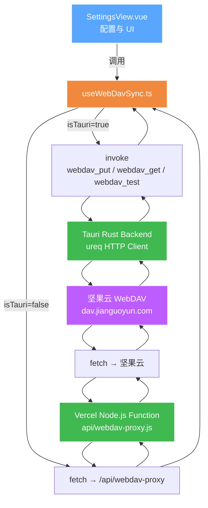
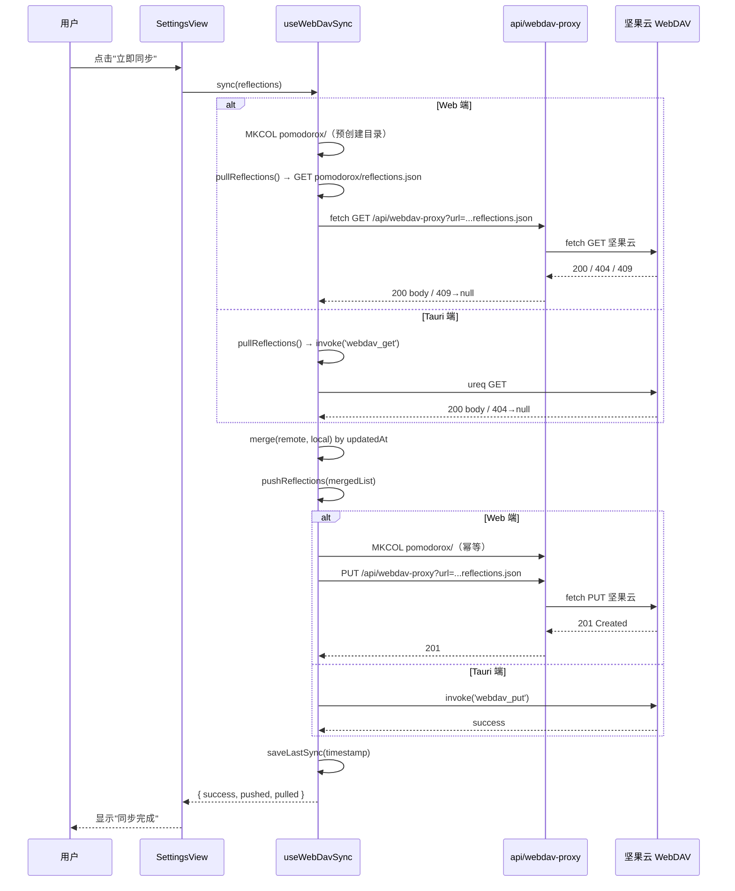

# WebDAV 同步模块架构文档

> **版本**: v1.0
> **日期**: 2026-05-05
> **模块路径**: `src/composables/useWebDavSync.ts`, `api/webdav-proxy.js`, `src/views/SettingsView.vue`
> **关联组件**: `ReflectionEditor`, `ReflectionDetailModal`

---

## 1. 架构概览

WebDAV 同步采用**双端适配**策略：
- **Tauri 桌面端**：直接调用 Rust 后端 HTTP 命令，无 CORS 限制
- **Web 浏览器端**：通过 Vercel Serverless Function 代理转发，绕过 CORS 与 Cloudflare CDN 拦截



---

## 2. 文件职责矩阵

| 文件 | 路径 | 核心职责 | 运行环境 |
|------|------|---------|---------|
| **useWebDavSync.ts** | `src/composables/useWebDavSync.ts` | 配置管理、双向同步逻辑、合并冲突、Tauri/Web 分支 | 前端通用 |
| **webdav-proxy.js** | `api/webdav-proxy.js` | CORS 代理、请求头透传、User-Agent 伪装、错误诊断 | Vercel Node.js |
| **lib.rs** | `src-tauri/src/lib.rs` | ureq HTTP 客户端、Basic Auth、PUT/GET/PROPFIND | Tauri 桌面端 |
| **SettingsView.vue** | `src/views/SettingsView.vue` | WebDAV 配置面板、连接测试、立即同步按钮 | 前端通用 |
| **vercel.json** | `vercel.json` | `/api/*` 路由排除 SPA rewrite | Vercel 部署 |

---

## 3. 数据流

### 3.1 同步流程



### 3.2 合并策略

- **基准**：以 `updatedAt` 时间戳为准，后写入者胜出
- **本地新增**：本地有、远程无 → 推送
- **远程新增**：远程有、本地无 → 拉取
- **冲突**：同一 `id` 两边都有 → 比较 `updatedAt`，取较新者

---

## 4. 配置模型

```typescript
interface WebDavConfig {
  url: string           // 服务器地址，如 https://dav.jianguoyun.com/dav/
  username: string      // 账号（坚果云为邮箱）
  password: string      // 密码（坚果云为应用密码）
  proxyUrl?: string     // 可选：自定义代理（未设置时使用同域名 /api/webdav-proxy）
}
```

- **持久化**：`localStorage` 键 `webdav-config`
- **上次同步时间**：`localStorage` 键 `webdav-last-sync`
- **远程文件路径**：`pomodorox/reflections.json`

---

## 5. 错误码映射

| 上游状态 | 处理方式 | 说明 |
|---------|---------|------|
| 200 | 正常返回 body | 文件存在，读取成功 |
| 201 | 正常 | PUT 创建成功 |
| 207 | 正常 | PROPFIND 多状态响应 |
| 401 | 提示用户检查密码 | 应用密码/登录密码错误 |
| 404 | 视为 `null` | 文件不存在，首次同步 |
| 409 | 视为 `null` / 忽略 | 目录不存在（坚果云特殊行为） |
| 502 | 代理 fetch 失败 | Vercel → 坚果云网络问题 |
| 520 | Cloudflare 拦截 | 已弃用 Cloudflare Worker 方案 |

---

## 6. 代理安全限制

`api/webdav-proxy.js` 只允许以下目标主机：

- `dav.jianguoyun.com`（坚果云）
- `webdav.yandex.com`
- `dav.box.com`

仅允许 HTTPS 协议。User-Agent 强制伪装为 Chrome 124，避免坚果云拒绝非浏览器客户端。

---

## 7. 与 Cloudflare Worker 方案的对比

| 维度 | Cloudflare Worker | Vercel API Route |
|------|------------------|------------------|
| 部署域 | workers.dev | 与主应用同域名 |
| CDN 冲突 | 与坚果云 Cloudflare CDN 冲突（520） | 无冲突 |
| 运行环境 | V8 Isolate | Node.js 18+ |
| body 处理 | 直接透传 | 需显式读取 Buffer |
| CORS | 手动设置 | 手动设置 |
| 当前状态 | ❌ 已弃用 | ✅ 在用 |

---

## 8. 后续扩展点

- **增量同步**：目前为全量 JSON 覆盖，可按日期拆分多文件减少传输
- **加密传输**：本地加密后再上传，密码派生密钥
- **自动同步**：设置定时器或页面可见性变化时自动触发
- **冲突 UI**：当两边 updatedAt 相同时，弹出 diff 对比让用户选择
