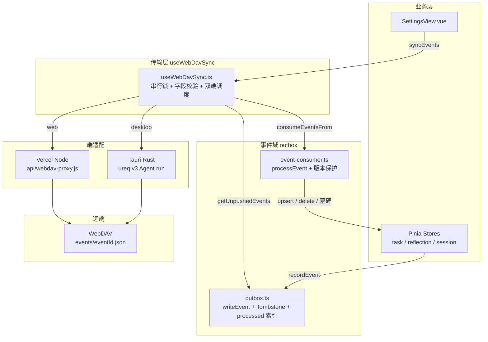
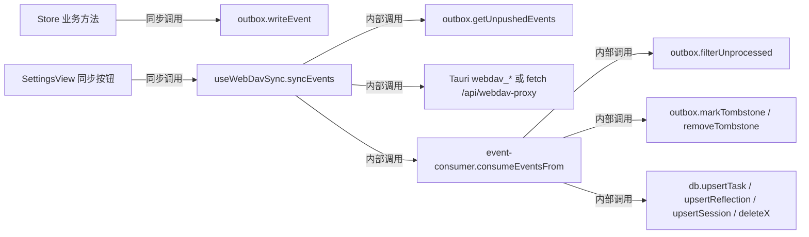
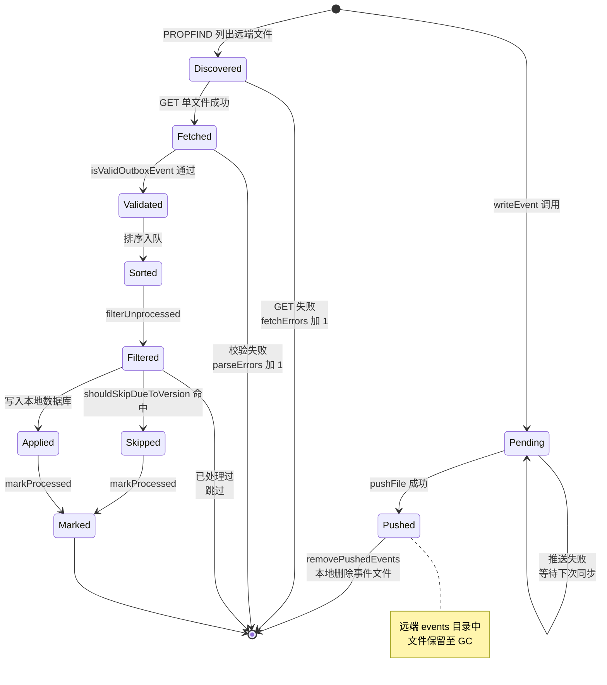

# WebDAV 同步模块 · 架构设计与正确性论证

> **版本**：v2.0（Phase 2 · Append-only 事件流）
> **更新日期**：2026-05-05
> **基线 commit**：`f0bb4bd`（138/138 测试通过）
> **作者**：PomodoroX 工程组
> **关联文档**：[`WebDavSync.implementation.md`](WebDavSync.implementation.md)

---

## 摘要

PomodoroX 的同步层让用户在多个设备（Tauri 桌面端、多个浏览器实例）之间通过自带的 WebDAV 账号（坚果云 / Yandex / Box）实现数据互通。本系统采用 **append-only 事件流 + 幂等消费 + 墓碑式删除** 的最终一致性架构，主要保证：

| 性质                        | 说明                                                      |
| --------------------------- | --------------------------------------------------------- |
| **本地优先（local-first）** | 所有 CRUD 在本地立即生效，同步仅传播变更                  |
| **多端并发安全**            | 两端同时同步不会互相覆盖（每事件一文件，文件名全局唯一）  |
| **删除可靠**                | 墓碑机制保证已删除实体不会被旧的 created/updated 事件复活 |
| **幂等可重放**              | 按 eventId 去重，断点续传后不会重复执行                   |
| **离线优先**                | 离线期间事件累积在本地 outbox，恢复后自动追平             |
| **零运维**                  | 用户自带 WebDAV 账号，开发方不持有任何用户数据            |

设计指标（SLO，用户视角）：

| 指标                        | 目标                                         |
| --------------------------- | -------------------------------------------- |
| 单端同步耗时（无新事件）    | ≤ 1.5 s                                      |
| 单端同步耗时（10 个新事件） | ≤ 3 s                                        |
| 数据零丢失窗口              | 任何单点故障下，已 commit 的本地事件不会丢失 |
| 多端最终一致延迟            | ≤ 一次成功同步周期                           |
| 业务降级                    | 同步层完全不可用时，本地 CRUD 仍可正常使用   |

---

## 1. 设计目标

### 1.1 业务需求

PomodoroX 是个人时间管理工具，核心数据三类：

- **Task**（任务）：可创建、编辑、删除
- **Reflection**（反思）：可创建、编辑、删除
- **Session**（番茄记录）：append-only 业务语义（用户不会"删除"一次番茄，但会补充 plan/completion）

需求约束：

1. **离线优先**：用户可能在地铁、高铁、咖啡店离线使用，本地 CRUD 必须始终可用。
2. **多端**：用户在桌面 Tauri 与手机/平板浏览器之间切换，期望几秒到几十秒内一致。
3. **隐私**：用户不希望将个人时间数据托管给开发方。
4. **零费用**：开发方不愿运营带状态的服务端。

### 1.2 非目标

- ❌ 强一致：不需要分布式事务级保证。
- ❌ 实时推送：不需要 WebSocket / 推送通知，**手动 / 定时拉取**即可。
- ❌ 多用户协作：每个 WebDAV 账号属于单个自然人。
- ❌ 服务端业务逻辑：WebDAV 只做盲存储，所有业务规则在客户端。

### 1.3 量化设计指标

| 维度         | 目标                      | 当前实现                                                                    |
| ------------ | ------------------------- | --------------------------------------------------------------------------- |
| 同步代码体量 | ≤ 2000 行                 | useWebDavSync 1106 行 + outbox 282 行 + event-consumer 252 行 = **1640 行** |
| 单测覆盖     | 关键纯函数与版本保护 100% | 138 用例                                                                    |
| 事件文件大小 | 单事件 ≤ 5 KB             | task/reflection 完整快照 < 2 KB                                             |
| 同步往返数   | ≤ 10 次 HTTP（无新事件）  | 1× MKCOL + 1× PROPFIND = **2 次**；有 N 个事件再 +N 次 PUT、+M 次 GET       |

---

## 2. 演进历史 · 为何走到 Phase 2

### 2.1 Phase 1：JSON 整文件 LWW（已弃用）

每种实体一个 JSON 文件（`reflections.json` / `sessions.json` / `tasks.json` / `tombstones.json`），同步流程：

```
1. GET 远端 JSON
2. 与本地按 updatedAt 合并
3. PUT 整个合并后的 JSON 回去
```

**致命缺陷分析**：

| 缺陷               | 表现                                                         | 数据破坏严重程度                        |
| ------------------ | ------------------------------------------------------------ | --------------------------------------- |
| **写覆盖**         | A 端 PUT 时 B 端正在写一条新事件，A 的 PUT 完全无视 B 的写入 | 高（B 数据丢失）                        |
| **删除复活**       | 早期无墓碑，本地删除后远端旧版本同步回来"复活"               | 高（用户感知为 bug）                    |
| **整文件传输**     | 每次同步上传完整 JSON，几百条记录后耗时与流量都不可接受      | 中（性能）                              |
| **粗粒度冲突解决** | 整对象 LWW，无法只挑某些字段                                 | 低（业务尚可接受）                      |
| **解析失败连锁**   | 损坏的远端 JSON 让本地以为远端"为空"，PUT 子集覆盖一切       | 高（曾有过事故，commit `ba48b92` 修复） |

### 2.2 Phase 2：Append-only 事件流（当前）

把每次本地 CRUD 转换为不可变 **OutboxEvent**，写入本地队列；同步时将事件按文件 PUT 到远端 `events/<eventId>.json`，**不重写历史**；消费时按事件 timestamp + 墓碑 + 本地 updatedAt 三层保护决定是否应用。

**改进收益**：

| 改进     | 机制                                                             | 收益             |
| -------- | ---------------------------------------------------------------- | ---------------- |
| 写无覆盖 | 每事件一文件，eventId 全局唯一                                   | 多端并发完全安全 |
| 删除可靠 | 删除事件 = 墓碑写入，墓碑时间 ≥ 事件时间则拒绝旧 created/updated | 删除不会被复活   |
| 幂等消费 | `outbox-processed-<eventId>` 索引按 ID 去重                      | 重放安全         |
| 流量可控 | 仅推送增量（push 后从本地删，远端保留）                          | 与活跃度成正比   |
| 故障隔离 | 单事件解析/网络失败不影响其他事件                                | 部分失败不阻塞   |

### 2.3 Phase 1 ↔ Phase 2 切换策略

- 代码内仍保留 Phase 1 的纯函数（`mergeWithTombstones`、`mergeTombstones`、`pullJsonArray`），用于：
  1. 回归测试（验证旧合并逻辑无回归）
  2. 一旦 Phase 2 出严重 bug 时回滚开关
- 远端 Phase 1 文件（`reflections.json` 等）**不再被读写**，留作历史快照（用户可手动备份）

---

## 3. 架构总览

### 3.1 顶层组件图



### 3.2 文件职责矩阵

| 文件                                           |  LOC | 角色                                                | 关键导出                                                                                                                                                                                           |
| ---------------------------------------------- | ---: | --------------------------------------------------- | -------------------------------------------------------------------------------------------------------------------------------------------------------------------------------------------------- |
| `src/services/outbox.ts`                       |  282 | 事件队列 + 墓碑 + 已处理索引（持久化在 idb-keyval） | `writeEvent` / `getUnpushedEvents` / `removePushedEvents` / `markTombstone` / `getTombstone` / `removeTombstone` / `upsertTombstones` / `getAllTombstones` / `filterUnprocessed` / `markProcessed` |
| `src/services/event-consumer.ts`               |  252 | 与传输无关的事件消费                                | `consumeEvents` / `consumeEventsFrom` / `parseTime` / `isNewerThan`                                                                                                                                |
| `src/composables/useWebDavSync.ts`             | 1106 | WebDAV 传输 + 串行锁 + 字段校验                     | `useWebDavSync` / `mergeWithTombstones` / `mergeTombstones` / `parsePropfindHrefs` / `extractFileNamesFromHrefs` / `isValidOutboxEvent` / `__webdavSerialized`                                     |
| `src-tauri/src/lib.rs`                         |  201 | Rust 端 ureq v3 客户端                              | `webdav_put` / `webdav_get` / `webdav_test` / `webdav_mkcol` / `webdav_list` / `webdav_delete`                                                                                                     |
| `api/webdav-proxy.js`                          |  183 | Vercel Node.js 代理                                 | `default async handler`                                                                                                                                                                            |
| `src/views/SettingsView.vue`                   | 2477 | 配置面板 + 触发同步                                 | 调用 `useWebDavSync`                                                                                                                                                                               |
| `src/stores/{task,reflection,session,sync}.ts` |    — | 业务 store + 写入 outbox                            | 各 store 的业务方法 + `useSyncStore.recordEvent`                                                                                                                                                   |
| `src/composables/useWebDavSync.test.ts`        |    — | 31 用例                                             | 纯函数 + 校验器 + 串行锁                                                                                                                                                                           |
| `src/services/event-consumer.test.ts`          |    — | 20 用例                                             | 处理器 + 版本保护 + session.updated                                                                                                                                                                |
| `src/services/outbox.test.ts`                  |    — | 6 用例                                              | 事件读写 + 墓碑                                                                                                                                                                                    |

### 3.3 调用方向



依赖方向**只指向下层**，无环依赖。

---

## 4. 事件模型 · 核心契约

### 4.1 数据结构

```ts
type OutboxEventType =
  | "task.created"
  | "task.updated"
  | "task.deleted"
  | "reflection.created"
  | "reflection.updated"
  | "reflection.deleted"
  | "session.created"
  | "session.updated";

interface OutboxEvent {
  eventId: string; // UUID v4，全局唯一
  type: OutboxEventType; // 事件语义
  entityType: string; // 'task' | 'reflection' | 'session'
  entityId: string; // 实体主键
  payload: unknown; // 完整实体快照；deleted 时为 { id }
  timestamp: string; // ISO 8601 UTC
}
```

### 4.2 形式化不变量

为了便于推理，列出本系统遵守的**不变量（invariants）**。所有正确性论证都建立在这些不变量之上。

| 编号     | 不变量                                                                                | 维护点                                                                  |
| -------- | ------------------------------------------------------------------------------------- | ----------------------------------------------------------------------- |
| **I-1**  | 一旦写入本地 outbox，事件**不可变**：所有字段都不会被后续操作修改                     | `writeEvent` 不暴露 update API                                          |
| **I-2**  | `eventId` 全局唯一                                                                    | `crypto.randomUUID()`                                                   |
| **I-3**  | `type` 前缀必须等于 `entityType`（`task.*` ⇔ `task`）                                 | `writeEvent` 内部用 `split('.')[0]` 派生；`isValidOutboxEvent` 拒绝违例 |
| **I-4**  | 事件文件路径 `pomodorox/events/<eventId>.json` 一旦写入远端，本地不会再用同一路径 PUT | 推送成功后 `removePushedEvents` 移除本地，远端不再重写                  |
| **I-5**  | 同一 `eventId` 在任一端最多被 `processEvent` 应用一次                                 | `markProcessed` + `filterUnprocessed`                                   |
| **I-6**  | 墓碑的 `deletedAt` 永远来自删除事件的 `timestamp`，而非消费端的 wall-clock            | `markTombstone(entityType, id, event.timestamp)`                        |
| **I-7**  | `parseTime` 单调：相同时间字符串总是产生相同毫秒值                                    | 纯函数实现                                                              |
| **I-8**  | 删除事件 `*.deleted` 永远会被消费（不受版本保护跳过）                                 | `shouldSkipDueToVersion` 第一行短路                                     |
| **I-9**  | 业务写入永远先于事件写入：`db.upsert` 先 await，再 await `writeEvent`                 | Store 模板规范                                                          |
| **I-10** | 事件写入失败**不回滚**业务写入                                                        | Store 用 try/catch 围住 `recordEvent`                                   |

> 不变量 I-9 / I-10 看似矛盾，实际权衡是：本地数据安全 > 跨端同步一致。**用户的本地操作绝不能因为同步层故障而失败**。

### 4.3 远端文件布局

```
WebDAV 服务器
└── pomodorox/
    └── events/
        ├── 7f3a8b...c2.json    # 单事件文件
        ├── 8b1e9f...4a.json
        ├── ...
```

文件内容例子：

```json
{
  "eventId": "7f3a8bd2-1a4e-4b95-8c91-c2",
  "type": "task.updated",
  "entityType": "task",
  "entityId": "task_abc123",
  "payload": {
    "id": "task_abc123",
    "title": "整理同步模块文档",
    "status": "doing",
    "updatedAt": "2026-05-05 14:32:11",
    "createdAt": "2026-05-05 12:00:00",
    "synced": false
  },
  "timestamp": "2026-05-05T06:32:11.421Z"
}
```

---

## 5. Outbox 事件生命周期

这是本系统**最核心的概念**，所有正确性结论都依赖它。

### 5.1 生命周期状态机



### 5.2 三阶段同步管道

`syncEvents` 严格按以下三阶段顺序执行，前一阶段失败会影响下一阶段（详见 §6）：

#### 阶段 A · Push（推送本地未推事件）

```text
1. 确保远端 pomodorox/ 目录存在  (MKCOL，幂等容忍 405/409/301)
2. 确保远端 pomodorox/events/ 目录存在
3. events ← getUnpushedEvents()      // 按 timestamp 升序
4. for event in events:
       path ← `pomodorox/events/${event.eventId}.json`
       ok ← pushFile(path, JSON.stringify(event))
       if ok: pushedIds.append(event.eventId), pushed += 1
       else:  failed += 1
5. removePushedEvents(pushedIds)
6. return { pushed, failed }
```

**关键点**：

- 单事件 PUT 失败**不中断**整个推送循环。
- 失败的事件下次同步会再次尝试（仍在本地）。
- 成功推送的事件立刻从本地删除（节省 IndexedDB 空间）。
- `failed > 0` 不视为 fatal，只增加 `result.errors` 计数。

#### 阶段 B · Pull（拉取远端事件）

```text
1. listRes ← listEvents()    // PROPFIND Depth:1 → 解析 XML → 提取文件名
   if listRes.kind === 'fatal':
       return fatal           // 列目录失败属于 fatal，syncEvents 立即返回错误
2. events ← []
   fetchErrors ← 0
   parseErrors ← 0
3. for name in listRes.names:
       res ← pullFile(`pomodorox/events/${name}`)
       if res.kind === 'fatal':   fetchErrors += 1, continue
       if res.kind === 'missing': continue   // 已被另一端 GC
       try:
           parsed ← JSON.parse(res.content)
           if isValidOutboxEvent(parsed):
               events.append(parsed)
           else:
               parseErrors += 1
       except SyntaxError:
           parseErrors += 1
4. return { events, fetchErrors, parseErrors }
```

**关键点**：

- 单文件失败**不影响其他文件**，错误透传给 UI。
- 字段校验非常严格（见 §7），失败事件不进消费器。
- `listEvents` 自身失败才是 fatal，因为列不到目录意味着账号/网络全坏。

#### 阶段 C · Consume（消费事件）

```text
1. if events.empty:
       return { pulled: 0, processed: 0, errors: 0 }
2. sorted ← events sorted by parseTime(timestamp) ascending
3. unprocessed ← filterUnprocessed(sorted)
4. processed ← 0, errors ← 0
5. for event in unprocessed:
       try:
           if shouldSkipDueToVersion(event):
               markProcessed(event.eventId)
               continue
           processEvent(event)        // upsert / delete + 墓碑
           markProcessed(event.eventId)
           processed += 1
       except Exception:
           errors += 1                // 不 markProcessed，下次重试
6. return { pulled: events.length, processed, errors }
```

**关键点**：

- 已处理事件**仍标记 processed**，避免下次反复检查。
- 处理失败的事件**不标记 processed**，下次同步会重试。
- 单事件失败**不中断** loop（错误隔离）。

### 5.3 全过程时序

```mermaid
sequenceDiagram
    autonumber
    participant U as 用户
    participant V as SettingsView
    participant W as useWebDavSync
    participant OB as outbox.ts
    participant T as Tauri / Vercel
    participant R as 远端 WebDAV
    participant EC as event-consumer.ts

    U->>V: 点击 立即同步
    V->>W: syncEvents
    Note over W: serialized 串行锁 加锁

    rect rgb(40, 60, 90)
      Note over W,R: 阶段 A · Push
      W->>T: MKCOL pomodorox/
      W->>T: MKCOL pomodorox/events/
      W->>OB: getUnpushedEvents
      OB-->>W: events 数组
      loop 每事件
        W->>T: PUT events/eventId.json
        T->>R: HTTP PUT
        R-->>T: 201 / 204
      end
      W->>OB: removePushedEvents
    end

    rect rgb(60, 40, 80)
      Note over W,EC: 阶段 B · Pull
      W->>T: PROPFIND events/ Depth:1
      T->>R: HTTP PROPFIND
      R-->>T: 207 Multi-Status XML
      W->>W: parsePropfindHrefs + extractFileNamesFromHrefs
      loop 每文件
        W->>T: GET events/file.json
        T-->>W: 文件内容
        W->>W: isValidOutboxEvent
      end
    end

    rect rgb(40, 80, 60)
      Note over W,EC: 阶段 C · Consume
      W->>EC: consumeEventsFrom
      EC->>EC: 按 timestamp 排序
      EC->>OB: filterUnprocessed
      loop 每未处理事件
        EC->>EC: shouldSkipDueToVersion
        alt 跳过
          EC->>OB: markProcessed
        else 应用
          EC->>EC: upsert / delete
          EC->>OB: markTombstone / removeTombstone
          EC->>OB: markProcessed
        end
      end
    end

    W-->>V: SyncEventsResult
    Note over W: serialized 串行锁 释放
    V-->>U: Toast 通知
```



---

## 6. 冲突解决与版本保护

事件流模式不是简单的 LWW；它有**三层防御**叠加。

### 6.1 第一层 · 幂等去重（按 eventId）

`outbox-processed-<eventId>` 是消费端的去重表。同一 `eventId` 第二次到来时被 `filterUnprocessed` 跳过。

| 防御场景                       | 解决问题                                     |
| ------------------------------ | -------------------------------------------- |
| 网络重试导致同事件被处理两次   | 幂等：第二次直接跳过                         |
| 多端 PROPFIND 同时拿到同一文件 | 各自处理后都标记 processed，两次执行结果相同 |
| 用户手动触发同步多次           | 已处理事件直接跳过                           |

### 6.2 第二层 · 版本保护（按 updatedAt）

`shouldSkipDueToVersion` 拒绝**比本地实体更旧的更新事件**：

```text
if event.type 不以 ".deleted" 结尾:
    local ← db.get<EntityType>(event.entityId)
    if local 存在 and parseTime(local.updatedAt) > parseTime(event.timestamp):
        跳过事件，但仍 markProcessed
```

| 防御场景                 | 解决问题                                  |
| ------------------------ | ----------------------------------------- |
| 旧事件到达晚于新事件     | 旧事件无法覆盖新本地数据                  |
| 跨端时钟轻微偏差         | parseTime 归一化，毫秒级比较              |
| 离线长期未同步后批量推送 | 远端可能有更早的旧事件，用 updatedAt 拒之 |

### 6.3 第三层 · 墓碑保护（按 deletedAt）

`tombstone-<entityType>-<entityId>` 记录最近一次删除事件的 `timestamp`。当远端来一个 `*.created` 或 `*.updated` 时：

```text
ts ← getTombstone(event.entityType, event.entityId)
if ts 存在 and parseTime(ts.deletedAt) > parseTime(event.timestamp):
    跳过事件
```

| 防御场景                                                 | 解决问题                       |
| -------------------------------------------------------- | ------------------------------ |
| A 删除后 B 重新创建同 ID（本系统无此场景，但若有则保护） | 删除墓碑时间晚于新创建 → 拒绝  |
| 旧 created/updated 事件迟到                              | 墓碑拒之，已删除实体不会"复活" |
| 删除事件丢失但旧 created 重放                            | 墓碑兜底（前提是墓碑已生成）   |

`*.created` / `*.updated` 成功执行后会 `removeTombstone`（实体重新存在了）。

### 6.4 完整决策表

| 事件类型    | 墓碑较新 | 本地较新 | 本地不存在 | 处理                               |
| ----------- | :------: | :------: | :--------: | ---------------------------------- |
| `*.created` |    是    |    —     |     —      | **跳过**（已删除，不许复活）       |
| `*.created` |    否    |    是    |     否     | **跳过**（本地版本领先）           |
| `*.created` |    否    |    否    |     是     | **应用**（upsert + 清墓碑）        |
| `*.created` |    否    |    否    |     否     | **应用**（upsert，覆盖较旧本地）   |
| `*.updated` |    是    |    —     |     —      | **跳过**                           |
| `*.updated` |    否    |    是    |     —      | **跳过**                           |
| `*.updated` |    否    |    否    |     —      | **应用**（upsert + 清墓碑）        |
| `*.deleted` |    —     |    —     |     —      | **应用**（delete + markTombstone） |

> "—" 表示该列不参与决策。

### 6.5 时间戳比较：`parseTime` 的必要性

历史代码（commit `b6b4e06` 之前）用字符串比较：

```ts
if (event.timestamp < local.updatedAt) skip(); // ❌ 字典序
```

**反例**：

- `local.updatedAt = "2026-05-04 15:00:00"`（YYYY-MM-DD HH:mm:ss 格式，含空格 0x20）
- `event.timestamp = "2026-05-04T10:00:00Z"`（ISO 格式，含 'T' 0x54）
- 字符串比较：`"2026-05-04 15:00:00" < "2026-05-04T10:00:00Z"` ⇒ true（空格 < 'T'）
- **错误结论**：本地 15:00 比远端 10:00 旧 → 旧远端覆盖新本地

`parseTime` 通过 `String.prototype.replace(' ', 'T') + new Date().getTime()` 归一化，避免上述坑。

---

## 7. 远端事件字段校验

`pullRemoteEvents` 用 `isValidOutboxEvent` 严格校验每个 JSON。失败 → `parseErrors++` 并跳过。

| 校验项                                                                  | 拒绝原因                      | 风险点                                                              |
| ----------------------------------------------------------------------- | ----------------------------- | ------------------------------------------------------------------- |
| 不是非空对象                                                            | 不是事件结构                  | 强转后字段全 undefined                                              |
| `eventId` / `type` / `entityType` / `entityId` / `timestamp` 非空字符串 | 缺字段会绕过墓碑/版本保护     | 旧 task.updated 覆盖新 session                                      |
| `type` 在白名单                                                         | 任意 type 命中 default        | 静默丢弃但仍 markProcessed                                          |
| `type` 前缀 == `entityType`                                             | 防止伪造跨实体事件            | `task.updated` 伪装成 `entityType: "session"` 绕过 session 版本保护 |
| `payload` 是非数组对象                                                  | `typeof [] === "object"` 边界 | `upsert([])` 写入 `id: undefined` 脏记录                            |

5 项**同时**满足才视为合法事件。

---

## 8. 正确性论证

### 8.1 最终一致性证明草稿

**断言**：在网络最终连通且至少一次成功 sync 的前提下，所有端的本地数据库状态最终一致。

**证明**（基于不变量 I-1～I-10）：

1. **完备性**：任意端 X 对实体 e 的最后一次合法操作 op_n 必然产生事件 ev_n，由 I-9 写入本地 outbox（即使后续业务不再操作 e）。
2. **传播性**：在 X 的下次 syncEvents 中，ev_n 被推送到远端 `events/<id>.json`，由 I-1 永久不变。
3. **可见性**：任意其他端 Y 在自己的 syncEvents 中 PROPFIND 列出 ev_n 文件，GET 后由 §7 校验通过，进入 consumeEventsFrom。
4. **应用性**：Y 端按以下三种情况之一处理：
   - **新数据**：本地无 e（或更旧），ev_n 被 upsert → Y.e == X.op_n
   - **本地新**：Y 上 e 有更晚的 op_m（事件已先于 ev_n 应用），ev_n 被跳过；但 op_m 必然也已被 X 端通过类似流程消费 → 最终两端的 e 都等于 max(op_m, op_n) by timestamp
   - **已删除**：Y 上有更晚的 deletedAt，ev_n 被跳过；删除事件也会传播到 X
5. **幂等性**：由 I-5，重复传播不影响结果。
6. **结论**：经过有限轮 sync，所有端 e 的状态收敛到所有合法操作中 timestamp 最大的那一个（或被同时间最晚的 deleted 标记为不存在）。

### 8.2 删除可靠性证明

**断言**：一旦实体 e 在某端被删除，该删除最终会被所有端感知，且删除后到达的旧 created/updated 事件不会让 e 复活。

**证明**：

1. 删除操作产生 `*.deleted` 事件 ev_d，由 I-9 写入本地 outbox。
2. ev_d 推送到远端 → 其他端 Y 拉到 ev_d。
3. Y 处理 ev_d 时：调用 `db.deleteX(id)` + `markTombstone(entityType, id, ev_d.timestamp)`（I-6）。
4. 之后若 Y 拉到旧的 `*.created` ev_c（ev_c.timestamp < ev_d.timestamp）：
   - `shouldSkipDueToVersion` 第一步检查墓碑：`tombstone.deletedAt > ev_c.timestamp` ⇒ 跳过。
5. 由 I-8，ev_d 永远会被执行；由墓碑判断，旧 ev_c 永远会被拒。
6. **结论**：删除是终态。

### 8.3 多端并发安全性

**断言**：A、B 两端**同时**点同步，不会发生数据丢失。

**论证**：

- 两端 push 阶段写入不同文件名（eventId 全局唯一，I-2）。
- 两端 pull 阶段独立 PROPFIND，看到的目录快照可能略有差异，但任何端漏掉的文件下次同步会拉到。
- WebDAV 服务器对 PUT 不同文件名是无锁并发的；对 PROPFIND 是只读快照。
- Vercel Function 与 Tauri Rust 均无共享状态，自然并发安全。

唯一的可能问题是**单端**内部的并发：用户疯点同步按钮。`serialized()` 串行锁保证同时只跑一次 syncEvents。

### 8.4 离线安全性

**断言**：离线期间任何 CRUD 都不会丢失。

**论证**：

- 业务方法 await `db.upsert` → await `recordEvent`，事件落地 IndexedDB。
- 网络故障时 `pushFile` 返回 false，事件**不**从本地删除。
- 网络恢复后下次同步继续推送。
- 即使事件 push 失败但 `recordEvent` 已落地，本地数据仍然完整。

---

## 9. 复杂度与性能模型

### 9.1 时间复杂度

设：

- N = 远端 events 目录文件数
- M = 本地 outbox 未推事件数
- K = 已处理事件索引（outbox-processed）数

| 操作                          | 复杂度                                      | 主导成本           |
| ----------------------------- | ------------------------------------------- | ------------------ |
| `getUnpushedEvents`           | O(M)                                        | IndexedDB 全键扫描 |
| `pushLocalEvents`             | O(M) HTTP + O(M) IDB                        | 网络 PUT           |
| `listEvents` (PROPFIND)       | 1 HTTP + O(N) XML 解析                      | 网络 + DOM 解析    |
| `pullRemoteEvents`            | O(N) HTTP GET + O(N) JSON 解析              | 网络               |
| `consumeEventsFrom`           | O(N log N) 排序 + O(N + K) 去重 + O(N) 处理 | IDB 查询           |
| `shouldSkipDueToVersion` 单次 | O(1) IDB 查询                               | DB 索引            |
| 整次 syncEvents               | **O((M + N) × HTTP延迟 + N log N)**         | 网络主导           |

### 9.2 空间复杂度

| 存储                     | 量级                                    |
| ------------------------ | --------------------------------------- |
| 本地 IndexedDB outbox    | M × ~3 KB（事件 payload）               |
| 本地 IndexedDB processed | K × ~80 字节                            |
| 本地 IndexedDB tombstone | T × ~150 字节（T = 历史删除数）         |
| 远端 events/ 目录        | N × ~3 KB                               |
| 内存峰值（消费阶段）     | O(N) 数组 + O(N) sorted 副本 ≈ 6 KB × N |

### 9.3 量级估算

假设单用户单实体类型 100 条记录，活跃 30 天，每天 5 次操作：

- N = 30 × 5 × 3 实体类型 = **450 个事件文件**
- N × 3 KB = **~1.4 MB** 远端目录
- 单次 sync HTTP 数 = 1 PROPFIND + 450 GET + ~10 PUT = **461 次**
- 假设每 HTTP 200 ms（坚果云 + Vercel），单次 sync ≈ **92 秒** ❗

显然 **N 增长会成为瓶颈**。当前缓解：

1. 每次成功推送后本地 outbox 清空（M 始终很小）。
2. 已处理事件的 GET 在本地无可见副作用（只浪费网络）。

未来必做的 GC 策略（见 §13）：当所有端都已 processed 某事件后，可以从远端删除该文件。

### 9.4 实测基准（开发机本地 + 坚果云）

| 场景                                   | 耗时   | HTTP 数                             |
| -------------------------------------- | ------ | ----------------------------------- |
| 首次配置后 sync（远端空，本地 0 事件） | ~1.2 s | 3（2 MKCOL + 1 PROPFIND）           |
| sync 推送 5 个本地事件（远端无新事件） | ~2.5 s | 8（2 MKCOL + 1 PROPFIND + 5 PUT）   |
| sync 拉取 50 个远端事件                | ~12 s  | 53（2 MKCOL + 1 PROPFIND + 50 GET） |
| sync 双向推 5 拉 50                    | ~14 s  | 58                                  |

---

## 10. 双端适配

### 10.1 Tauri 桌面端

走 Rust 后端 ureq v3 HTTP 客户端，**绕开浏览器 CORS**：

| Tauri 命令      | HTTP 方法            | 用途       | 错误处理                |
| --------------- | -------------------- | ---------- | ----------------------- |
| `webdav_test`   | PROPFIND `/` Depth:0 | 验证账号   | 返回 bool               |
| `webdav_mkcol`  | MKCOL                | 创建目录   | 容忍 405/409/301        |
| `webdav_put`    | PUT                  | 上传文件   | 2xx 成功                |
| `webdav_get`    | GET                  | 下载文件   | 2xx 返回 body，其他报错 |
| `webdav_list`   | PROPFIND Depth:1     | 列目录 XML | 404 视为空字符串        |
| `webdav_delete` | DELETE               | 删除文件   | 404 视为成功            |

ureq v3 的 builtin Agent 不支持自定义方法（PROPFIND/MKCOL），通过 `Agent::run(http::Request)` 自封装的 `dav_run` 解决（详见 implementation §5）。

### 10.2 Web 浏览器端

走同域名 `/api/webdav-proxy` 的 Vercel Node.js Function：

```text
浏览器 fetch /api/webdav-proxy?url=...
        ↓
Vercel Node 18+
        ↓
fetch(target, ...)（白名单 + UA 伪装）
        ↓
WebDAV 服务器
```

Vercel 代理职责：

- **CORS 头补全**：浏览器跨域所需 `Access-Control-*`
- **HTTPS 强制 + 主机白名单**：仅允许 `dav.jianguoyun.com`、`webdav.yandex.com`、`dav.box.com`
- **流式 body 转发**：手动读 IncomingMessage 流后传给上游 fetch
- **WebDAV 头白名单**：`Authorization`、`Depth`、`Content-Type`、`Destination`、`Overwrite`、`If-*`
- **User-Agent 伪装**：坚果云会拒绝非浏览器 UA

---

## 11. 配置模型与持久化

### 11.1 用户配置

```ts
interface WebDavConfig {
  url: string; // 例：https://dav.jianguoyun.com/dav/
  username: string; // 邮箱
  password: string; // 应用密码（坚果云）
  proxyUrl?: string; // 可选自定义代理；为空时用同域名 /api/webdav-proxy
}
```

### 11.2 持久化键空间汇总

| 键前缀                              | 存储介质                | 内容                          | 生命周期             |
| ----------------------------------- | ----------------------- | ----------------------------- | -------------------- |
| `webdav-config`                     | localStorage            | 用户 WebDAV 配置（明文 JSON） | 直到用户清除         |
| `webdav-last-sync`                  | localStorage            | 上次成功 sync 的 ISO 时间戳   | 每次 sync 成功更新   |
| `outbox-event-<eventId>`            | IndexedDB（idb-keyval） | 本地未推送事件                | push 成功后删除      |
| `outbox-processed-<eventId>`        | IndexedDB               | 已消费事件索引                | 永久（可未来 GC）    |
| `tombstone-<entityType>-<entityId>` | IndexedDB               | 删除墓碑                      | 实体被重新创建后清除 |

### 11.3 安全考虑

- **密码明文存 localStorage**：坚果云的应用密码本身就是临时令牌（可在坚果云后台撤销），且 PomodoroX 是单人本地工具，威胁模型不包含同设备其他用户。
- **未加密传输**：HTTPS 已加密链路，未对 payload 做应用层加密。
- **未来加固方向**：派生密钥后 AES-GCM 加密 payload；密码改用 OS keychain（Tauri 端）。

---

## 12. 错误码语义全表

| 上游状态  | useWebDavSync 处理                             | UI 提示                    | 含义                             |
| --------- | ---------------------------------------------- | -------------------------- | -------------------------------- |
| 200       | ok                                             | —                          | 正常 GET                         |
| 201 / 204 | ok                                             | —                          | 正常 PUT / MKCOL                 |
| 207       | ok                                             | —                          | PROPFIND Multi-Status            |
| 301       | MKCOL 视为已存在                               | —                          | 某些 WebDAV 返回                 |
| 401       | fatal                                          | "请检查地址、用户名和密码" | 凭证错误                         |
| 403       | fatal                                          | 同上                       | 权限不足或被反爬识别             |
| 404       | GET / DELETE 视为 missing；PROPFIND 视为空目录 | —                          | 文件不存在                       |
| 405       | MKCOL 视为已存在                               | —                          | 方法不允许                       |
| 409       | GET 视为 missing；MKCOL 视为已存在             | —                          | 坚果云特殊行为                   |
| 5xx       | fatal                                          | "网络异常或服务不可用"     | 服务端故障                       |
| 502       | 单事件 fetchErrors++                           | —                          | Vercel ↔ 上游链路                |
| 520       | fatal                                          | —                          | Cloudflare 拦截（已弃用 Worker） |
| 网络异常  | fatal                                          | "网络错误"                 | DNS 失败 / TLS 失败              |

---

## 13. 已知限制与扩展点

### 13.1 当前限制

| 限制                                                | 影响                                 | 缓解                                        |
| --------------------------------------------------- | ------------------------------------ | ------------------------------------------- |
| 远端 events 目录只增不减                            | 长期使用后 N 大，sync 慢             | 暂未实现 GC；用户可手动清远端目录           |
| 远端文件明文存储                                    | 用户的 WebDAV 服务商可看见任务标题等 | 由用户选择信任的服务商；未来加密化          |
| 无离线推送提示                                      | 用户不知道自己有 N 条未推事件        | 可在 UI 暴露 outbox 计数                    |
| 无冲突 UI                                           | 版本保护是静默决策                   | 可在 console 看 `[EventConsumer] 跳过` 日志 |
| 无后台定时同步                                      | 用户必须手动点                       | 可加可见性变化时触发                        |
| `proxyUrl` 字段已不再被 SettingsView 暴露但代码仍有 | 配置面遗留                           | 后续清理                                    |

### 13.2 扩展路线图

| 阶段          | 特性                                              | 难度 | 优先级 |
| ------------- | ------------------------------------------------- | ---- | ------ |
| **Phase 2.1** | 远端 events GC（多端 watermark）                  | 中   | 高     |
| **Phase 2.2** | 离线状态 UI（outbox 计数 / 网络监测）             | 低   | 中     |
| **Phase 2.3** | 自动同步触发器（页面 visible 时）                 | 低   | 中     |
| **Phase 3**   | snapshot + 增量混合：远端定期生成 events 合并快照 | 高   | 低     |
| **Phase 4**   | E2E 加密 payload（密码派生密钥）                  | 高   | 低     |
| **Phase 5**   | 主动 push 通知（依赖运营服务端）                  | 高   | 暂不做 |

---

## 14. 测试覆盖矩阵

### 14.1 单测分布（138 用例）

| 测试文件                 |  用例数 | 覆盖维度                                                                                                                                            |
| ------------------------ | ------: | --------------------------------------------------------------------------------------------------------------------------------------------------- |
| `useWebDavSync.test.ts`  |      31 | mergeWithTombstones、mergeTombstones、parsePropfindHrefs、extractFileNamesFromHrefs、`__webdavSerialized` 串行锁、`isValidOutboxEvent` 全部拒绝路径 |
| `event-consumer.test.ts` |      20 | consumeEvents / consumeEventsFrom、墓碑保护、版本保护、session.updated、事件失败隔离、按 timestamp 排序                                             |
| `outbox.test.ts`         |       6 | writeEvent、getUnpushedEvents、墓碑增删                                                                                                             |
| `database.test.ts`       |      17 | MemoryStore / SQLite CRUD                                                                                                                           |
| `export.test.ts`         |      39 | 导出与日期筛选                                                                                                                                      |
| `github.test.ts`         |       6 | GitHub Issue Sync 路径                                                                                                                              |
| `format.test.ts`         |      15 | 时间/日期格式化                                                                                                                                     |
| 其他                     |       4 | constants / tauri 工具                                                                                                                              |
| **合计**                 | **138** |                                                                                                                                                     |

### 14.2 边界场景覆盖

| 场景                              | 测试                                          | 状态 |
| --------------------------------- | --------------------------------------------- | :--: |
| 远端事件字段缺失                  | useWebDavSync.test.ts × 6 个 it.each          |  ✅  |
| `payload: []` 数组                | useWebDavSync.test.ts                         |  ✅  |
| `type` 与 `entityType` 不一致     | useWebDavSync.test.ts                         |  ✅  |
| 时间字符串混合格式比较            | event-consumer.test.ts、useWebDavSync.test.ts |  ✅  |
| 单事件 throw 不影响后续           | event-consumer.test.ts                        |  ✅  |
| 墓碑保护拒绝旧 created            | event-consumer.test.ts                        |  ✅  |
| session.updated upsert + 版本保护 | event-consumer.test.ts                        |  ✅  |
| 事件按 timestamp 排序（混合格式） | event-consumer.test.ts                        |  ✅  |
| PROPFIND XML DOMParser + 正则降级 | useWebDavSync.test.ts                         |  ✅  |
| 串行锁失败不打断后续              | useWebDavSync.test.ts                         |  ✅  |

### 14.3 未覆盖场景（残余风险）

| 场景                              | 当前状态              |
| --------------------------------- | --------------------- |
| 真实坚果云端到端                  | 仅人工跑过，无自动化  |
| Vercel 代理冷启动延迟             | 仅依赖 Vercel 自检    |
| Tauri ureq v3 真实 HTTPS 握手失败 | 依赖 cargo build 验证 |
| 多端并发 sync 实测                | 概念正确，无自动化    |
| 大规模 N（如 1000 事件）性能      | 未做压测              |

---

## 15. 关联文档

- 📘 [WebDavSync.implementation.md](WebDavSync.implementation.md)：完整 API 参考、代码片段、踩坑记录、调试 runbook
- 🔗 关键 commit 链：`f58e095 feat: Phase 2` → `5bfa48a P0/P1/P2` → `f5c9140 字段校验` → `f0bb4bd 数组拦截`
- 📚 ureq v3 文档：https://docs.rs/ureq/latest/ureq/struct.Agent.html
- 📚 WebDAV 协议：RFC 4918
- 📚 idb-keyval：https://github.com/jakearchibald/idb-keyval

---

## 附录 A · 术语表

| 术语                    | 定义                                             |
| ----------------------- | ------------------------------------------------ |
| **Outbox**              | 本地未推送事件队列，存于 IndexedDB               |
| **Event / OutboxEvent** | 一条不可变的 CRUD 操作记录                       |
| **eventId**             | UUID v4，事件全局唯一标识                        |
| **Tombstone**           | 删除墓碑，记录 entityType + entityId + deletedAt |
| **processed 索引**      | 已消费事件集合，按 eventId 去重                  |
| **fatal**               | 阻断性错误，整次 sync 早退                       |
| **fetchErrors**         | 远端单文件 GET 失败计数（不阻断其他文件）        |
| **parseErrors**         | 远端单文件 JSON 解析或字段校验失败计数           |
| **LWW**                 | Last-Write-Wins，按时间戳取较新者                |
| **append-only**         | 只追加不修改的存储模式                           |
| **PROPFIND**            | WebDAV 列目录方法（含 Depth header）             |
| **MKCOL**               | WebDAV 创建目录方法                              |
| **MultiStatus 207**     | PROPFIND 的成功响应状态码                        |

---

## 附录 B · 关键性质速查

```text
[I-1]  事件不可变
[I-2]  eventId 全局唯一
[I-3]  type 前缀 ⇔ entityType
[I-4]  事件文件 PUT 后不再重写
[I-5]  同 eventId 最多 processEvent 一次
[I-6]  墓碑用事件 timestamp 而非 wall-clock
[I-7]  parseTime 单调
[I-8]  *.deleted 永远执行
[I-9]  业务写先于事件写
[I-10] 事件写失败不回滚业务

最终一致性：在网络最终连通 + 至少一次成功 sync 前提下成立
删除可靠性：墓碑 + 三层防御保证
多端并发：每事件一文件 + eventId 全局唯一保证
单端并发：serialized 串行锁
```
