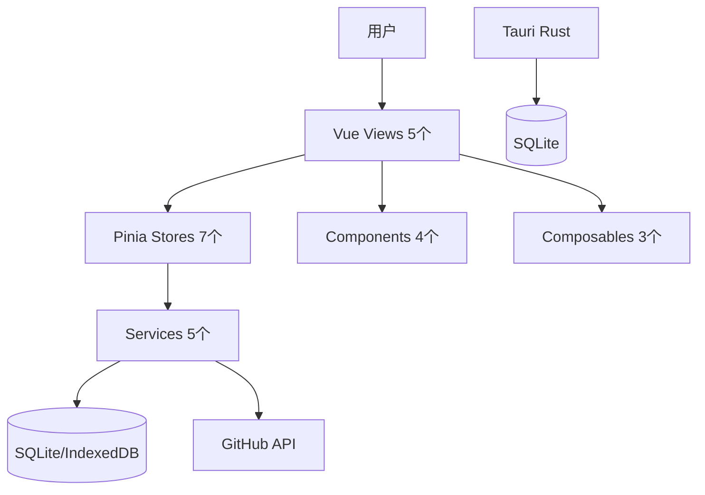
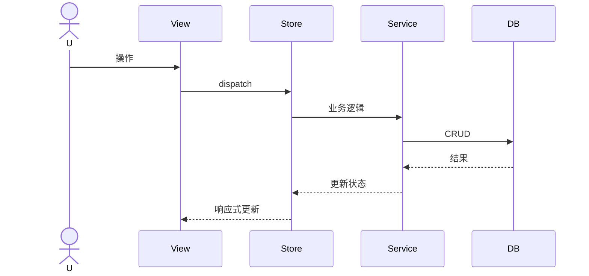

# PomodoroX 项目状态报告

> 生成时间: 2026-05-04 | 项目: `E:\Development\MyAwesomeApp\potodoroX`

---

## 一、概览

| 属性 | 值 |
|------|-----|
| 名称 | PomodoroX |
| 前端 | Vue 3.5.33 + TS + Vite 8.0.10 + Tailwind v4 |
| 状态 | Pinia 3.0.4 |
| 桌面 | Tauri v2 + SQLite + Store + Notification + Dialog + FS |
| 测试 | Vitest 3.0.0 + happy-dom |
| 包管理 | pnpm |

---

## 二、架构

---

## 三、模块状态

### 番茄计时器 (TimerView.vue ~57KB)
- 环形进度条, 动态背景, 音效, 通知, 粒子动画: 完成
- 时间戳防节流: 完成
- 自由模式 UI 入口: **缺失**
- 完成检测竞态: **问题**

### 任务管理 (TasksView.vue ~78KB)
- 列表视图, CRUD, 筛选: 完成
- 看板视图: **无拖拽**
- 日历热力图: **数据逻辑错误** (用 updatedAt 非 sessions)
- 内联编辑 ref: **绑定错误**
- 拖拽排序/批量操作: **缺失**

### 反思日志 (ReflectionsView.vue ~33KB)
- Markdown 编辑预览, 心情, 模板: 完成
- 自动保存: **仅心情/模板切换触发，内容输入无自动保存**
- XSS: **v-html 未过滤**

### 统计 (StatsView.vue ~40KB)
- 卡片, SVG 图表, 导出: 完成
- 完成率算法: **统计创建任务而非完成任务**
- 越层访问 DB: **直接 import db**

### 设置 (SettingsView.vue ~48KB)
- GitHub 配置, 主题切换, 导入导出: 完成
- 滑块高频保存: **无 debounce**
- Token 明文: **未加密**
- 数据清除: **仅清 localStorage，SQLite 保留**

### 全局
- 导航, 搜索, Toast, 快捷键, SW: 完成
- 响应式断点: **不统一**
- 骨架屏/撤销: **缺失**

---

## 四、Store 矩阵

| Store | 职责 | 依赖 | 问题 |
|-------|------|------|------|
| `app.ts` | 全局状态/Toast/搜索/沉浸 | 无 | 无 |
| `timer.ts` | 计时器核心 | session, settings | 内部状态非 ref; 循环依赖 hack |
| `task.ts` | 任务 CRUD + 筛选 | sync, db | filteredTasks 被视图架空 |
| `reflection.ts` | 反思 CRUD + 筛选 | sync, db | 无 |
| `session.ts` | 会话数据统一管理 | sync, db | 新增，消除越层访问 |
| `sync.ts` | GitHub 同步 + Outbox | github, outbox | 无 |
| `settings.ts` | 配置持久化 | 无 | watch + updateSetting 双触发保存 |

---

## 五、技术债务

### 高
1. 计时器完成检测竞态 (TimerView)
2. 看板无拖拽 (TasksView)
3. XSS v-html (ReflectionsView)
4. Token 明文存储 (SettingsView)
5. 导入无事务 (SettingsView)
6. TimerStore tick 竞态锁

### 中
7. Store 循环依赖 hack (timer.ts)
8. 筛选逻辑重复 (task.ts vs TasksView)
9. 越层访问 DB (StatsView)
10. 非响应式内部状态 (timer.ts)
11. 直接修改 store state (TimerView)
12. 颜色硬编码全局
13. 响应式断点混乱
14. 测试覆盖率未知

### 低
15. SettingsStore 重复保存
16. StatsView 无数据缓存
17. 缺少错误边界

---

## 六、README 差距

| 承诺 | 实际 |
|------|------|
| 环境音效 | 仅提示音，无白噪音 |
| 全局搜索 Ctrl+K | GlobalSearch.vue 已实现 |
| 快捷键 Ctrl+1~5 | useKeyboard.ts 已实现 |
| 自由计时器 UI | TIMER_MODES 定义 free，无切换控件 |
| 自定义主题 | THEMES 有 custom，无配色面板 |

---

## 七、文件规模

| 文件 | 行数/大小 |
|------|-----------|
| TimerView.vue | ~57KB |
| TasksView.vue | ~78KB |
| ReflectionsView.vue | ~33KB |
| StatsView.vue | ~40KB |
| SettingsView.vue | ~48KB |
| database.ts | ~38KB |
| github.ts | ~18KB |
| export.ts | ~13KB |
| sync.ts | ~11KB |
| timer.ts | ~11KB |
| task.ts | ~8KB |
| style.css | ~12KB |

---

## 八、测试

- Vitest 配置完成，环境 happy-dom
- 测试文件: `database.test.ts`, `event-consumer.test.ts`, `export.test.ts`, `github.test.ts`, `outbox.test.ts`, `constants.test.ts`, `format.test.ts`, `tauri.test.ts`
- 覆盖率: 未运行，状态未知

---

## 九、构建与部署

| 脚本 | 状态 |
|------|------|
| `pnpm dev` | Vite 开发服务器 port 1420 |
| `pnpm build` | Tauri 桌面构建 |
| `pnpm build:web` | Web 构建 (dist-web) |
| `pnpm typecheck` | vue-tsc --noEmit |
| `pnpm test` | vitest run |
| dist/ | Tauri 前端产物 |
| dist-web/ | Web 部署产物 |
| Vercel | 配置存在 (vercel.json) |

---

## 十、改进优先级

**立即 (1-2天)**
- 修复 TimerView 完成检测逻辑
- 修复 ReflectionsView 自动保存 (watch content)
- 修复 TasksView 内联编辑 ref 绑定
- 统一使用 store filteredTasks

**短期 (1-2周)**
- 移除 StatsView 越层 db 调用
- 提取公共 UI 组件 (Modal/Button/Toast/EmptyState)
- 修复热力图数据逻辑 (改用 sessions)
- 添加拖拽库实现看板拖拽

**中期 (1月)**
- 引入单元测试覆盖 timer/task
- 接入 marked + DOMPurify
- 定时自动同步
- CSS 变量替换硬编码颜色
- 统一响应式断点

**长期**
- Token 加密存储 (Tauri Stronghold)
- 系统托盘/迷你窗
- 白噪音系统
- Schema 版本管理
