# PomodoroX 项目规划与开发指导

> **文档版本**: v1.0 | **更新日期**: 2026-05-02 | **项目状态**: MVP 已完成
>
> 本文档是 PomodoroX 的**核心规划指导文件**，涵盖架构设计、迭代路线、数据模型、开发规范、测试策略与运维方案。所有 Mermaid 图表支持在 GitHub / Obsidian / VS Code 中直接渲染。

---

## 目录

- [1. 项目愿景与定位](#1-项目愿景与定位)
- [2. 系统架构设计](#2-系统架构设计)
- [3. 数据模型与存储策略](#3-数据模型与存储策略)
- [4. 功能模块详细设计](#4-功能模块详细设计)
- [5. 迭代路线图](#5-迭代路线图)
- [6. 技术决策记录 (ADR)](#6-技术决策记录-adr)
- [7. 开发规范与工作流](#7-开发规范与工作流)
- [8. 测试策略](#8-测试策略)
- [9. 部署与发布流程](#9-部署与发布流程)
- [10. 风险评估与应对](#10-风险评估与应对)
- [11. 扩展愿景](#11-扩展愿景)

---

## 1. 项目愿景与定位

### 1.1 一句话定义

> **PomodoroX 是一款以番茄计时为核心基座的沉浸式多端生产力工具，融合任务规划、反思日志、自律统计与知识库导出，面向追求高效专注与知识管理的个人用户。**

### 1.2 核心价值主张

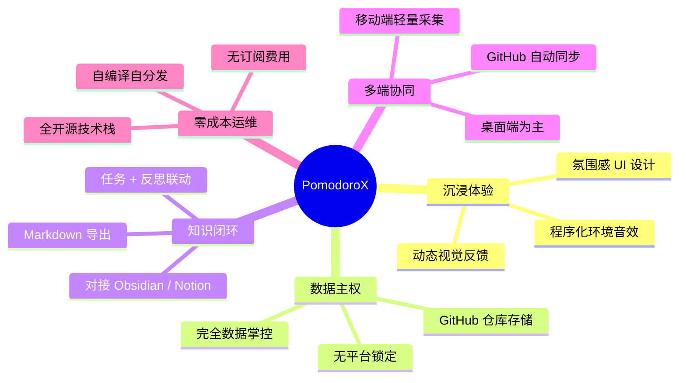
```mermaid
mindmap
  root((PomodoroX))
    沉浸体验
      氛围感 UI 设计
      程序化环境音效
      动态视觉反馈
    数据主权
      GitHub 仓库存储
      无平台锁定
      完全数据掌控
    知识闭环
      Markdown 导出
      对接 Obsidian / Notion
      任务 + 反思联动
    多端协同
      桌面端为主
      移动端轻量采集
      GitHub 自动同步
    零成本运维
      全开源技术栈
      无订阅费用
      自编译自分发
```

### 1.3 目标用户画像

| 用户类型 | 核心需求 | 使用场景 |
|----------|----------|----------|
| **知识工作者** | 番茄数据自动归档到知识库 | 使用 Obsidian/Notion 管理笔记 |
| **远程工作者** | 数据驱动习惯养成 | 在家办公需要自律工具 |
| **开发者/技术人** | 数据开放与自主控制 | 熟悉 GitHub 生态 |
| **学生/考研党** | 学习任务规划与复盘 | 需要定期反思与统计 |

### 1.4 与竞品差异化

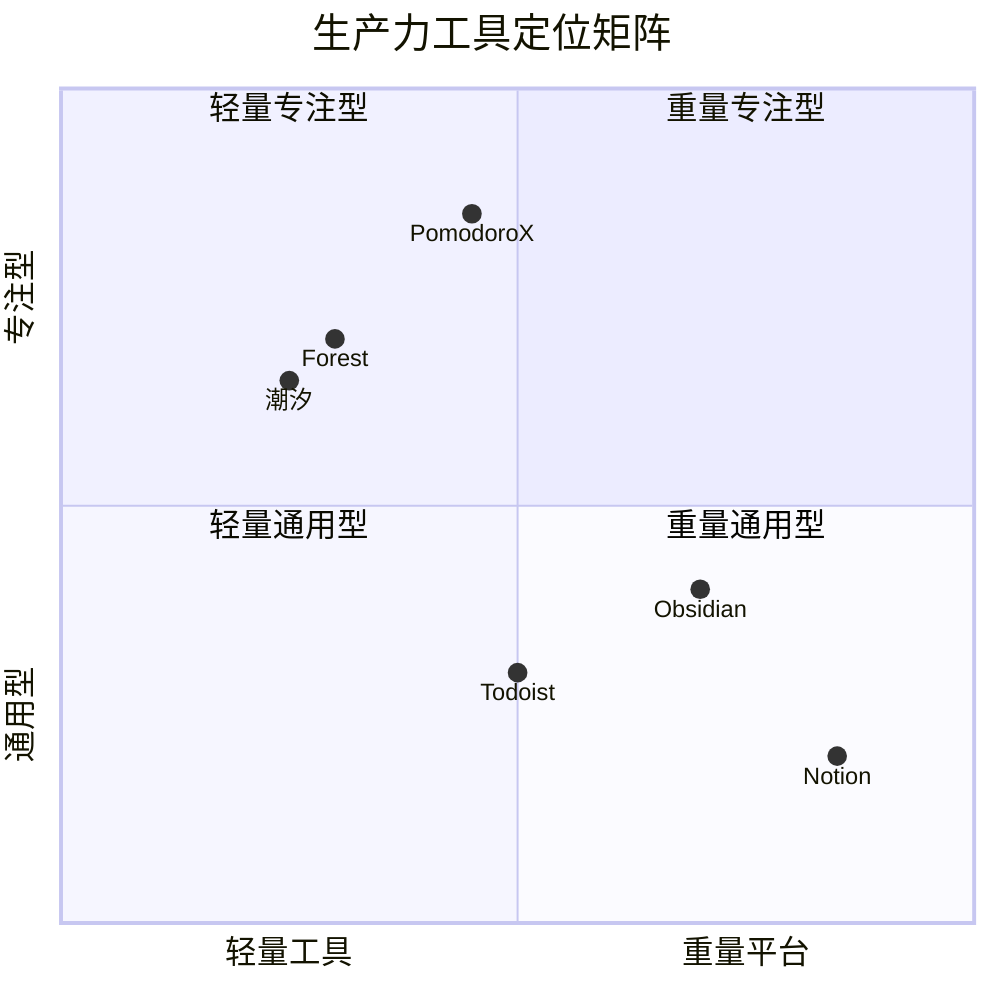
```mermaid
quadrantChart
    title 生产力工具定位矩阵
    x-axis "轻量工具" --> "重量平台"
    y-axis "通用型" --> "专注型"
    quadrant-1 "重量专注型"
    quadrant-2 "轻量专注型"
    quadrant-3 "轻量通用型"
    quadrant-4 "重量通用型"
    "Forest": [0.3, 0.7]
    "潮汐": [0.25, 0.65]
    "Todoist": [0.5, 0.3]
    "Notion": [0.85, 0.2]
    "Obsidian": [0.7, 0.4]
    "PomodoroX": [0.45, 0.85]
```

**PomodoroX 的差异化定位**：在"专注型"象限中提供比 Forest/潮汐更强的数据管理和知识库对接能力，同时保持轻量级桌面应用的简洁体验。

---

## 2. 系统架构设计

### 2.1 整体架构图

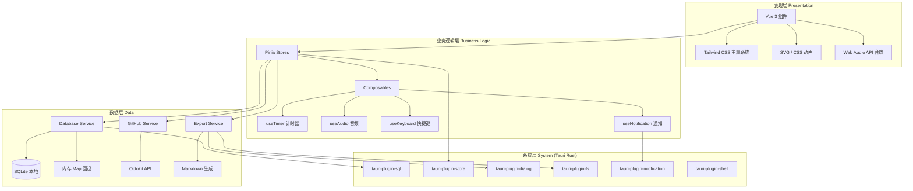
```mermaid
graph TB
    subgraph "表现层 Presentation"
        A[Vue 3 组件] --> B[Tailwind CSS 主题系统]
        A --> C[SVG / CSS 动画]
        A --> D[Web Audio API 音效]
    end

    subgraph "业务逻辑层 Business Logic"
        E[Pinia Stores] --> F[Composables]
        F --> G[useTimer 计时器]
        F --> H[useAudio 音频]
        F --> I[useKeyboard 快捷键]
        F --> J[useNotification 通知]
    end

    subgraph "数据层 Data"
        K[Database Service] --> L[(SQLite 本地)]
        K --> M[内存 Map 回退]
        N[GitHub Service] --> O[Octokit API]
        P[Export Service] --> Q[Markdown 生成]
    end

    subgraph "系统层 System (Tauri Rust)"
        R[tauri-plugin-sql]
        S[tauri-plugin-store]
        T[tauri-plugin-dialog]
        U[tauri-plugin-fs]
        V[tauri-plugin-notification]
        W[tauri-plugin-shell]
    end

    A --> E
    E --> K
    E --> N
    E --> P
    K --> R
    E --> S
    P --> T
    P --> U
    J --> V
```

### 2.2 前端架构分层

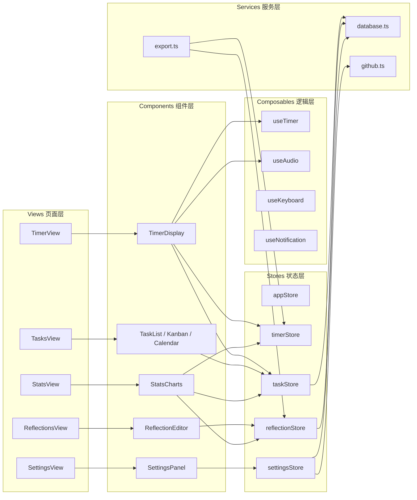
```mermaid
graph LR
    subgraph "Views 页面层"
        V1[TimerView]
        V2[TasksView]
        V3[ReflectionsView]
        V4[StatsView]
        V5[SettingsView]
    end

    subgraph "Components 组件层"
        C1[TimerDisplay]
        C2[TaskList / Kanban / Calendar]
        C3[ReflectionEditor]
        C4[StatsCharts]
        C5[SettingsPanel]
    end

    subgraph "Composables 逻辑层"
        L1[useTimer]
        L2[useAudio]
        L3[useKeyboard]
        L4[useNotification]
    end

    subgraph "Stores 状态层"
        S1[appStore]
        S2[timerStore]
        S3[taskStore]
        S4[reflectionStore]
        S5[settingsStore]
    end

    subgraph "Services 服务层"
        SV1[database.ts]
        SV2[github.ts]
        SV3[export.ts]
    end

    V1 --> C1
    V2 --> C2
    V3 --> C3
    V4 --> C4
    V5 --> C5
    C1 --> L1 & L2
    C1 --> S2 & S3
    C2 --> S3
    C3 --> S4
    C4 --> S2 & S3 & S4
    C5 --> S5
    S3 --> SV1
    S4 --> SV1
    S5 --> SV2 & SV1
    SV3 --> S2 & S4
```

### 2.3 计时器核心机制

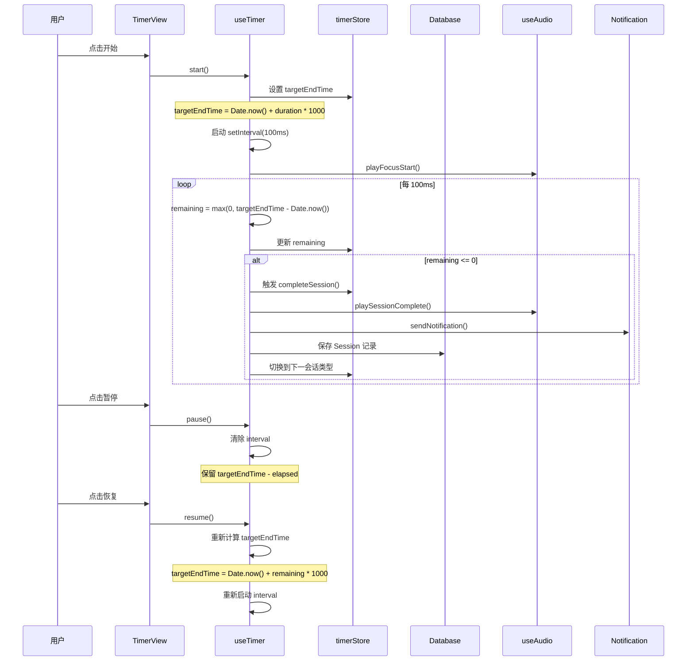
```mermaid
sequenceDiagram
    participant U as 用户
    participant C as TimerView
    participant CT as useTimer
    participant ST as timerStore
    participant DB as Database
    participant AU as useAudio
    participant NT as Notification

    U->>C: 点击开始
    C->>CT: start()
    CT->>ST: 设置 targetEndTime
    Note over CT: targetEndTime = Date.now() + duration * 1000
    CT->>CT: 启动 setInterval(100ms)
    CT->>AU: playFocusStart()

    loop 每 100ms
        CT->>CT: remaining = max(0, targetEndTime - Date.now())
        CT->>ST: 更新 remaining
        alt remaining <= 0
            CT->>ST: 触发 completeSession()
            CT->>AU: playSessionComplete()
            CT->>NT: sendNotification()
            CT->>DB: 保存 Session 记录
            CT->>ST: 切换到下一会话类型
        end
    end

    U->>C: 点击暂停
    C->>CT: pause()
    CT->>CT: 清除 interval
    Note over CT: 保留 targetEndTime - elapsed

    U->>C: 点击恢复
    C->>CT: resume()
    CT->>CT: 重新计算 targetEndTime
    Note over CT: targetEndTime = Date.now() + remaining * 1000
    CT->>CT: 重新启动 interval
```

### 2.4 数据同步架构


```mermaid
flowchart TB
    subgraph "写入流程"
        W1[用户操作] --> W2[写入本地 SQLite]
        W2 --> W3[标记 synced = 0]
        W3 --> W4[加入同步队列]
    end

    subgraph "同步流程"
        S1[定时触发 / 手动触发] --> S2[扫描 synced = 0 记录]
        S2 --> S3[按月分组数据]
        S3 --> S4[通过 Octokit 推送到 GitHub]
        S4 --> S5{推送成功?}
        S5 -->|是| S6[更新 synced = 1]
        S5 -->|否| S7[记录错误，下次重试]
    end

    subgraph "读取流程"
        R1[应用启动] --> R2[读取本地缓存]
        R2 --> R3{缓存存在?}
        R3 -->|是| R4[使用本地数据]
        R3 -->|否| R5[从 GitHub 拉取]
        R5 --> R6[写入本地缓存]
        R6 --> R4
    end

    subgraph "冲突解决"
        C1[检测到冲突] --> C2[比较 updatedAt 时间戳]
        C2 --> C3[保留最新版本]
        C3 --> C4[记录冲突日志]
    end
```

---

## 3. 数据模型与存储策略

### 3.1 实体关系图

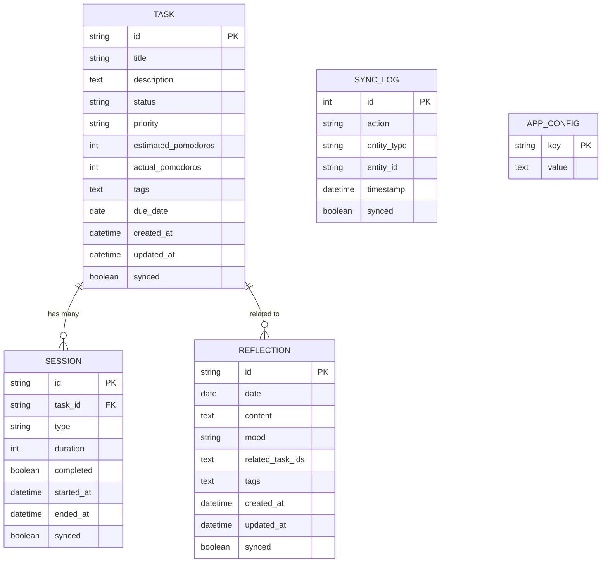
```mermaid
erDiagram
    TASK {
        string id PK
        string title
        text description
        string status
        string priority
        int estimated_pomodoros
        int actual_pomodoros
        text tags
        date due_date
        datetime created_at
        datetime updated_at
        boolean synced
    }

    SESSION {
        string id PK
        string task_id FK
        string type
        int duration
        boolean completed
        datetime started_at
        datetime ended_at
        boolean synced
    }

    REFLECTION {
        string id PK
        date date
        text content
        string mood
        text related_task_ids
        text tags
        datetime created_at
        datetime updated_at
        boolean synced
    }

    SYNC_LOG {
        int id PK
        string action
        string entity_type
        string entity_id
        datetime timestamp
        boolean synced
    }

    APP_CONFIG {
        string key PK
        text value
    }

    TASK ||--o{ SESSION : "has many"
    TASK ||--o{ REFLECTION : "related to"
```

### 3.2 GitHub 仓库数据结构

```
.pomodorox/
├── config.json                    # 用户配置（番茄参数、主题等）
├── tasks/
│   └── 2026/
│       ├── 01.json                # 1月任务数据
│       ├── 02.json                # 2月任务数据
│       └── ...
├── reflections/
│   └── 2026/
│       ├── 01.json                # 1月反思数据
│       └── ...
├── sessions/
│   └── 2026/
│       ├── 01.json                # 1月计时记录
│       └── ...
└── exports/
    ├── 2026-05-01-daily.md        # 导出的日报
    ├── 2026-W18-weekly.md         # 导出的周报
    └── ...
```

**设计原则**：
- 按月分区，单文件体积小（远小于 GitHub 100MB 限制）
- JSON 格式，便于 Git diff 和版本追溯
- exports 目录可直接被 Obsidian 等工具索引

### 3.3 状态枚举定义

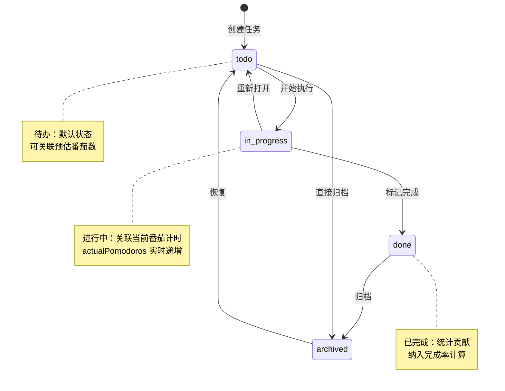
```mermaid
stateDiagram-v2
    [*] --> todo: 创建任务

    todo --> in_progress: 开始执行
    in_progress --> done: 标记完成
    in_progress --> todo: 重新打开
    done --> archived: 归档
    todo --> archived: 直接归档
    archived --> todo: 恢复

    note right of todo
        待办：默认状态
        可关联预估番茄数
    end note

    note right of in_progress
        进行中：关联当前番茄计时
        actualPomodoros 实时递增
    end note

    note right of done
        已完成：统计贡献
        纳入完成率计算
    end note
```

---

## 4. 功能模块详细设计

### 4.1 番茄计时器模块

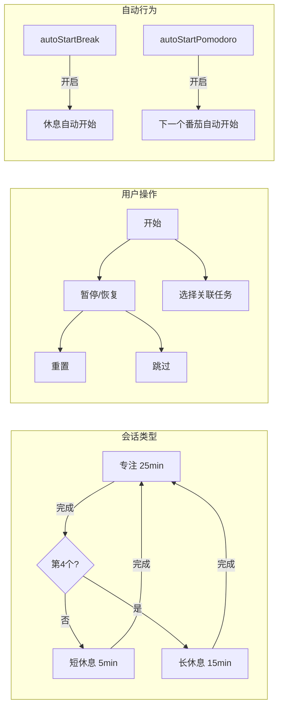
```mermaid
flowchart LR
    subgraph "会话类型"
        A[专注 25min] -->|完成| B{第4个?}
        B -->|否| C[短休息 5min]
        B -->|是| D[长休息 15min]
        C -->|完成| A
        D -->|完成| A
    end

    subgraph "用户操作"
        E[开始] --> F[暂停/恢复]
        F --> G[重置]
        F --> H[跳过]
        E --> I[选择关联任务]
    end

    subgraph "自动行为"
        J[autoStartBreak] -->|开启| K[休息自动开始]
        L[autoStartPomodoro] -->|开启| M[下一个番茄自动开始]
    end
```

**关键设计决策**：

| 决策 | 方案 | 理由 |
|------|------|------|
| 计时方式 | `Date.now()` 时间戳 | 不受 WebView 后台节流影响 |
| 精度 | 100ms 轮询 | 平衡精度与性能 |
| 暂停机制 | 保留 remaining，恢复时重算 targetEndTime | 无累积误差 |
| 音效生成 | Web Audio API 程序化合成 | 零音频文件依赖 |
| 后台通知 | Tauri Notification + 浏览器 Notification 双回退 | 跨环境兼容 |

### 4.2 任务管理模块

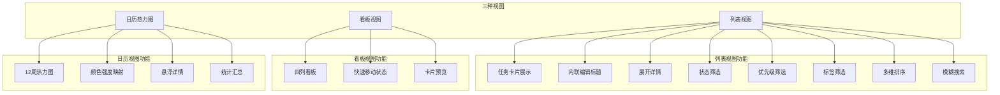
```mermaid
flowchart TB
    subgraph "三种视图"
        V1[列表视图]
        V2[看板视图]
        V3[日历热力图]
    end

    subgraph "列表视图功能"
        L1[任务卡片展示]
        L2[内联编辑标题]
        L3[展开详情]
        L4[状态筛选]
        L5[优先级筛选]
        L6[标签筛选]
        L7[多维排序]
        L8[模糊搜索]
    end

    subgraph "看板视图功能"
        K1[四列看板]
        K2[快速移动状态]
        K3[卡片预览]
    end

    subgraph "日历视图功能"
        C1[12周热力图]
        C2[颜色强度映射]
        C3[悬浮详情]
        C4[统计汇总]
    end

    V1 --> L1 & L2 & L3 & L4 & L5 & L6 & L7 & L8
    V2 --> K1 & K2 & K3
    V3 --> C1 & C2 & C3 & C4
```

### 4.3 反思日志模块

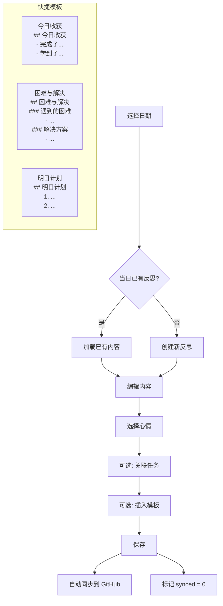
```mermaid
flowchart TB
    A[选择日期] --> B{当日已有反思?}
    B -->|是| C[加载已有内容]
    B -->|否| D[创建新反思]

    C --> E[编辑内容]
    D --> E

    E --> F[选择心情]
    F --> G[可选: 关联任务]
    G --> H[可选: 插入模板]

    H --> I[保存]
    I --> J[自动同步到 GitHub]
    I --> K[标记 synced = 0]

    subgraph "快捷模板"
        T1["今日收获\n## 今日收获\n- 完成了...\n- 学到了..."]
        T2["困难与解决\n## 困难与解决\n### 遇到的困难\n- ...\n### 解决方案\n- ..."]
        T3["明日计划\n## 明日计划\n1. ...\n2. ..."]
    end
```

### 4.4 统计分析模块

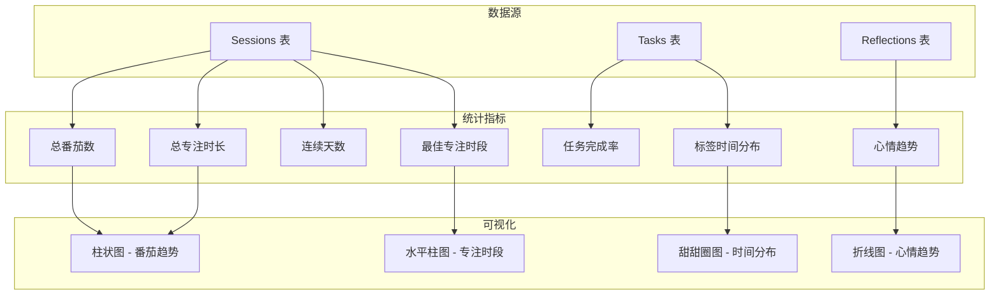
```mermaid
flowchart TB
    subgraph "数据源"
        D1[Sessions 表]
        D2[Tasks 表]
        D3[Reflections 表]
    end

    subgraph "统计指标"
        M1[总番茄数]
        M2[总专注时长]
        M3[连续天数]
        M4[任务完成率]
        M5[最佳专注时段]
        M6[心情趋势]
        M7[标签时间分布]
    end

    subgraph "可视化"
        C1[柱状图 - 番茄趋势]
        C2[甜甜圈图 - 时间分布]
        C3[折线图 - 心情趋势]
        C4[水平柱图 - 专注时段]
    end

    D1 --> M1 & M2 & M3 & M5
    D2 --> M4 & M7
    D3 --> M6

    M1 & M2 --> C1
    M7 --> C2
    M6 --> C3
    M5 --> C4
```

### 4.5 Markdown 导出模块

**导出模板示例**：

````markdown
# 🍅 PomodoroX 日报 - 2026-05-01

> 专注时长：3.5h | 番茄数：8 | 心情：🙂 Good

---

## ✅ 今日任务

- [x] 完成项目方案设计 (3个番茄)
- [x] 代码审查 (2个番茄)
- [ ] 撰写技术文档 (1/2个番茄)

## 💭 反思

今天专注度较高，下午效率明显低于上午。
需要调整休息策略...

## 📊 数据摘要

| 指标 | 数值 |
|------|------|
| 完成番茄 | 8 |
| 专注时长 | 3.5h |
| 任务完成 | 2/3 |
| 最佳时段 | 09:00-11:00 |
````

---

## 5. 迭代路线图

### 5.1 总体路线图

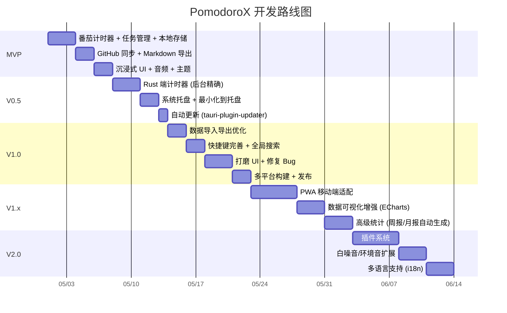
```mermaid
gantt
    title PomodoroX 开发路线图
    dateFormat YYYY-MM-DD
    axisFormat %m/%d

    section MVP
    番茄计时器 + 任务管理 + 本地存储    :m1, 2026-05-01, 3d
    GitHub 同步 + Markdown 导出         :m2, after m1, 2d
    沉浸式 UI + 音频 + 主题              :m3, after m2, 2d

    section V0.5
    Rust 端计时器 (后台精确)             :v1, after m3, 3d
    系统托盘 + 最小化到托盘               :v2, after v1, 2d
    自动更新 (tauri-plugin-updater)       :v3, after v2, 1d

    section V1.0
    数据导入导出优化                      :r1, after v3, 2d
    快捷键完善 + 全局搜索                 :r2, after r1, 2d
        打磨 UI + 修复 Bug                 :r3, after r2, 3d
    多平台构建 + 发布                     :r4, after r3, 2d

    section V1.x
    PWA 移动端适配                        :f1, after r4, 5d
    数据可视化增强 (ECharts)              :f2, after f1, 3d
    高级统计 (周报/月报自动生成)          :f3, after f2, 3d

    section V2.0
    插件系统                              :p1, after f3, 5d
    白噪音/环境音扩展                     :p2, after p1, 3d
    多语言支持 (i18n)                     :p3, after p2, 3d
```

### 5.2 各迭代详细说明

#### Phase 1: MVP（当前已完成 ✅）

| 任务 | 状态 | 说明 |
|------|------|------|
| 项目初始化 | ✅ | Tauri v2 + Vue 3 + TS + Tailwind |
| 番茄计时器 | ✅ | SVG 环形进度 + 时间戳计时 |
| 任务管理 | ✅ | 列表/看板/日历三视图 |
| 反思日志 | ✅ | Markdown 编辑 + 心情 + 模板 |
| 自律统计 | ✅ | 4 卡片 + 4 图表 |
| GitHub 同步 | ✅ | Octokit + 按月分区 |
| Markdown 导出 | ✅ | 日报/周报/任务/反思 |
| 主题系统 | ✅ | 深夜/晨雾/日光 |
| 快捷键 | ✅ | Ctrl+Space/N/R/K/1-5 |
| Tauri 后端骨架 | ✅ | Rust + 6 插件 |

#### Phase 2: V0.5 — 桌面体验增强

| 任务 | 优先级 | 预估 | 说明 |
|------|--------|------|------|
| Rust 端 heartbeat 计时器 | P0 | 3天 | 参考 Obliqoro，解决 WebView 后台节流 |
| 系统托盘图标 | P0 | 2天 | 最小化到托盘，托盘菜单快捷操作 |
| 窗口行为优化 | P1 | 1天 | 关闭时隐藏到托盘，记住窗口位置 |
| 自动更新 | P1 | 1天 | tauri-plugin-updater |
| 开机自启 | P2 | 0.5天 | tauri-plugin-autostart |

#### Phase 3: V1.0 — 正式发布

| 任务 | 优先级 | 预估 | 说明 |
|------|--------|------|------|
| 数据导入导出优化 | P0 | 2天 | JSON 完整备份/恢复，冲突处理 |
| 全局搜索 (Ctrl+K) | P1 | 2天 | 搜索任务、反思、设置项 |
| UI 打磨 | P0 | 3天 | 动画细节、空状态、加载状态、错误提示 |
| 无障碍访问 | P2 | 1天 | ARIA 标签、键盘导航、高对比度 |
| 多平台构建测试 | P0 | 2天 | Windows/macOS/Linux 编译与测试 |
| 应用图标与安装包 | P0 | 1天 | 设计图标，配置各平台安装包 |

#### Phase 4: V1.x — 功能扩展

| 任务 | 优先级 | 预估 | 说明 |
|------|--------|------|------|
| PWA 移动端适配 | P1 | 5天 | 响应式布局 + Service Worker + 离线缓存 |
| ECharts 图表升级 | P2 | 3天 | 替换纯 CSS 图表，更丰富的交互 |
| 周报/月报自动生成 | P1 | 3天 | 定时任务 + 自动导出到 GitHub |
| WebDAV 同步选项 | P2 | 3天 | 支持坚果云、NextCloud |
| 自定义番茄时长方案 | P2 | 2天 | 保存多套时长方案，快速切换 |

#### Phase 5: V2.0 — 生态扩展

| 任务 | 优先级 | 预估 | 说明 |
|------|--------|------|------|
| 插件系统 | P1 | 5天 | 允许社区开发扩展 |
| 白噪音/环境音扩展 | P1 | 3天 | 雨声、咖啡厅、森林等 |
| 多语言 i18n | P2 | 3天 | 英文、日文等 |
| Obsidian 插件 | P2 | 5天 | 在 Obsidian 中直接查看番茄数据 |
| 团队模式（可选） | P3 | 10天 | 多人共享番茄目标 |

---

## 6. 技术决策记录 (ADR)

### ADR-001: 计时器实现方案

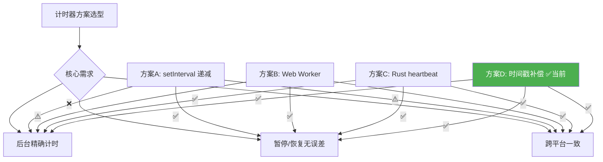
```mermaid
flowchart TB
    A[计时器方案选型] --> B{核心需求}
    B --> C[后台精确计时]
    B --> D[暂停/恢复无误差]
    B --> E[跨平台一致]

    F[方案A: setInterval 递减] -->|❌| C
    F -->|✅| D
    F -->|⚠️| E

    G[方案B: Web Worker] -->|⚠️| C
    G -->|✅| D
    G -->|✅| E

    H[方案C: Rust heartbeat] -->|✅| C
    H -->|✅| D
    H -->|✅| E

    I[方案D: 时间戳补偿 ✅当前] -->|✅| C
    I -->|✅| D
    I -->|✅| E

    style I fill:#4CAF50,color:#fff
```

**决策**: 当前 MVP 使用**方案D（时间戳补偿）**，V0.5 升级到**方案C（Rust heartbeat）**。

**理由**:
- 方案D 实现简单，通过 `targetEndTime = Date.now() + remaining * 1000` 天然处理后台节流
- 方案C 是终极方案（参考 Obliqoro），计时逻辑完全在 Rust tokio runtime 中运行

### ADR-002: 数据存储方案

| 方案 | 优势 | 劣势 | 决策 |
|------|------|------|------|
| 纯 localStorage | 最简单 | 容量限制 5MB，无结构化查询 | ❌ |
| IndexedDB | 容量大 | API 复杂，无 SQL | ❌ |
| **SQLite (tauri-plugin-sql)** | **结构化查询，成熟稳定** | **需 Tauri 环境** | **✅ MVP** |
| **Rust 端 rusqlite** | **完全控制，支持事务** | **开发复杂度高** | **✅ V0.5 升级** |
| GitHub 作为主存储 | 数据在云端 | 离线不可用，API 限速 | ❌ 作辅助 |

### ADR-003: UI 框架选型

| 方案 | 优势 | 劣势 | 决策 |
|------|------|------|------|
| Element Plus | 组件丰富 | 风格固定，难以定制沉浸式 UI | ❌ |
| Naive UI | TypeScript 友好 | 包体积较大 | ❌ |
| **Tailwind CSS + 自定义组件** | **完全控制视觉风格** | **开发量稍大** | **✅** |

**理由**: 沉浸式 UI 需要高度定制化的视觉效果（动态背景、发光效果、粒子动画），UI 组件库的预设样式反而是限制。

### ADR-004: 图表方案

| 方案 | 优势 | 劣势 | 决策 |
|------|------|------|------|
| ECharts | 功能强大 | 包体积 ~800KB | ❌ MVP |
| Chart.js | 轻量 | 定制性一般 | ❌ |
| **纯 CSS/SVG** | **零依赖，包体积 0** | **复杂图表开发成本高** | **✅ MVP** |
| ECharts | 功能强大 | — | ✅ V1.x 升级 |

---

## 7. 开发规范与工作流

### 7.1 Git 分支策略

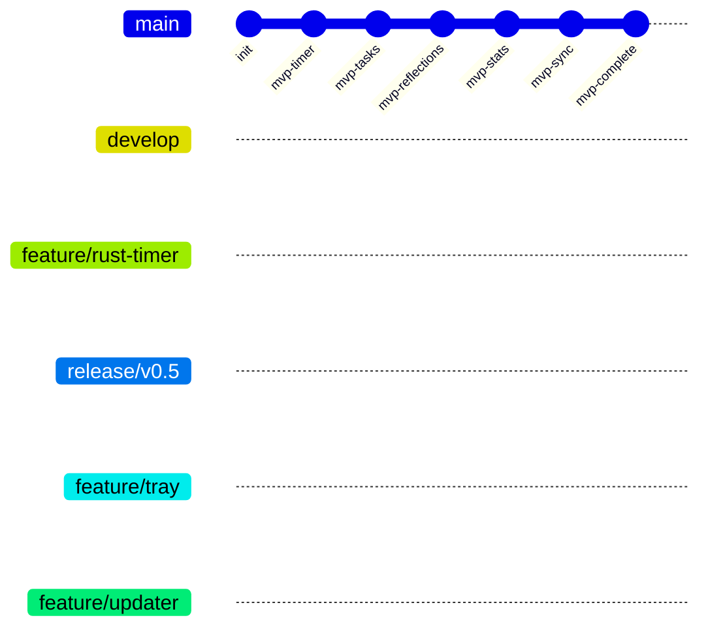
```mermaid
gitGraph
    commit id: "init"
    commit id: "mvp-timer"
    commit id: "mvp-tasks"
    commit id: "mvp-reflections"
    commit id: "mvp-stats"
    commit id: "mvp-sync"
    commit id: "mvp-complete"
    branch develop
    checkout develop
    branch feature/rust-timer
    checkout main
    branch release/v0.5
    checkout develop
    branch feature/tray
    branch feature/updater
```

**分支规范**：

| 分支类型 | 命名 | 说明 |
|----------|------|------|
| `main` | — | 稳定发布分支 |
| `develop` | — | 开发集成分支 |
| `feature/*` | `feature/rust-timer` | 功能分支 |
| `fix/*` | `fix/timer-background` | 修复分支 |
| `release/*` | `release/v0.5` | 发布准备分支 |

### 7.2 Commit 规范

```
<type>(<scope>): <subject>

<body>
```

**类型**：

| type | 说明 | 示例 |
|------|------|------|
| `feat` | 新功能 | `feat(timer): add rust heartbeat timer` |
| `fix` | 修复 | `fix(sync): resolve github api rate limit` |
| `refactor` | 重构 | `refactor(db): migrate to rusqlite` |
| `style` | 样式 | `style(timer): improve ring animation` |
| `docs` | 文档 | `docs: update project roadmap` |
| `perf` | 性能 | `perf(chart): optimize svg rendering` |
| `test` | 测试 | `test(timer): add timestamp accuracy tests` |
| `chore` | 杂项 | `chore: update dependencies` |

### 7.3 代码规范

**Vue 组件**：
```vue
<script setup lang="ts">
// 1. Imports
import { ref, computed, onMounted } from 'vue'
import { useTaskStore } from '@/stores/task'

// 2. Types & Interfaces
interface Props { ... }

// 3. Props & Emits
const props = defineProps<Props>()
const emit = defineEmits<{ ... }>()

// 4. Composables
const store = useTaskStore()

// 5. Reactive State
const isLoading = ref(false)

// 6. Computed
const filteredTasks = computed(() => ...)

// 7. Methods
function handleSave() { ... }

// 8. Lifecycle
onMounted(async () => { ... })
</script>
```

**TypeScript**：
- 优先使用 `interface` 而非 `type`
- 禁止 `any`，使用 `unknown` + 类型守卫
- 所有异步函数必须有错误处理

**CSS**：
- 优先使用 Tailwind 工具类
- 复杂动画使用 `<style scoped>`
- 所有颜色使用 CSS 变量（`var(--color-accent)`）

### 7.4 项目目录规范

```
src/
├── assets/              # 静态资源（图片、字体）
├── components/          # 可复用组件
│   ├── common/          # 基础组件 (Button, Card, Modal...)
│   └── layout/          # 布局组件 (Sidebar, Header...)
├── composables/         # Vue Composables（逻辑复用）
├── services/            # 服务层（API、数据库、导出）
├── stores/              # Pinia 状态管理
├── types/               # TypeScript 类型定义
├── utils/               # 纯工具函数
├── views/               # 页面级组件
├── router/              # 路由配置
├── App.vue              # 根组件
├── main.ts              # 入口
└── style.css            # 全局样式 + 主题变量
```

---

## 8. 测试策略

### 8.1 测试金字塔

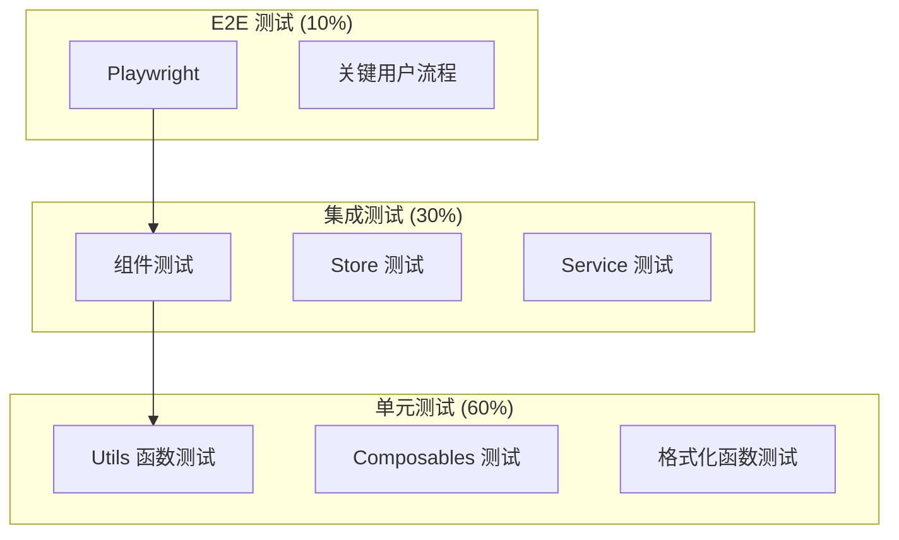
```mermaid
graph TB
    subgraph "E2E 测试 (10%)"
        E1[Playwright]
        E2[关键用户流程]
    end

    subgraph "集成测试 (30%)"
        I1[组件测试]
        I2[Store 测试]
        I3[Service 测试]
    end

    subgraph "单元测试 (60%)"
        U1[Utils 函数测试]
        U2[Composables 测试]
        U3[格式化函数测试]
    end

    E1 --> I1
    I1 --> U1
```

### 8.2 各模块测试重点

| 模块 | 测试类型 | 重点 |
|------|----------|------|
| **计时器** | 单元 + 集成 | 时间戳精度、暂停恢复、后台恢复、会话切换 |
| **任务管理** | 单元 + 集成 | CRUD、筛选排序、状态流转 |
| **数据库** | 单元 | SQLite 操作、内存回退、迁移兼容性 |
| **GitHub 同步** | 集成 | 推送拉取、冲突解决、离线队列、API 限速 |
| **Markdown 导出** | 单元 | 模板正确性、特殊字符处理、编码 |
| **UI 组件** | 单元 + E2E | 渲染正确性、交互响应、主题切换 |

### 8.3 推荐测试工具

| 工具 | 用途 | 安装 |
|------|------|------|
| Vitest | 单元测试 + 组件测试 | `pnpm add -D vitest @vue/test-utils` |
| Playwright | E2E 测试 | `pnpm add -D @playwright/test` |
| MSW | API Mock | `pnpm add -D msw` |

---

## 9. 部署与发布流程

### 9.1 发布流程

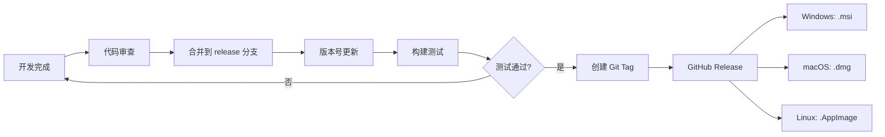
```mermaid
flowchart LR
    A[开发完成] --> B[代码审查]
    B --> C[合并到 release 分支]
    C --> D[版本号更新]
    D --> E[构建测试]
    E --> F{测试通过?}
    F -->|否| A
    F -->|是| G[创建 Git Tag]
    G --> H[GitHub Release]
    H --> I1[Windows: .msi]
    H --> I2[macOS: .dmg]
    H --> I3[Linux: .AppImage]
```

### 9.2 版本号规范

采用 **Semantic Versioning**：`MAJOR.MINOR.PATCH`

| 变更类型 | 版本示例 | 说明 |
|----------|----------|------|
| 新功能（向后兼容） | 0.1.0 → 0.2.0 | 新增功能模块 |
| Bug 修复 | 0.1.0 → 0.1.1 | 修复问题 |
| 破坏性变更 | 1.0.0 → 2.0.0 | 架构重构、API 变更 |

### 9.3 CI/CD（可选）

```yaml
# .github/workflows/build.yml 概念配置
on:
  push:
    tags: ['v*']

jobs:
  build:
    strategy:
      matrix:
        os: [windows-latest, macos-latest, ubuntu-latest]
    runs-on: ${{ matrix.os }}
    steps:
      - uses: actions/checkout@v4
      - uses: pnpm/action-setup@v2
      - uses: dtolnay/rust-toolchain@stable
      - run: pnpm install
      - run: pnpm tauri build
      - uses: softprops/action-gh-release@v1
        with:
          files: src-tauri/target/release/bundle/*
```

---

## 10. 风险评估与应对

### 10.1 风险矩阵

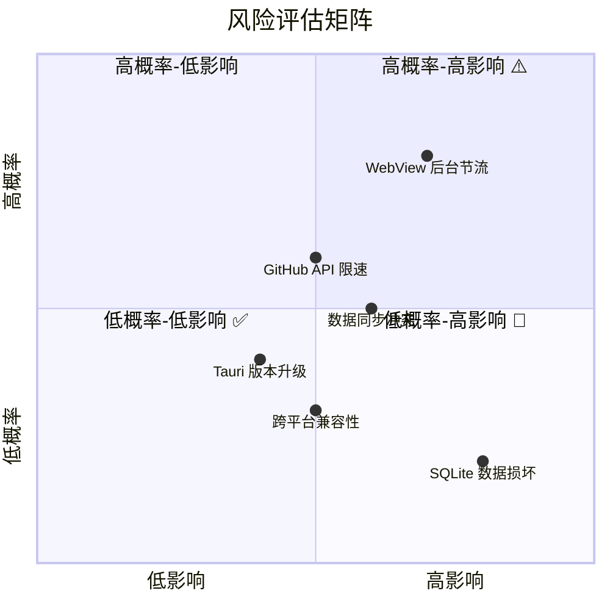
```mermaid
quadrantChart
    title 风险评估矩阵
    x-axis "低影响" --> "高影响"
    y-axis "低概率" --> "高概率"
    quadrant-1 "高概率-高影响 ⚠️"
    quadrant-2 "高概率-低影响"
    quadrant-3 "低概率-低影响 ✅"
    quadrant-4 "低概率-高影响 👀"
    "WebView 后台节流": [0.7, 0.8]
    "GitHub API 限速": [0.5, 0.6]
    "数据同步冲突": [0.6, 0.5]
    "Tauri 版本升级": [0.4, 0.4]
    "SQLite 数据损坏": [0.8, 0.2]
    "跨平台兼容性": [0.5, 0.3]
```

### 10.2 风险应对表

| 风险 | 概率 | 影响 | 应对策略 |
|------|------|------|----------|
| WebView 后台节流 | 高 | 高 | ✅ 已用时间戳方案缓解；V0.5 升级 Rust heartbeat |
| GitHub API 限速 | 中 | 中 | ✅ 本地优先架构；批量同步减少请求数 |
| 数据同步冲突 | 中 | 中 | ✅ "最后修改时间"策略 + 冲突提示 |
| Tauri 版本升级 | 低 | 中 | 锁定版本；升级前阅读 CHANGELOG |
| SQLite 数据损坏 | 低 | 高 | 定期 JSON 导出备份；PRAGMA journal_mode=WAL |
| 跨平台兼容性 | 低 | 中 | CI 多平台构建测试；尽早发现差异 |

---

## 11. 扩展愿景

### 11.1 长期产品愿景

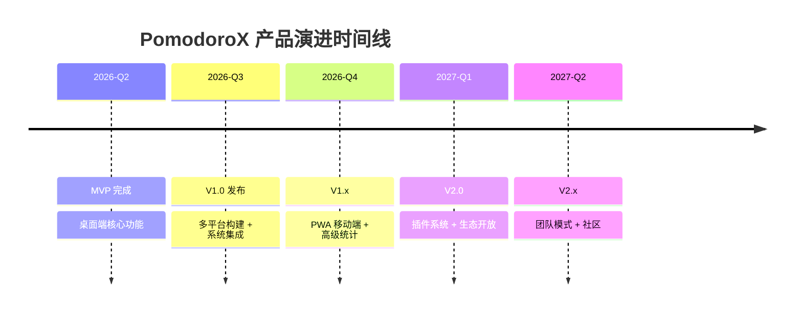
```mermaid
timeline
    title PomodoroX 产品演进时间线
    2026-Q2 : MVP 完成 : 桌面端核心功能
    2026-Q3 : V1.0 发布 : 多平台构建 + 系统集成
    2026-Q4 : V1.x : PWA 移动端 + 高级统计
    2027-Q1 : V2.0 : 插件系统 + 生态开放
    2027-Q2 : V2.x : 团队模式 + 社区
```

### 11.2 可能的扩展方向

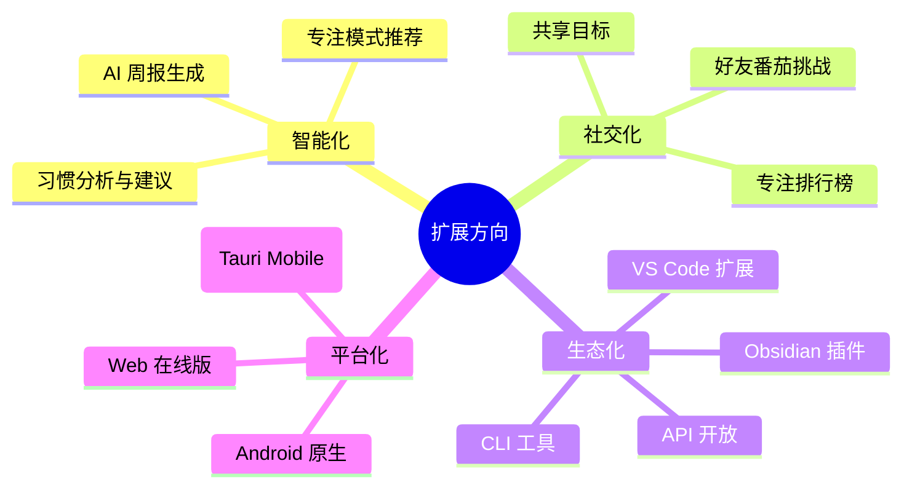
```mermaid
mindmap
  root((扩展方向))
    智能化
      AI 周报生成
      专注模式推荐
      习惯分析与建议
    社交化
      好友番茄挑战
      专注排行榜
      共享目标
    生态化
      Obsidian 插件
      VS Code 扩展
      CLI 工具
      API 开放
    平台化
      iOS 原生 (Tauri Mobile)
      Android 原生
      Web 在线版
```

### 11.3 技术债务追踪

| 债务 | 优先级 | 计划版本 | 说明 |
|------|--------|----------|------|
| 前端 setInterval 计时 | P0 | V0.5 | 升级为 Rust heartbeat |
| 纯 CSS 图表 | P2 | V1.x | 升级为 ECharts |
| 无国际化 | P2 | V2.0 | 引入 vue-i18n |
| 无 E2E 测试 | P1 | V1.0 | 引入 Playwright |
| 无 CI/CD | P2 | V1.0 | 配置 GitHub Actions |
| 无错误监控 | P3 | V2.0 | 接入 Sentry（自托管） |

---

## 附录

### A. 快速命令参考

```bash
# 开发
pnpm dev                  # 前端开发服务器
pnpm tauri dev            # Tauri 桌面开发

# 构建
pnpm build                # 前端生产构建
pnpm tauri build          # Tauri 桌面构建

# 代码质量
pnpm type-check           # TypeScript 类型检查
pnpm lint                 # ESLint 检查
pnpm test                 # 运行测试

# Tauri
pnpm tauri icon icon.png  # 生成应用图标
pnpm tauri signer         # 代码签名（Windows）
```

### B. 有价值的参考项目

| 项目 | 地址 | 参考点 |
|------|------|--------|
| Obliqoro | https://github.com/mrjackwills/obliqoro | Rust heartbeat 计时器、async_channel 架构 |
| mini-todo | https://github.com/dreamlonglll/mini-todo | Rust 端三层架构、数据库迁移、WebDAV 同步 |
| Topdo | https://github.com/SkyNone/Topdo | macOS 悬浮窗、Tailwind CSS、飞书同步 |
| Presto | https://github.com/murdercode/presto | Tauri 自动更新、Rust 文件存储 |

### C. 关键依赖版本

| 依赖 | 当前版本 | 许可证 |
|------|----------|--------|
| Tauri | v2.10+ | Apache-2.0/MIT |
| Vue | v3.5+ | MIT |
| TypeScript | v6.0+ | Apache-2.0 |
| Vite | v8.0+ | MIT |
| Pinia | v3.0+ | MIT |
| Tailwind CSS | v4.2+ | MIT |
| Octokit | v5.0+ | MIT |

---

> 📌 **本文档随项目演进持续更新。每次迭代完成后回顾并更新路线图状态。**
