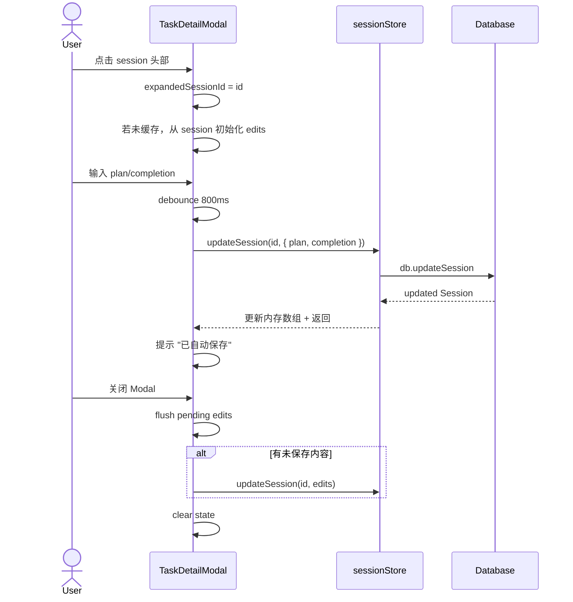

# Session Plan/Completion Inline Edit Design

> **日期**: 2026-05-05
> **组件**: `src/components/TaskDetailModal.vue`
> **类型**: 功能增强

## 目标

在 `TaskDetailModal` 的 **"专注记录" Tab** 中，将每个 session 从只读列表升级为**可折叠编辑卡片**，支持修改该 session 的 `plan`（目标）和 `completion`（总结）。

## 设计约束

- **单开模式**：一次仅展开一个 session，避免 Modal 内纵向滚动失控
- **零新增组件**：改动完全内嵌于 `TaskDetailModal.vue`，不新增 Modal 或子组件
- **复用自动保存机制**：与现有的 task plan/completion 完全一致（800ms debounce + 关闭 flush）

## 状态设计

```typescript
// 当前展开的 session ID
const expandedSessionId = ref<string | null>(null)

// 编辑文本缓存：Map<sessionId, { plan: string; completion: string }>
const sessionEdits = ref<Map<string, { plan: string; completion: string }>>(new Map())

// 保存中状态
const sessionSaving = ref<Set<string>>(new Set())
```

## 交互时序



## 视觉设计

- **Session 头部**：保留现有时间/时长/状态布局，右侧增加 ▼/▶ 指示器
- **展开体**：
  - 两个 textarea（"本次目标" / "完成总结"），样式复用 `.detail-textarea`
  - 底部保存状态提示（"保存中…" / "有未保存更改" / "已自动保存"）
- **未填写时**：placeholder 提示用户填写

## API 改动

### `sessionStore.updateSession`
已存在，无需改动。

### `TaskDetailModal.vue`
新增局部状态 + 方法，sessions Tab 渲染逻辑替换为可折叠卡片。

## 范围

仅修改 `src/components/TaskDetailModal.vue`，无其他文件变更。
